# //uses-text-compression/samples/pages+cached+noadtech+nomedia+nocss

[→ Parent](../..)


## Raw


```yaml
p90min: 1260
p90max: 1800
p90range: 540
p90mean: 1484.0425531914893
p90median: 1465
p90stdev: 111.77788717615984
p90skewness: 0.40440784801800145
p90eccentricity: 1.0000000000000007
p90discretization: 2.35
outlandishness: 1.003449564736321
confidence: 53.412438516468555
p90confidence: 45.192883931493455

```

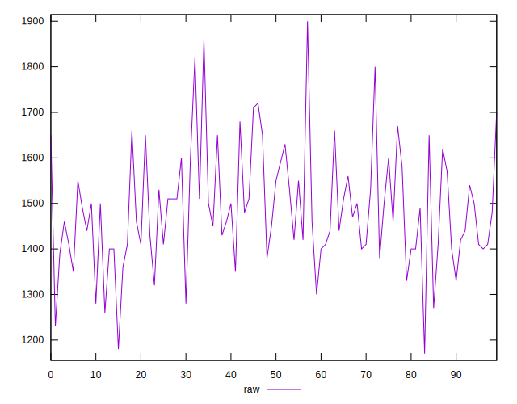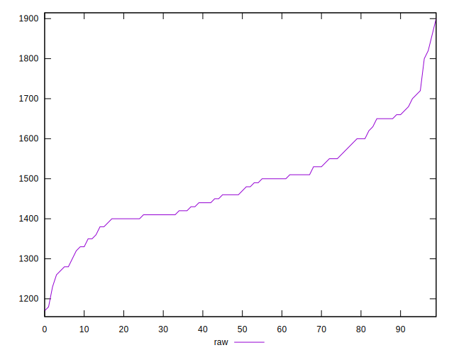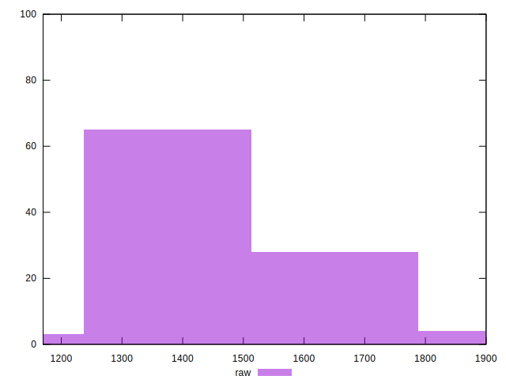
## Score


```yaml
p90min: 0.38
p90max: 0.44
p90range: 0.06
p90mean: 0.4131914893617023
p90median: 0.42
p90stdev: 0.013385667625553887
p90skewness: -0.27640051337321003
p90eccentricity: 1.0000000000000004
p90discretization: 13.428571428571429
outlandishness: 0.9981059440563149
confidence: 0.006419113949315242
p90confidence: 0.005411955250091973

```

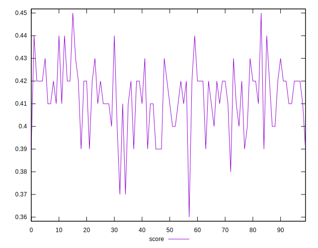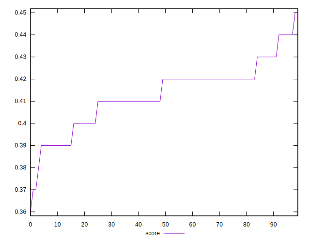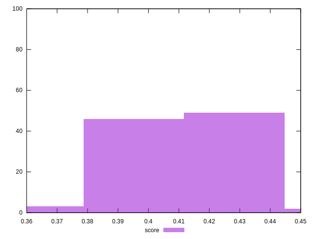
## Raw Estimate

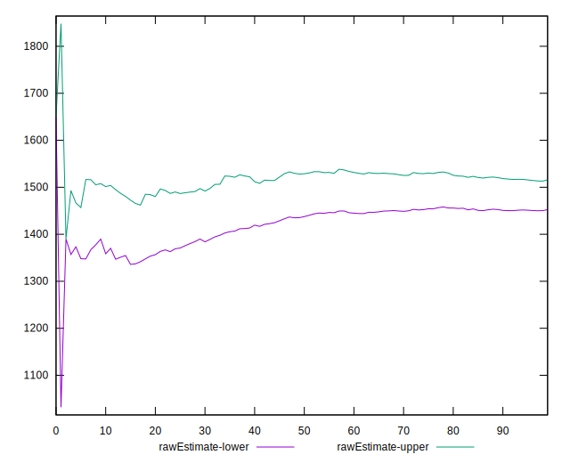
## Score Estimate

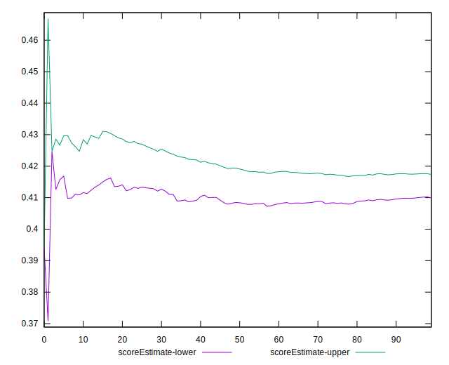
## P Score


```yaml
p90min: 0.3764705882352941
p90max: 0.44
p90range: 0.06352941176470589
p90mean: 0.41364205256570696
p90median: 0.4158823529411765
p90stdev: 0.013150339667783516
p90skewness: -0.404407848018
p90eccentricity: 0.9999999999999996
p90discretization: 2.35
outlandishness: 0.9985457635788626
confidence: 0.006283816296055122
p90confidence: 0.00531680987429335

```

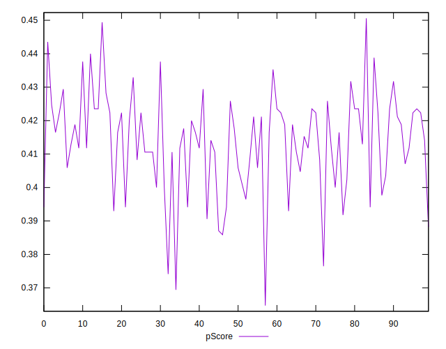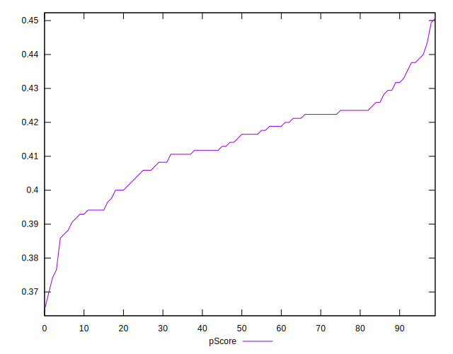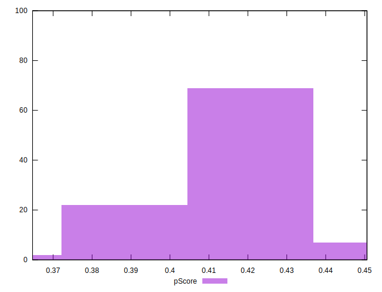
## Score Difference


```yaml
p90min: 0
p90max: 5.551115123125783e-17
p90range: 5.551115123125783e-17
p90mean: 1.2401427402727812e-17
p90median: 0
p90stdev: 2.3121896773646406e-17
p90skewness: 1.328104555020872
p90eccentricity: 1.0000000000000018
p90discretization: 47
outlandishness: 1.1540897959183674
confidence: 9.293316709112384e-18
p90confidence: 9.348407127436227e-18

```

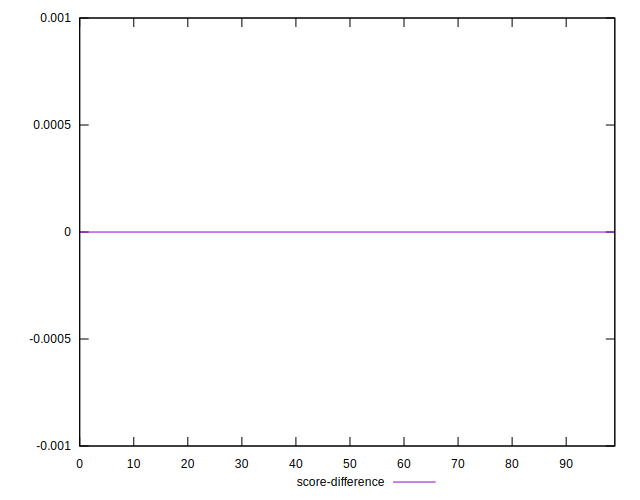
## P Score Difference


```yaml
p90min: -0.004117647058823504
p90max: 0.004117647058823559
p90range: 0.008235294117647063
p90mean: 0.0005694618272841128
p90median: 0.000882352941176473
p90stdev: 0.0025445339609741734
p90skewness: -0.3536293865958812
p90eccentricity: 1.0000000000000004
p90discretization: 4.086956521739131
outlandishness: 0.9031264823089005
confidence: 0.0010645291807920216
p90confidence: 0.0010287797601400304

```

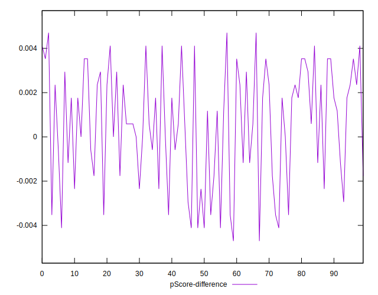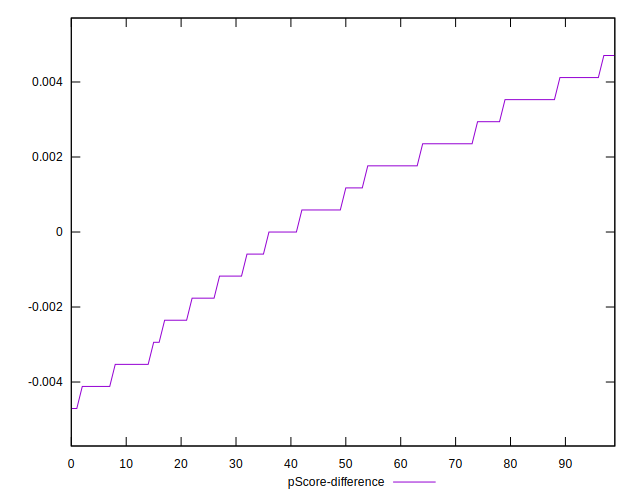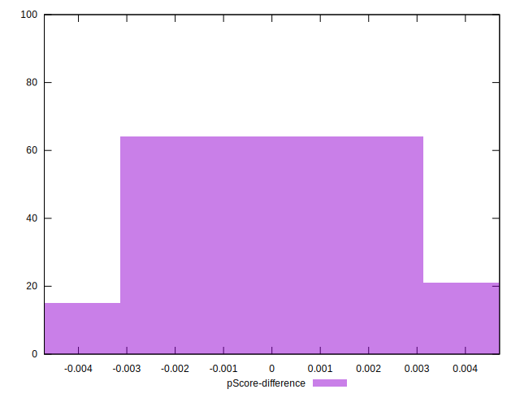