# //uses-text-compression/samples/pages+cached+noadtech+nomedia

[→ Parent](../..)


## Raw


```yaml
p90min: 1200
p90max: 3190
p90range: 1990
p90mean: 2598.404255319149
p90median: 2800
p90stdev: 578.987199343102
p90skewness: -1.4478235140549423
p90eccentricity: 1.0000000000000002
p90discretization: 1.8431372549019607
outlandishness: 0.981532932780712
confidence: 242.8510092931497
p90confidence: 234.09014035572162

```

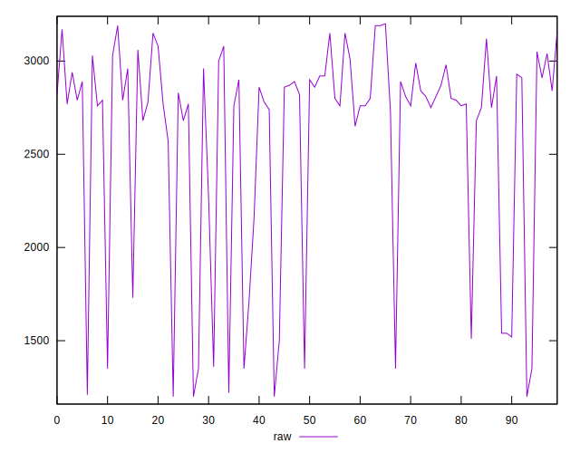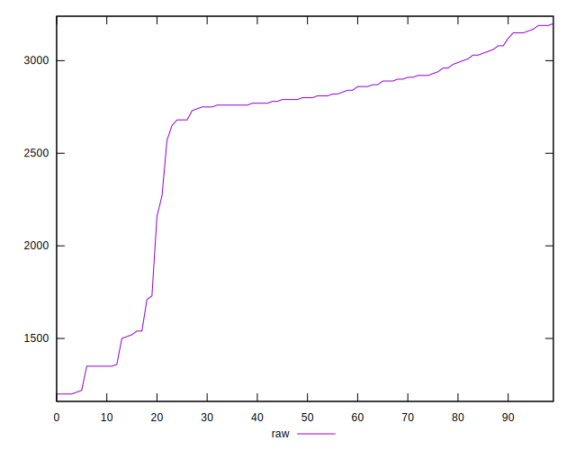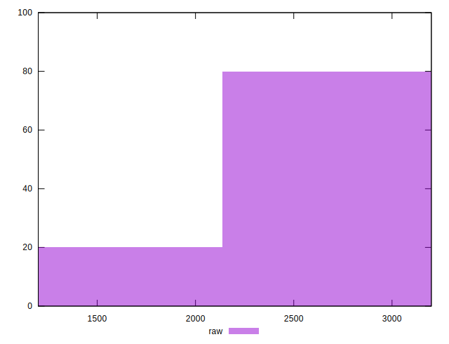
## Score


```yaml
p90min: 0.21
p90max: 0.45
p90range: 0.24000000000000002
p90mean: 0.2824468085106384
p90median: 0.26
p90stdev: 0.06828734922577157
p90skewness: 1.46795195700687
p90eccentricity: 0.9999999999999983
p90discretization: 5.529411764705882
outlandishness: 1.0203054340706696
confidence: 0.028738472770790776
p90confidence: 0.027609237618582062

```

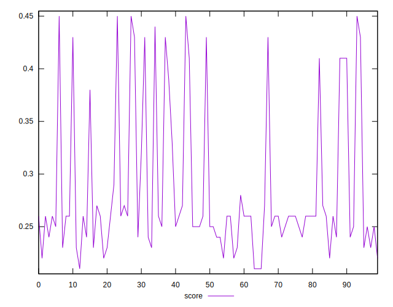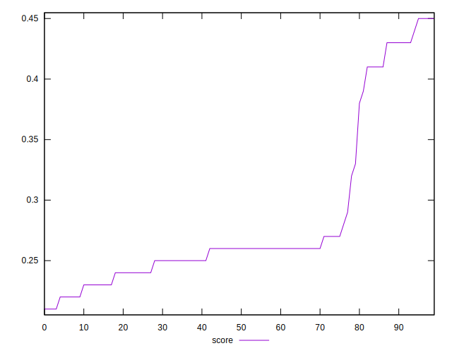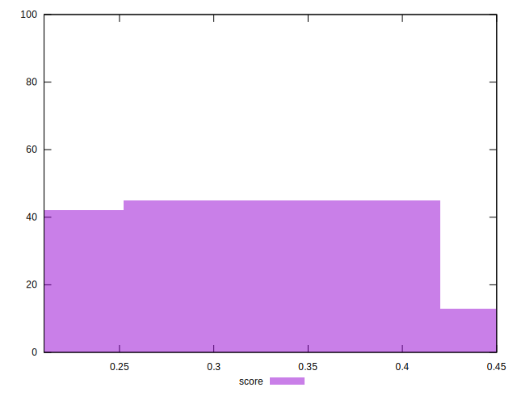
## Raw Estimate

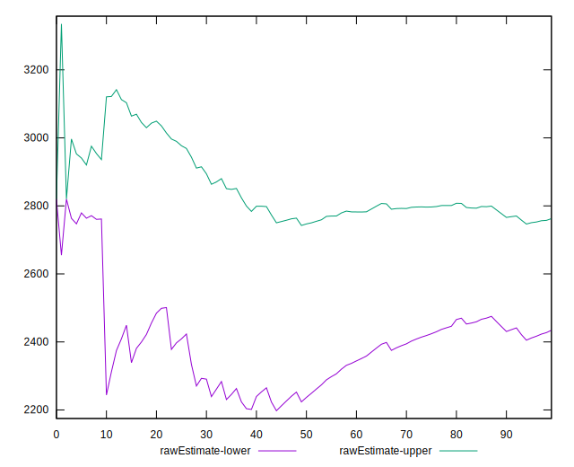
## Score Estimate

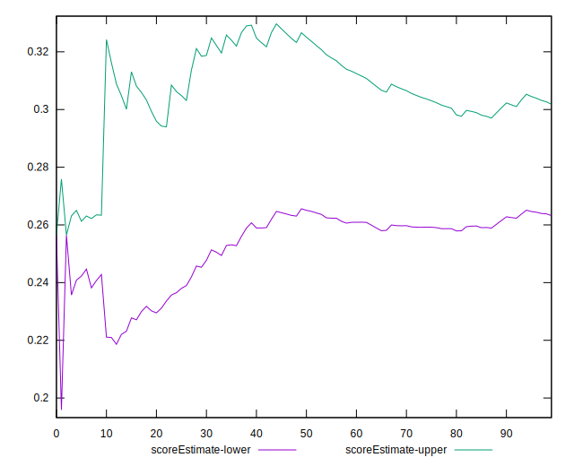
## P Score


```yaml
p90min: 0.21294117647058824
p90max: 0.4470588235294118
p90range: 0.23411764705882354
p90mean: 0.28254067584480597
p90median: 0.2588235294117647
p90stdev: 0.06811614109918847
p90skewness: 1.4478235140549451
p90eccentricity: 0.9999999999999999
p90discretization: 1.8431372549019607
outlandishness: 1.0201742693473341
confidence: 0.02857070697566466
p90confidence: 0.02754001651243784

```

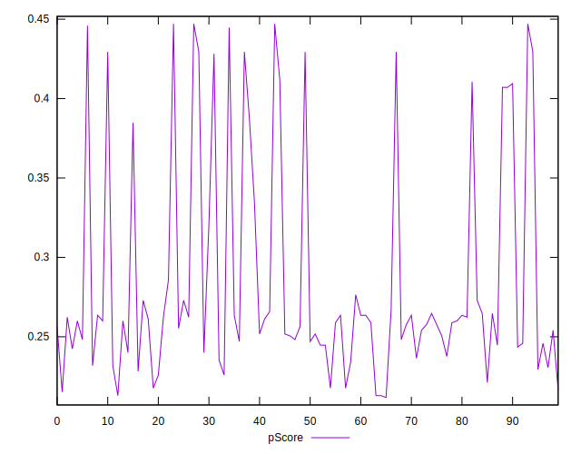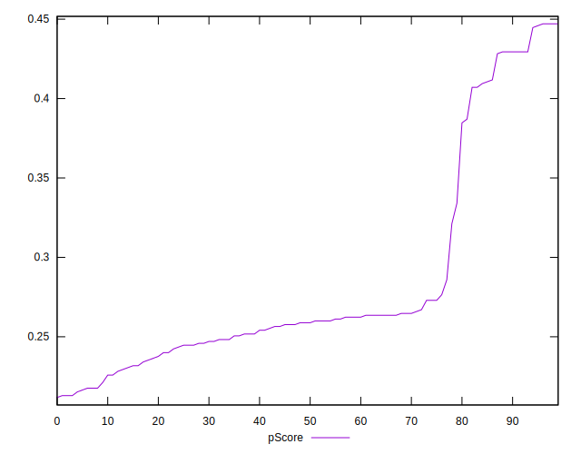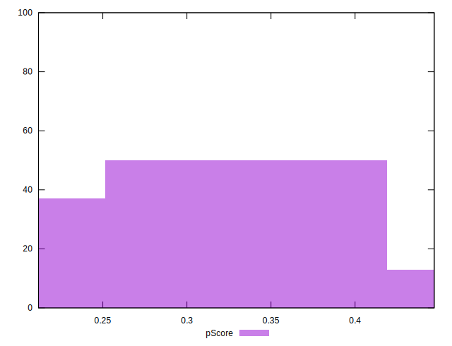
## Score Difference


```yaml
p90min: 0
p90max: 5.551115123125783e-17
p90range: 5.551115123125783e-17
p90mean: 1.1810883240693154e-18
p90median: 0
p90stdev: 8.010530753054493e-18
p90skewness: 6.6348880269703665
p90eccentricity: 0.9999999999999994
p90discretization: 47
outlandishness: 5.522500000000001
confidence: 4.742475824042984e-18
p90confidence: 3.2387352784895233e-18

```

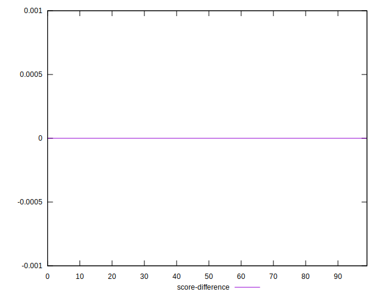
## P Score Difference


```yaml
p90min: -0.004117647058823559
p90max: 0.004705882352941171
p90range: 0.00882352941176473
p90mean: 0.00008135168961201455
p90median: 0
p90stdev: 0.002757201040561603
p90skewness: 0.07767606196406428
p90eccentricity: 0.9999999999999989
p90discretization: 3.2413793103448274
outlandishness: 0.883599999999981
confidence: 0.0011411718316530544
p90confidence: 0.0011147631230989097

```

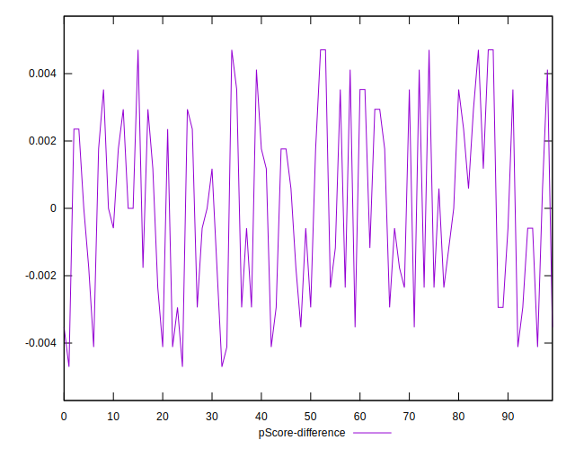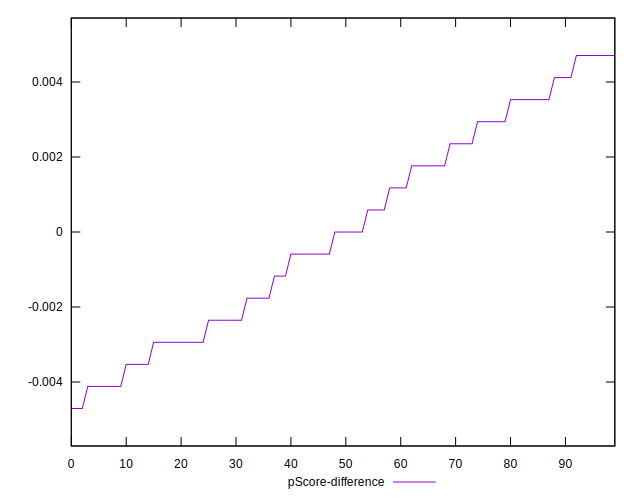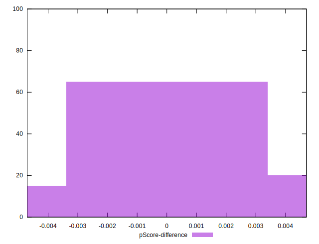