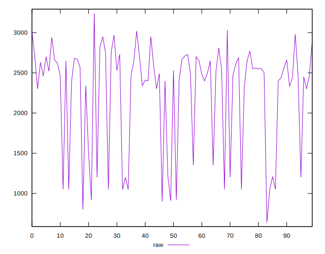

# //uses-text-compression/samples/pages+cached+noadtech

[→ Parent](../..)


## Raw


```yaml
p90min: 910
p90max: 3020
p90range: 2110
p90mean: 2261.3829787234044
p90median: 2495
p90stdev: 633.0483512571731
p90skewness: -1.1449359388735743
p90eccentricity: 0.9999999999999999
p90discretization: 1.8431372549019607
outlandishness: 0.9829308787597637
confidence: 266.94335318035246
p90confidence: 255.94758841971165

```


## Score


```yaml
p90min: 0.23
p90max: 0.48
p90range: 0.24999999999999997
p90mean: 0.32234042553191494
p90median: 0.295
p90stdev: 0.07366435570848755
p90skewness: 1.124238039166983
p90eccentricity: 0.9999999999999996
p90discretization: 5.875
outlandishness: 1.0165697262795585
confidence: 0.03156698303747217
p90confidence: 0.029783213491728636

```


## Raw Estimate


## Score Estimate


## P Score


```yaml
p90min: 0.2329411764705882
p90max: 0.4811764705882353
p90range: 0.2482352941176471
p90mean: 0.3221902377972465
p90median: 0.29470588235294115
p90stdev: 0.07447627661849095
p90skewness: 1.144935938873577
p90eccentricity: 0.9999999999999996
p90discretization: 1.8431372549019607
outlandishness: 1.0172189508681106
confidence: 0.03190157016649841
p90confidence: 0.030111480990554308

```


## Score Difference


```yaml
p90min: 0
p90max: 0
p90range: 0
p90mean: 0
p90median: 0
p90stdev: 0
p90skewness: .nan
p90eccentricity: .nan
p90discretization: 94
outlandishness: .inf
confidence: 2.165089820536967e-18
p90confidence: 0

```


## P Score Difference


```yaml
p90min: -0.004705882352941171
p90max: 0.004705882352941171
p90range: 0.009411764705882342
p90mean: -0.00005075789180921097
p90median: 0
p90stdev: 0.002960430100952554
p90skewness: 0.17685496916813095
p90eccentricity: 1.0000000000000009
p90discretization: 2.9375
outlandishness: 0.8836000000000412
confidence: 0.0012124662679530206
p90confidence: 0.0011969306033562535

```

