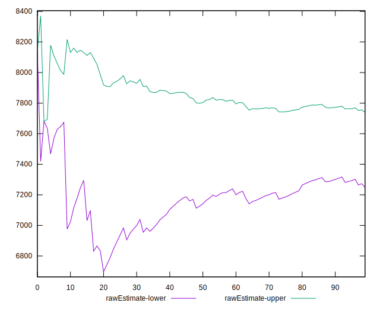

# //uses-text-compression/samples/pages+cached

[→ Parent](../..)


## Raw


```yaml
p90min: 4960
p90max: 8340
p90range: 3380
p90mean: 7493.404255319149
p90median: 7845
p90stdev: 867.4584461094221
p90skewness: -1.5685633906020646
p90eccentricity: 1.0000000000000002
p90discretization: 1.3623188405797102
outlandishness: 0.9834135713815702
confidence: 394.08691270024303
p90confidence: 350.7218633380829

```


## Score


```yaml
p90min: 0
p90max: 0
p90range: 0
p90mean: 0
p90median: 0
p90stdev: 0
p90skewness: .nan
p90eccentricity: .nan
p90discretization: 94
outlandishness: .inf
confidence: 0.005422976318195211
p90confidence: 0

```


## Raw Estimate


## Score Estimate


## P Score


```yaml
p90min: 0
p90max: 0.004705882352941171
p90range: 0.004705882352941171
p90mean: 0.00005006257822277841
p90median: 0
p90stdev: 0.00048278602057536674
p90skewness: 9.539955591519892
p90eccentricity: 0.9999999999999987
p90discretization: 47
outlandishness: 1485.3316000000027
confidence: 0.005421233307582207
p90confidence: 0.00019519507071398326

```


## Score Difference


```yaml
p90min: 0
p90max: 0
p90range: 0
p90mean: 0
p90median: 0
p90stdev: 0
p90skewness: .nan
p90eccentricity: .nan
p90discretization: 94
outlandishness: .nan
confidence: 0
p90confidence: 0

```


## P Score Difference


```yaml
p90min: 0
p90max: 0
p90range: 0
p90mean: 0
p90median: 0
p90stdev: 0
p90skewness: .nan
p90eccentricity: .nan
p90discretization: 94
outlandishness: .inf
confidence: 0.0002291383162295319
p90confidence: 0

```

