# //uses-text-compression/samples/pages

[→ Parent](../..)


## Raw


```yaml
p90min: 4050
p90max: 8120
p90range: 4070
p90mean: 7037.234042553191
p90median: 7665
p90stdev: 1278.2171795082559
p90skewness: -1.3035346340171552
p90eccentricity: 0.9999999999999997
p90discretization: 1.4461538461538461
outlandishness: 0.9832363827006239
confidence: 540.8548936903513
p90confidence: 516.7956032459167

```

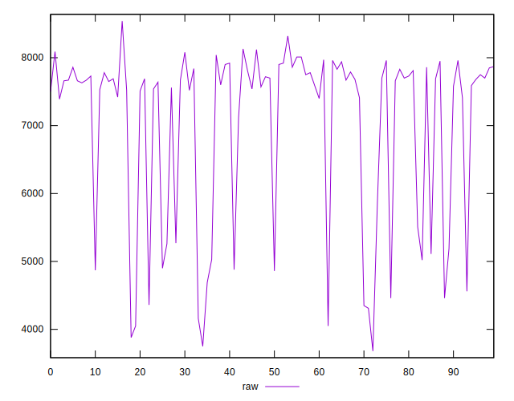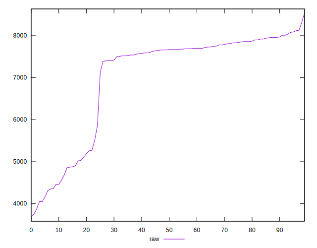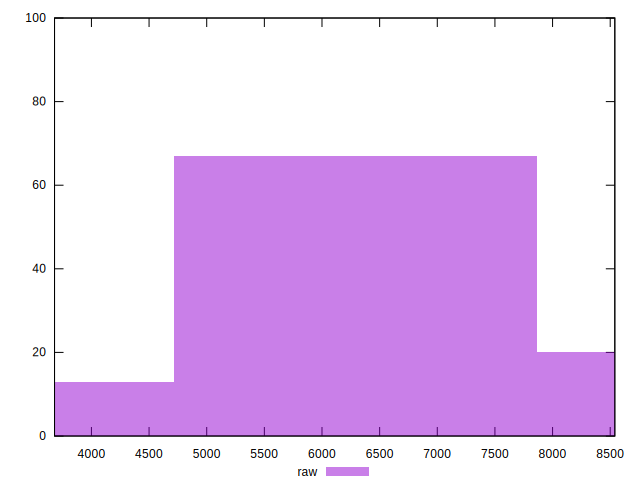
## Score


```yaml
p90min: 0
p90max: 0.11
p90range: 0.11
p90mean: 0.008829787234042553
p90median: 0
p90stdev: 0.024919290271079243
p90skewness: 2.9053732664743395
p90eccentricity: 1.0000000000000007
p90discretization: 10.444444444444445
outlandishness: 2.0687450137901013
confidence: 0.01326830476806659
p90confidence: 0.010075110751567959

```

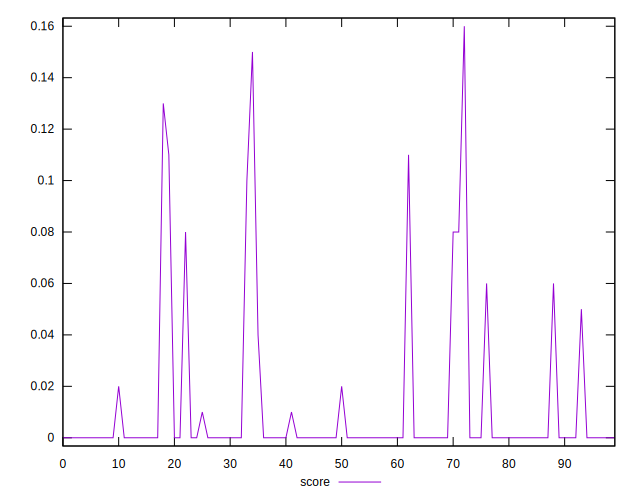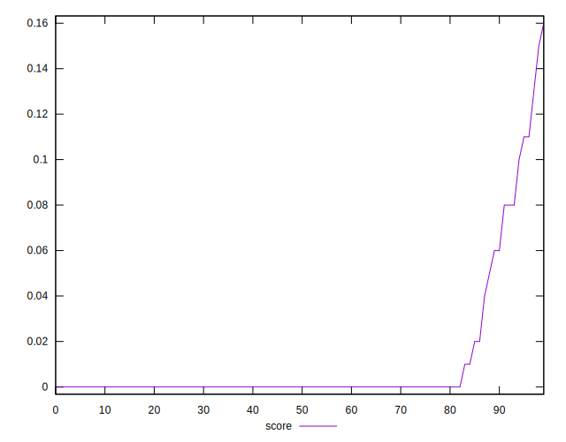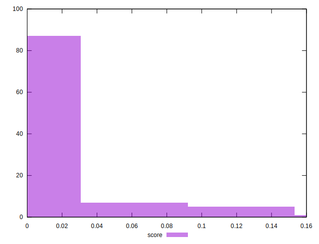
## Raw Estimate

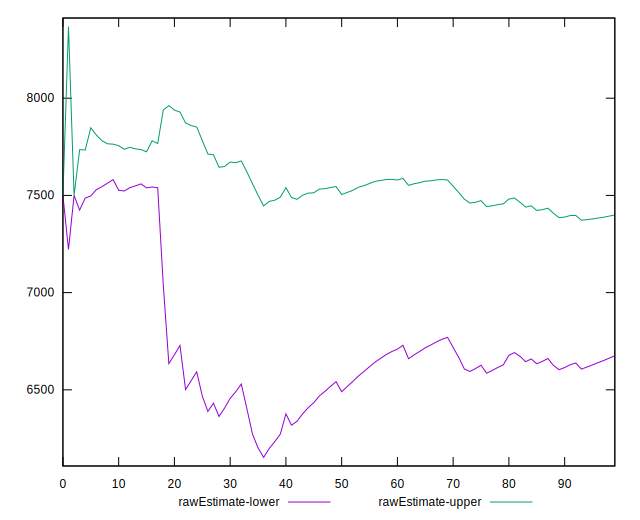
## Score Estimate


## P Score


```yaml
p90min: 0
p90max: 0.11176470588235293
p90range: 0.11176470588235293
p90mean: 0.00881101376720901
p90median: 0
p90stdev: 0.024942985671771938
p90skewness: 2.9262639870934906
p90eccentricity: 1.0000000000000016
p90discretization: 7.230769230769231
outlandishness: 2.0526260338649283
confidence: 0.01317405386447494
p90confidence: 0.010084691031892346

```

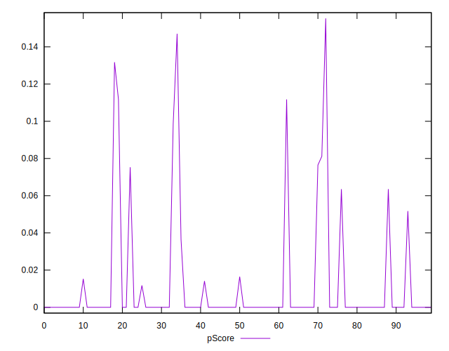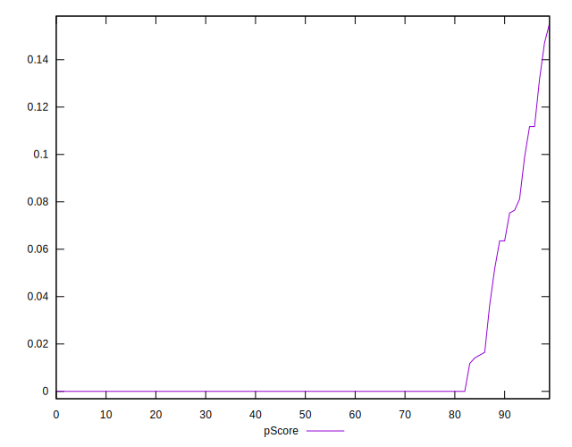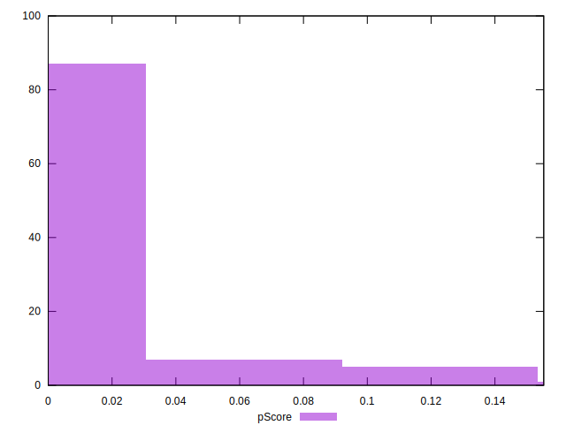
## Score Difference


```yaml
p90min: 0
p90max: 0
p90range: 0
p90mean: 0
p90median: 0
p90stdev: 0
p90skewness: .nan
p90eccentricity: .nan
p90discretization: 94
outlandishness: .nan
confidence: 0
p90confidence: 0

```


## P Score Difference


```yaml
p90min: -0.003529411764705913
p90max: 0.0017647058823529547
p90range: 0.0052941176470588675
p90mean: -0.000050062578222779095
p90median: 0
p90stdev: 0.0008259377197445023
p90skewness: -2.269846195689789
p90eccentricity: 1.0000000000000002
p90discretization: 9.4
outlandishness: 2.3332562500000313
confidence: 0.0005142126559296821
p90confidence: 0.0003339346309545983

```

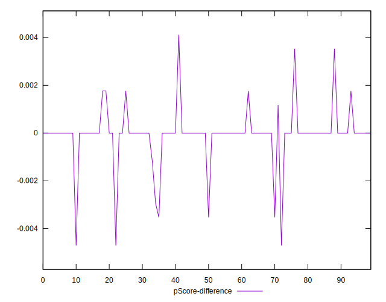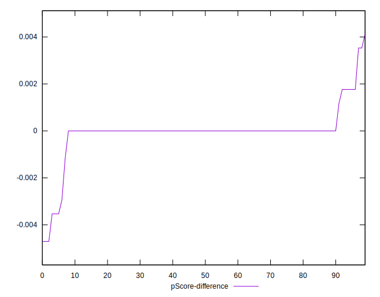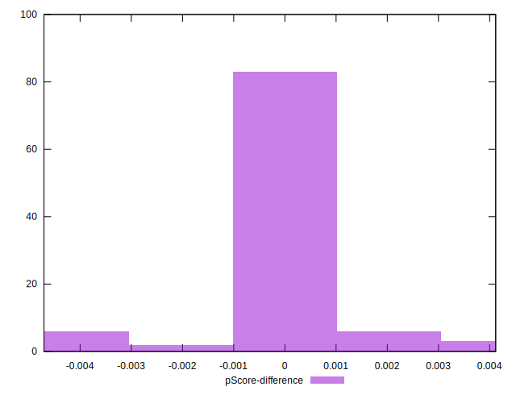