# //uses-webp-images/samples/pages+cached+noadtech

[→ Parent](../..)


## Raw


```yaml
p90min: 150
p90max: 470
p90range: 320
p90mean: 315.21276595744683
p90median: 300
p90stdev: 109.41555301366273
p90skewness: -0.09877994315132668
p90eccentricity: 1
p90discretization: 8.545454545454545
outlandishness: 1.0043651988656583
confidence: 49.59009451233779
p90confidence: 44.23776931705384

```

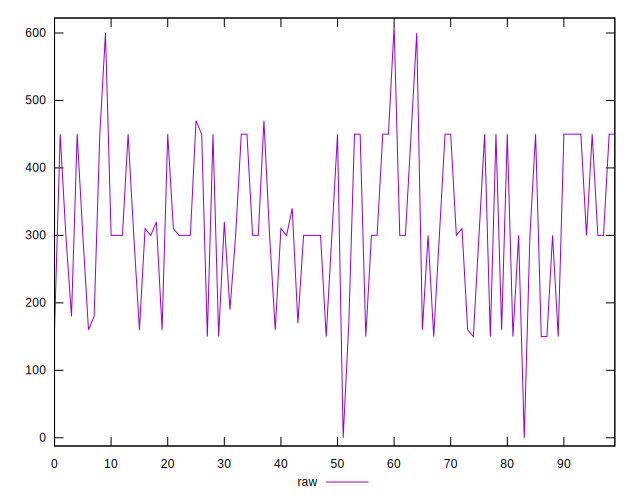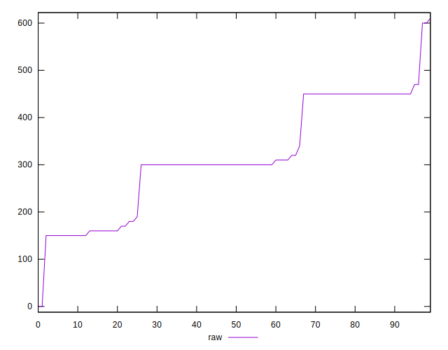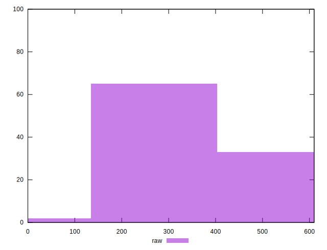
## Score


```yaml
p90min: 0.66
p90max: 0.88
p90range: 0.21999999999999997
p90mean: 0.7528723404255325
p90median: 0.75
p90stdev: 0.07523894335149889
p90skewness: 0.5192625110333478
p90eccentricity: 1.0000000000000018
p90discretization: 9.4
outlandishness: 1.002731833510904
confidence: 0.03417266763419155
p90confidence: 0.030419834547898972

```

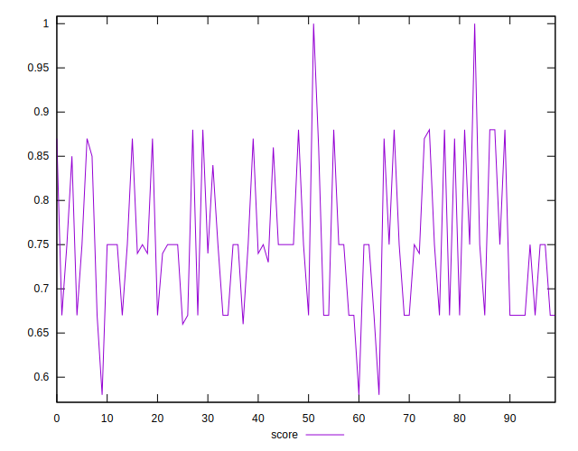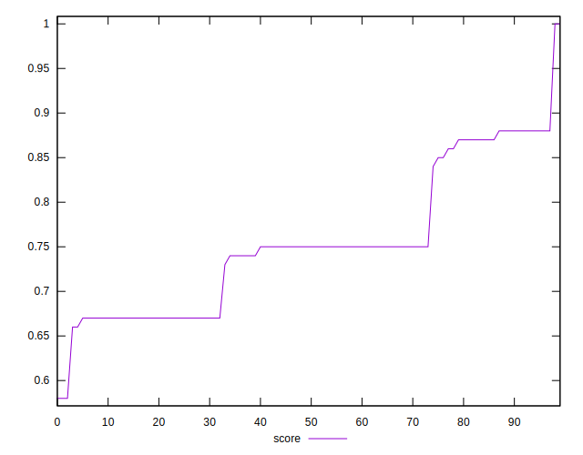
## Raw Estimate

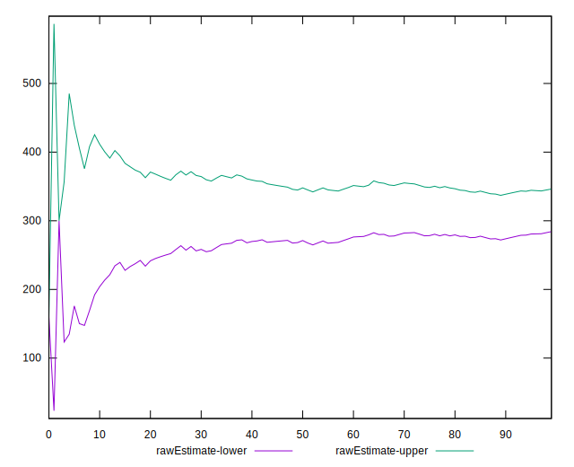
## Score Estimate

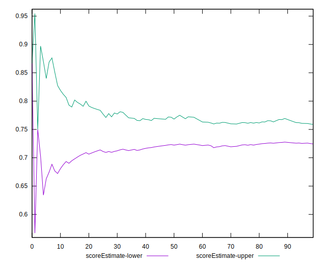
## P Score


```yaml
p90min: 0.6555555555555556
p90max: 0.875
p90range: 0.21944444444444444
p90mean: 0.7510933806146574
p90median: 0.75
p90stdev: 0.07509211802471864
p90skewness: 0.44987874959218077
p90eccentricity: 0.9999999999999992
p90discretization: 8.545454545454545
outlandishness: 1.0030081210201194
confidence: 0.03407202787095344
p90confidence: 0.03036047164420653

```

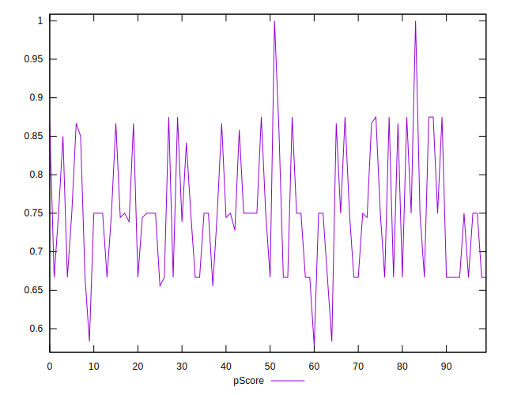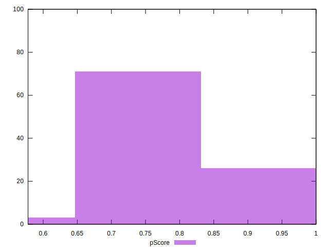
## Score Difference


```yaml
p90min: 0
p90max: 0
p90range: 0
p90mean: 0
p90median: 0
p90stdev: 0
p90skewness: .nan
p90eccentricity: .nan
p90discretization: 94
outlandishness: .nan
confidence: 0
p90confidence: 0

```


## P Score Difference


```yaml
p90min: -0.0050000000000000044
p90max: 0.004444444444444473
p90range: 0.009444444444444478
p90mean: -0.0017671394799054537
p90median: -0.0022222222222222365
p90stdev: 0.002084948571567802
p90skewness: 0.36224830414480336
p90eccentricity: 0.9999999999999992
p90discretization: 8.545454545454545
outlandishness: 0.901420055704074
confidence: 0.0009234121708056581
p90confidence: 0.0008429649296331767

```

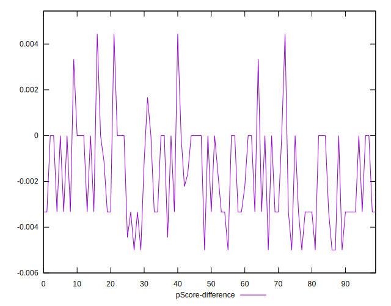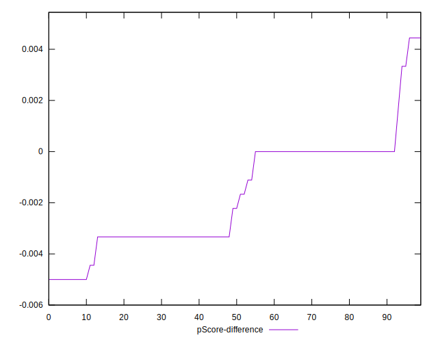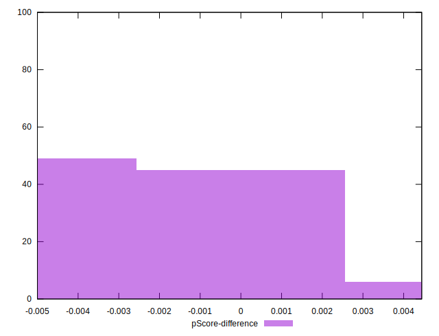