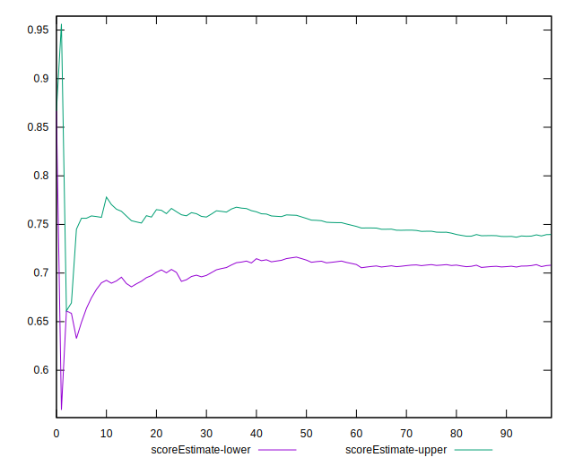
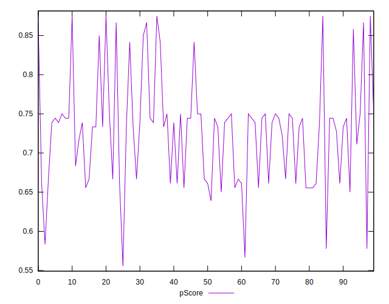

# //uses-webp-images/samples/pages+cached

[→ Parent](../..)


## Raw


```yaml
p90min: 150
p90max: 610
p90range: 460
p90mean: 347.02127659574467
p90median: 320
p90stdev: 100.26379872386904
p90skewness: 0.082334570183461
p90eccentricity: 0.9999999999999992
p90discretization: 4.476190476190476
outlandishness: 1.014917267939798
confidence: 44.72471186911541
p90confidence: 40.53762629380652

```


## Score


```yaml
p90min: 0.58
p90max: 0.88
p90range: 0.30000000000000004
p90mean: 0.7281914893617019
p90median: 0.74
p90stdev: 0.06444464499083358
p90skewness: 0.5421439950591215
p90eccentricity: 0.9999999999999989
p90discretization: 5.875
outlandishness: 0.9994741378142014
confidence: 0.028666441546220705
p90confidence: 0.026055595025580452

```


## Raw Estimate


## Score Estimate


## P Score


```yaml
p90min: 0.5777777777777777
p90max: 0.875
p90range: 0.2972222222222223
p90mean: 0.7284869976359339
p90median: 0.7388888888888889
p90stdev: 0.06453946713091269
p90skewness: 0.4543932607091188
p90eccentricity: 0.9999999999999991
p90discretization: 4.476190476190476
outlandishness: 0.9987396477374932
confidence: 0.028664396236062987
p90confidence: 0.026093932536504924

```


## Score Difference


```yaml
p90min: 0
p90max: 0
p90range: 0
p90mean: 0
p90median: 0
p90stdev: 0
p90skewness: .nan
p90eccentricity: .nan
p90discretization: 94
outlandishness: .inf
confidence: 4.330179641073933e-18
p90confidence: 0

```


## P Score Difference


```yaml
p90min: -0.0050000000000000044
p90max: 0.004444444444444473
p90range: 0.009444444444444478
p90mean: 0.00004728132387706532
p90median: 0
p90stdev: 0.0028977174318988784
p90skewness: -0.004272567652267674
p90eccentricity: 1
p90discretization: 5.875
outlandishness: 0.3451562499999896
confidence: 0.0011913539286926489
p90confidence: 0.0011715752630006935

```

