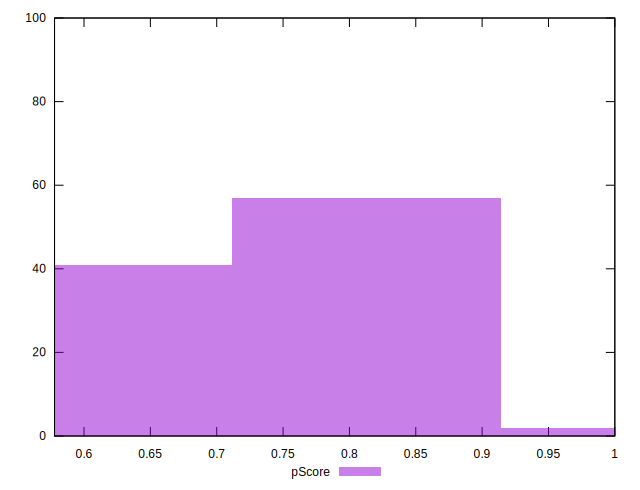

# //uses-webp-images/samples/pages

[→ Parent](../..)


## Raw


```yaml
p90min: 150
p90max: 600
p90range: 450
p90mean: 341.59574468085106
p90median: 310
p90stdev: 125.33617086289622
p90skewness: 0.04597765505281149
p90eccentricity: 0.9999999999999996
p90discretization: 4.7
outlandishness: 0.9941785375928145
confidence: 54.95683093279251
p90confidence: 50.67462952934391

```


## Score


```yaml
p90min: 0.58
p90max: 0.88
p90range: 0.30000000000000004
p90mean: 0.7365957446808509
p90median: 0.74
p90stdev: 0.08376198791928309
p90skewness: 0.34417948420090133
p90eccentricity: 1.0000000000000007
p90discretization: 5.529411764705882
outlandishness: 1.0057216213350122
confidence: 0.037082829362725916
p90confidence: 0.033865784132612264

```


## Raw Estimate


## Score Estimate


## P Score


```yaml
p90min: 0.5833333333333334
p90max: 0.875
p90range: 0.29166666666666663
p90mean: 0.7354609929078015
p90median: 0.7444444444444445
p90stdev: 0.08259466308878806
p90skewness: 0.32775402523273967
p90eccentricity: 1.0000000000000002
p90discretization: 4.7
outlandishness: 1.005931302046734
confidence: 0.03673068822822178
p90confidence: 0.033393823381629634

```


## Score Difference


```yaml
p90min: 0
p90max: 1.1102230246251565e-16
p90range: 1.1102230246251565e-16
p90mean: 1.1810883240693154e-18
p90median: 0
p90stdev: 1.139000331521095e-17
p90skewness: 9.539955591519904
p90eccentricity: 1.0000000000000002
p90discretization: 47
outlandishness: 14.137600000000003
confidence: 8.528132291650275e-18
p90confidence: 4.605088813249998e-18

```


## P Score Difference


```yaml
p90min: -0.0050000000000000044
p90max: 0.004444444444444473
p90range: 0.009444444444444478
p90mean: -0.0011111111111111241
p90median: 0
p90stdev: 0.002479228126659381
p90skewness: 0.11706956779055111
p90eccentricity: 1.0000000000000002
p90discretization: 7.230769230769231
outlandishness: 0.9120249999999984
confidence: 0.001048528152629871
p90confidence: 0.0010023759779180024

```

