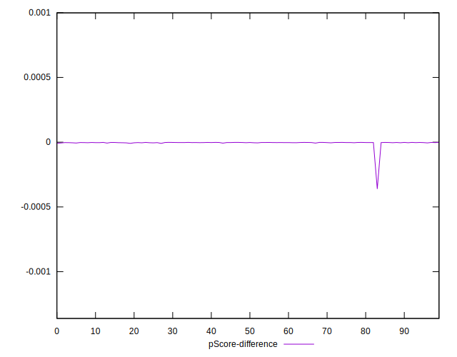
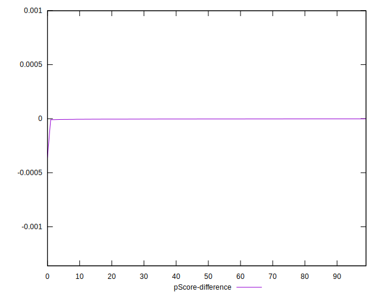

# //bootup-time/samples/pages+cached+noadtech+nomedia+nocss

[→ Parent](../..)


## Raw


```yaml
p90min: 91.024
p90max: 119.41600000000003
p90range: 28.392000000000024
p90mean: 100.65804255319149
p90median: 99.90599999999998
p90stdev: 6.7293743566717845
p90skewness: 0.630847517354741
p90eccentricity: 0.9999999999999997
p90discretization: 1
outlandishness: 1.0316050418401774
confidence: 6.412285185244517
p90confidence: 2.720751321353474

```


## Score


```yaml
p90min: 1
p90max: 1
p90range: 0
p90mean: 1
p90median: 1
p90stdev: 0
p90skewness: .nan
p90eccentricity: .nan
p90discretization: 94
outlandishness: 1
confidence: 0
p90confidence: 0

```


## Raw Estimate


## Score Estimate


## P Score


```yaml
p90min: 0.9999918404330272
p90max: 0.9999983914035677
p90range: 0.000006550970540475376
p90mean: 0.9999968217289166
p90median: 0.9999971559348921
p90stdev: 0.0000013916316202265858
p90skewness: -1.3718935357430961
p90eccentricity: 0.9999999999999999
p90discretization: 1
outlandishness: 0.999992701875163
confidence: 0.000013968145126526213
p90confidence: 5.626501616476245e-7

```


## Score Difference


```yaml
p90min: 0
p90max: 0
p90range: 0
p90mean: 0
p90median: 0
p90stdev: 0
p90skewness: .nan
p90eccentricity: .nan
p90discretization: 94
outlandishness: .nan
confidence: 0
p90confidence: 0

```


## P Score Difference


```yaml
p90min: -0.000008159566972754106
p90max: -0.0000016085964322787305
p90range: 0.000006550970540475376
p90mean: -0.000003178271083238261
p90median: -0.00000284406510786539
p90stdev: 0.0000013916316202265856
p90skewness: -1.371893535908595
p90eccentricity: 0.9999999999999999
p90discretization: 1
outlandishness: 4.614447763072273
confidence: 0.000013968145126526208
p90confidence: 5.626501616476244e-7

```

