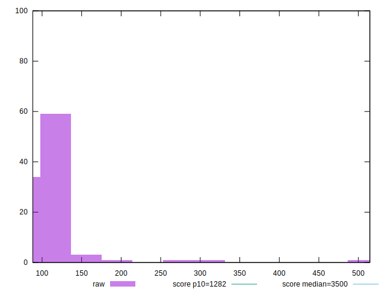
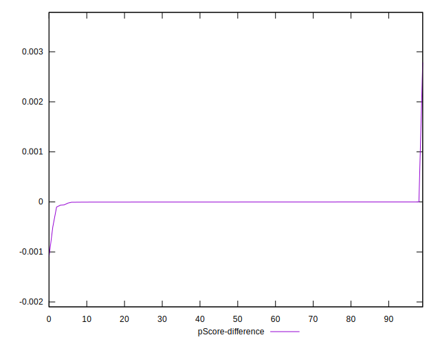

# //bootup-time/samples/pages+cached+noadtech+nomedia

[→ Parent](../..)


## Raw


```yaml
p90min: 89.51600000000002
p90max: 191.156
p90range: 101.63999999999999
p90mean: 102.66604255319149
p90median: 100.354
p90stdev: 15.829202743270143
p90skewness: 3.8596333580593205
p90eccentricity: 1.0000000000000002
p90discretization: 1
outlandishness: 1.151213125327032
confidence: 20.01981782892493
p90confidence: 6.399900198303802

```


## Score


```yaml
p90min: 1
p90max: 1
p90range: 0
p90mean: 1
p90median: 1
p90stdev: 0
p90skewness: .nan
p90eccentricity: .nan
p90discretization: 94
outlandishness: 0.9998000100000003
confidence: 0.0003900279083597584
p90confidence: 0

```


## Raw Estimate


## Score Estimate


## P Score


```yaml
p90min: 0.9998963047365461
p90max: 0.9999985498385066
p90range: 0.0001022451019604409
p90mean: 0.9999944892800389
p90median: 0.9999970779519076
p90stdev: 0.000013512595801251031
p90skewness: -5.693740226540853
p90eccentricity: 1
p90discretization: 1
outlandishness: 0.9998243556348868
confidence: 0.0002843812192941798
p90confidence: 0.0000054632735426168355

```


## Score Difference


```yaml
p90min: 0
p90max: 0
p90range: 0
p90mean: 0
p90median: 0
p90stdev: 0
p90skewness: .nan
p90eccentricity: .nan
p90discretization: 94
outlandishness: .nan
confidence: 0
p90confidence: 0

```


## P Score Difference


```yaml
p90min: -0.00006477205790744733
p90max: -0.0000014481474146510465
p90range: 0.00006332391049279629
p90mean: -0.000004422984684009652
p90median: -0.0000028798217565628725
p90stdev: 0.000008889729417402237
p90skewness: -6.031174125340211
p90eccentricity: 1.0000000000000002
p90discretization: 1
outlandishness: 2.269881734951293
confidence: 0.0001191420643837735
p90confidence: 0.0000035942038259310443

```

