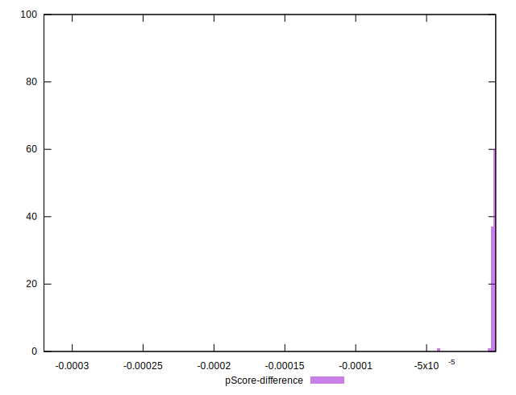

# //bootup-time/samples/pages+cached+noadtech

[→ Parent](../..)


## Raw


```yaml
p90min: 89.344
p90max: 107.98000000000002
p90range: 18.636000000000024
p90mean: 98.38527659574468
p90median: 98.49600000000001
p90stdev: 4.733531818493067
p90skewness: -0.06010973797497009
p90eccentricity: 0.9999999999999996
p90discretization: 1
outlandishness: 1.0392097037452248
confidence: 6.376061266039838
p90confidence: 1.9138128252688422

```


## Score


```yaml
p90min: 1
p90max: 1
p90range: 0
p90mean: 1
p90median: 1
p90stdev: 0
p90skewness: .nan
p90eccentricity: .nan
p90discretization: 94
outlandishness: 1
confidence: 0
p90confidence: 0

```


## Raw Estimate


## Score Estimate


## P Score


```yaml
p90min: 0.9999954709082937
p90max: 0.9999985670866796
p90range: 0.0000030961783858973746
p90mean: 0.9999973207559575
p90median: 0.9999973906118104
p90stdev: 7.669798811545453e-7
p90skewness: -0.29765999501862234
p90eccentricity: 1.0000000000000004
p90discretization: 1.0217391304347827
outlandishness: 0.9999928837141888
confidence: 0.000012456217198106401
p90confidence: 3.100974049740384e-7

```


## Score Difference


```yaml
p90min: 0
p90max: 0
p90range: 0
p90mean: 0
p90median: 0
p90stdev: 0
p90skewness: .nan
p90eccentricity: .nan
p90discretization: 94
outlandishness: .nan
confidence: 0
p90confidence: 0

```


## P Score Difference


```yaml
p90min: -0.000004529091706340083
p90max: -0.000001432913320442708
p90range: 0.0000030961783858973746
p90mean: -0.000002679244042672117
p90median: -0.0000026093881896338544
p90stdev: 7.669798811545453e-7
p90skewness: -0.29765999483383143
p90eccentricity: 0.9999999999999997
p90discretization: 1.0217391304347827
outlandishness: 5.419764061950824
confidence: 0.000012456217198106401
p90confidence: 3.100974049740384e-7

```

