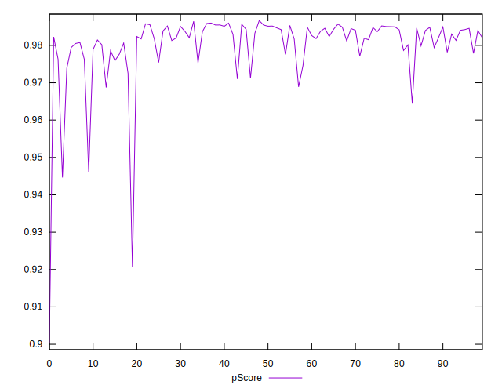
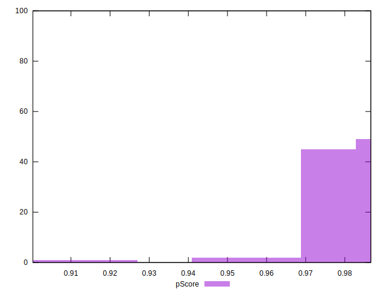

# //bootup-time/samples/pages+cached

[→ Parent](../..)


## Raw


```yaml
p90min: 626.1280000000004
p90max: 991.9320000000002
p90range: 365.80399999999986
p90mean: 683.3588510638298
p90median: 670.6720000000005
p90stdev: 57.71191073385359
p90skewness: 2.2640450908363507
p90eccentricity: 0.9999999999999999
p90discretization: 1
outlandishness: 1.0355628719299321
confidence: 39.11834940156908
p90confidence: 23.333485263944326

```


## Score


```yaml
p90min: 0.95
p90max: 0.99
p90range: 0.040000000000000036
p90mean: 0.9806382978723408
p90median: 0.98
p90stdev: 0.006325986700986604
p90skewness: -1.3122826548490447
p90eccentricity: 0.9999999999999994
p90discretization: 18.8
outlandishness: 0.996865120738567
confidence: 0.004898969088305073
p90confidence: 0.0025576577796581736

```


## Raw Estimate


## Score Estimate


## P Score


```yaml
p90min: 0.946178352872144
p90max: 0.9859529793648053
p90range: 0.03977462649266128
p90mean: 0.9811038465644528
p90median: 0.9824962256007896
p90stdev: 0.005665031456823679
p90skewness: -3.0961814772708713
p90eccentricity: 0.9999999999999999
p90discretization: 1
outlandishness: 0.9967004589251319
confidence: 0.004696442248398115
p90confidence: 0.002290427163764605

```


## Score Difference


```yaml
p90min: 0
p90max: 0
p90range: 0
p90mean: 0
p90median: 0
p90stdev: 0
p90skewness: .nan
p90eccentricity: .nan
p90discretization: 94
outlandishness: .inf
confidence: 6.092792000602812e-18
p90confidence: 0

```


## P Score Difference


```yaml
p90min: -0.0048891338676106955
p90max: 0.004849004083023245
p90range: 0.00973813795063394
p90mean: 0.00040976741928930245
p90median: 0.0012418249974043283
p90stdev: 0.0033476478764407677
p90skewness: -0.3035950194307325
p90eccentricity: 1
p90discretization: 1
outlandishness: 0.8777902328530643
confidence: 0.0013584979499066858
p90confidence: 0.001353486505654452

```

