# //bootup-time/samples/pages

[→ Parent](../..)


## Raw


```yaml
p90min: 628.7200000000005
p90max: 963.4600000000003
p90range: 334.7399999999998
p90mean: 696.4922978723406
p90median: 671.7180000000001
p90stdev: 67.91644661842201
p90skewness: 1.8988813731967986
p90eccentricity: 0.9999999999999999
p90discretization: 1
outlandishness: 1.046594624381725
confidence: 50.597890168168185
p90confidence: 27.45927809700496

```

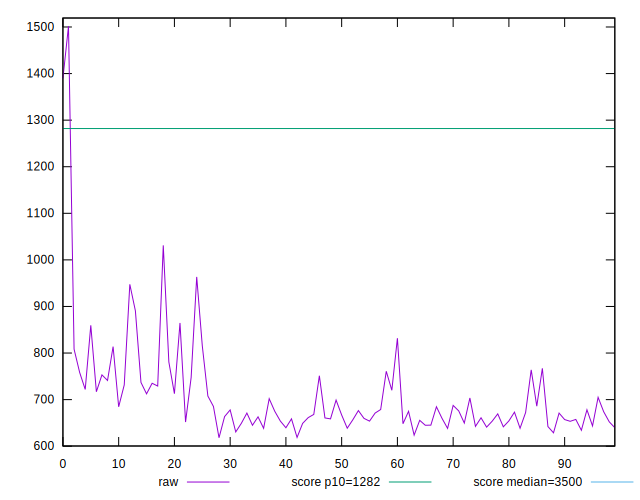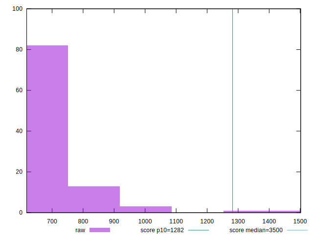
## Score


```yaml
p90min: 0.95
p90max: 0.99
p90range: 0.040000000000000036
p90mean: 0.9785106382978724
p90median: 0.98
p90stdev: 0.006835054640088947
p90skewness: -2.0011915134817495
p90eccentricity: 0.9999999999999974
p90discretization: 18.8
outlandishness: 0.9954867303654366
confidence: 0.006736233975565823
p90confidence: 0.0027634788849438675

```

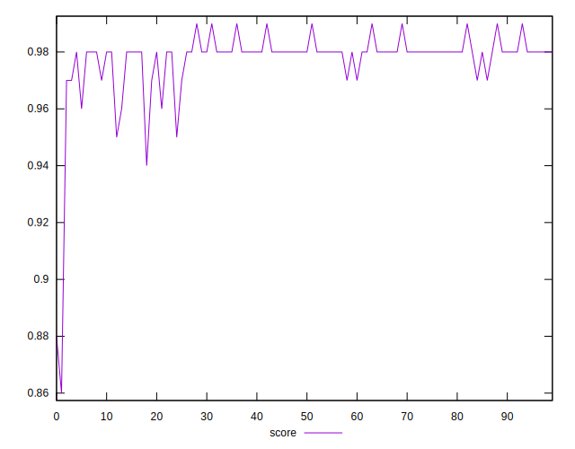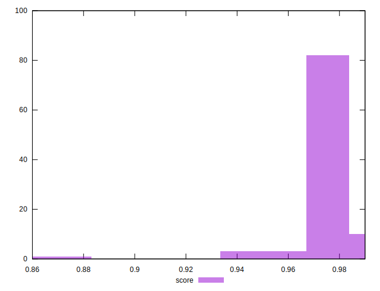
## Raw Estimate

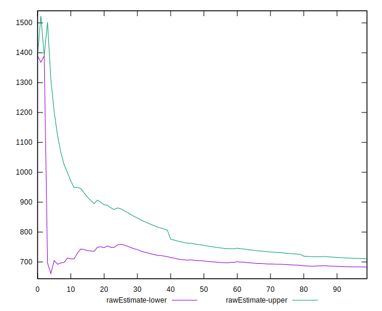
## Score Estimate

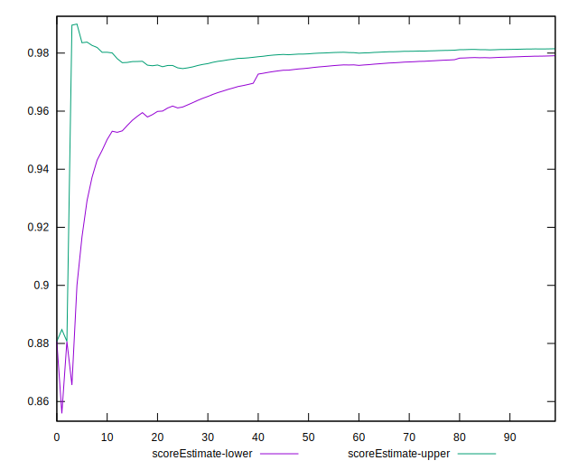
## P Score


```yaml
p90min: 0.9501221240441274
p90max: 0.9857632187276792
p90range: 0.03564109468355181
p90mean: 0.9798470007534664
p90median: 0.9824102842444085
p90stdev: 0.006821233611836423
p90skewness: -2.3120567674395747
p90eccentricity: 1.0000000000000002
p90discretization: 1
outlandishness: 0.9951319112914773
confidence: 0.006754799930153156
p90confidence: 0.00275789090916968

```

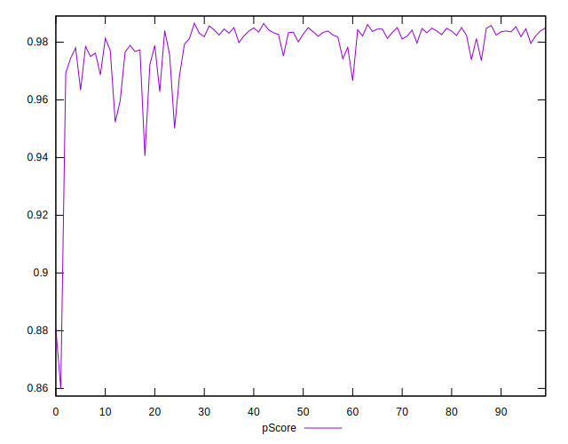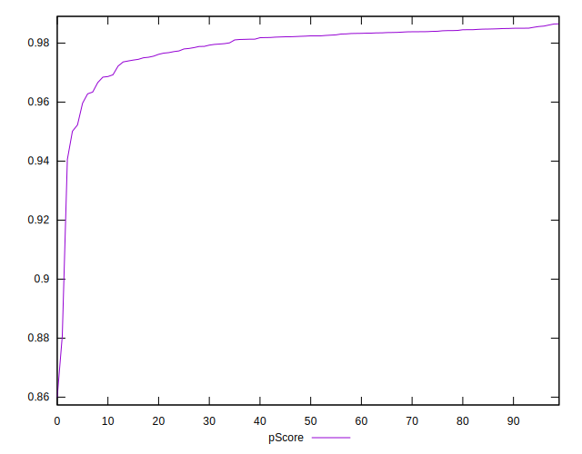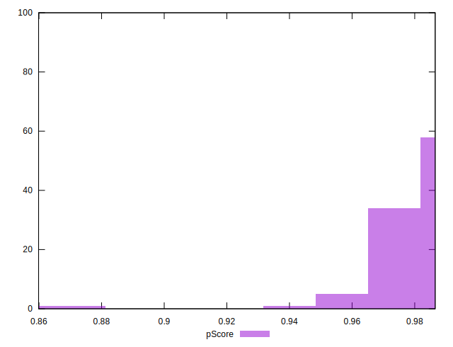
## Score Difference


```yaml
p90min: 0
p90max: 0
p90range: 0
p90mean: 0
p90median: 0
p90stdev: 0
p90skewness: .nan
p90eccentricity: .nan
p90discretization: 94
outlandishness: .inf
confidence: 7.423946114831068e-18
p90confidence: 0

```

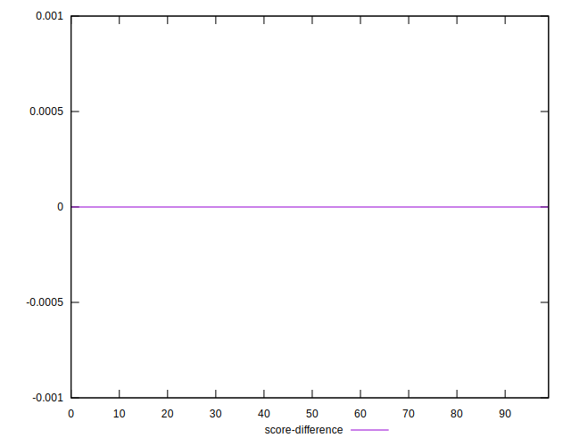
## P Score Difference


```yaml
p90min: -0.004956402988281705
p90max: 0.004801511352729437
p90range: 0.009757914341011142
p90mean: 0.001234901646675258
p90median: 0.002207559456353758
p90stdev: 0.0029106254053980108
p90skewness: -0.7342096366246242
p90eccentricity: 0.9999999999999997
p90discretization: 1
outlandishness: 0.8810023906610117
confidence: 0.0012094563790796256
p90confidence: 0.0011767940818822645

```

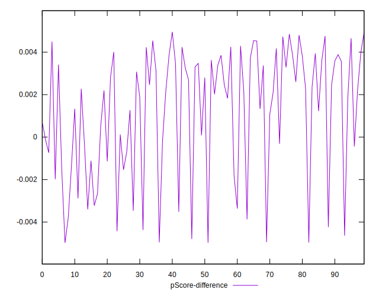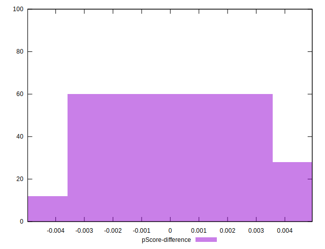