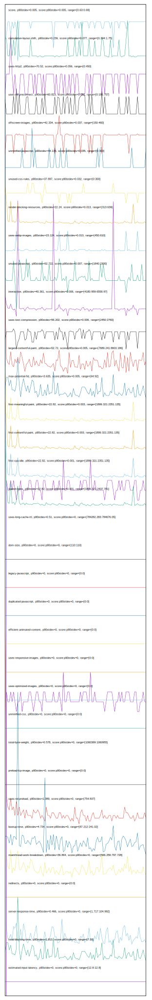

# //correlation/pages+cached+noadtech

[→ Parent](../..)

[0. score, p90stdev=0.005, score:p90stdev=0.005, range=[0.63:0.69]](../../meta/score/samples/pages+cached+noadtech)  
[1. cumulative-layout-shift, p90stdev=0.239, score:p90stdev=0.077, range=[0.394:1.75]](../../cumulative-layout-shift/samples/pages+cached+noadtech/)  
[2. uses-http2, p90stdev=70.52, score:p90stdev=0.056, range=[0:450]](../../uses-http2/samples/pages+cached+noadtech/)  
[3. uses-rel-preconnect, p90stdev=60.823, score:p90stdev=0.051, range=[0:195.757]](../../uses-rel-preconnect/samples/pages+cached+noadtech/)  
[4. offscreen-images, p90stdev=42.334, score:p90stdev=0.037, range=[150:460]](../../offscreen-images/samples/pages+cached+noadtech/)  
[5. unminified-javascript, p90stdev=44.136, score:p90stdev=0.035, range=[0:300]](../../unminified-javascript/samples/pages+cached+noadtech/)  
[6. unused-css-rules, p90stdev=37.897, score:p90stdev=0.032, range=[0:300]](../../unused-css-rules/samples/pages+cached+noadtech/)  
[7. render-blocking-resources, p90stdev=22.24, score:p90stdev=0.013, range=[313:639]](../../render-blocking-resources/samples/pages+cached+noadtech/)  
[8. uses-webp-images, p90stdev=23.124, score:p90stdev=0.013, range=[450:610]](../../uses-webp-images/samples/pages+cached+noadtech/)  
[9. unused-javascript, p90stdev=52.722, score:p90stdev=0.007, range=[1840:2300]](../../unused-javascript/samples/pages+cached+noadtech/)  
[10. interactive, p90stdev=40.361, score:p90stdev=0.006, range=[4180.959:6558.97]](../../interactive/samples/pages+cached+noadtech/)  
[11. uses-text-compression, p90stdev=56.202, score:p90stdev=0.006, range=[2450:2760]](../../uses-text-compression/samples/pages+cached+noadtech/)  
[12. largest-contentful-paint, p90stdev=52.72, score:p90stdev=0.005, range=[7689.241:8603.186]](../../largest-contentful-paint/samples/pages+cached+noadtech/)  
[13. max-potential-fid, p90stdev=3.635, score:p90stdev=0.005, range=[64:92]](../../max-potential-fid/samples/pages+cached+noadtech/)  
[14. first-meaningful-paint, p90stdev=22.82, score:p90stdev=0.003, range=[1899.321:2351.135]](../../first-meaningful-paint/samples/pages+cached+noadtech/)  
[15. first-contentful-paint, p90stdev=22.82, score:p90stdev=0.003, range=[1899.321:2351.135]](../../first-contentful-paint/samples/pages+cached+noadtech/)  
[16. first-cpu-idle, p90stdev=22.82, score:p90stdev=0.001, range=[1899.321:2351.135]](../../first-cpu-idle/samples/pages+cached+noadtech/)  
[17. speed-index, p90stdev=22.82, score:p90stdev=0.001, range=[1899.321:2437.781]](../../speed-index/samples/pages+cached+noadtech/)  
[18. uses-long-cache-ttl, p90stdev=0.51, score:p90stdev=0, range=[784282.283:784676.05]](../../uses-long-cache-ttl/samples/pages+cached+noadtech/)  
[19. uses-passive-event-listeners, p90stdev=NaN, score:p90stdev=0, range=[NaN:NaN]](../../uses-passive-event-listeners/samples/pages+cached+noadtech/)  
[20. no-document-write, p90stdev=NaN, score:p90stdev=0, range=[NaN:NaN]](../../no-document-write/samples/pages+cached+noadtech/)  
[21. dom-size, p90stdev=0, score:p90stdev=0, range=[110:110]](../../dom-size/samples/pages+cached+noadtech/)  
[22. legacy-javascript, p90stdev=0, score:p90stdev=0, range=[0:0]](../../legacy-javascript/samples/pages+cached+noadtech/)  
[23. duplicated-javascript, p90stdev=0, score:p90stdev=0, range=[0:0]](../../duplicated-javascript/samples/pages+cached+noadtech/)  
[24. efficient-animated-content, p90stdev=0, score:p90stdev=0, range=[0:0]](../../efficient-animated-content/samples/pages+cached+noadtech/)  
[25. uses-responsive-images, p90stdev=0, score:p90stdev=0, range=[0:0]](../../uses-responsive-images/samples/pages+cached+noadtech/)  
[26. uses-optimized-images, p90stdev=0, score:p90stdev=0, range=[0:0]](../../uses-optimized-images/samples/pages+cached+noadtech/)  
[27. unminified-css, p90stdev=0, score:p90stdev=0, range=[0:0]](../../unminified-css/samples/pages+cached+noadtech/)  
[28. total-byte-weight, p90stdev=0.578, score:p90stdev=0, range=[1060369:1060955]](../../total-byte-weight/samples/pages+cached+noadtech/)  
[29. preload-lcp-image, p90stdev=0, score:p90stdev=0, range=[0:0]](../../preload-lcp-image/samples/pages+cached+noadtech/)  
[30. unsized-images, p90stdev=NaN, score:p90stdev=0, range=[NaN:NaN]](../../unsized-images/samples/pages+cached+noadtech/)  
[31. third-party-summary, p90stdev=NaN, score:p90stdev=0, range=[NaN:NaN]](../../third-party-summary/samples/pages+cached+noadtech/)  
[32. font-display, p90stdev=NaN, score:p90stdev=0, range=[NaN:NaN]](../../font-display/samples/pages+cached+noadtech/)  
[33. uses-rel-preload, p90stdev=1.389, score:p90stdev=0, range=[754:837]](../../uses-rel-preload/samples/pages+cached+noadtech/)  
[34. bootup-time, p90stdev=4.734, score:p90stdev=0, range=[87.212:241.02]](../../bootup-time/samples/pages+cached+noadtech/)  
[35. mainthread-work-breakdown, p90stdev=36.864, score:p90stdev=0, range=[566.256:797.728]](../../mainthread-work-breakdown/samples/pages+cached+noadtech/)  
[36. redirects, p90stdev=0, score:p90stdev=0, range=[0:0]](../../redirects/samples/pages+cached+noadtech/)  
[37. server-response-time, p90stdev=0.466, score:p90stdev=0, range=[1.717:104.992]](../../server-response-time/samples/pages+cached+noadtech/)  
[38. total-blocking-time, p90stdev=1.913, score:p90stdev=0, range=[7:33]](../../total-blocking-time/samples/pages+cached+noadtech/)  
[39. estimated-input-latency, p90stdev=0, score:p90stdev=0, range=[12.8:12.8]](../../estimated-input-latency/samples/pages+cached+noadtech/)  
