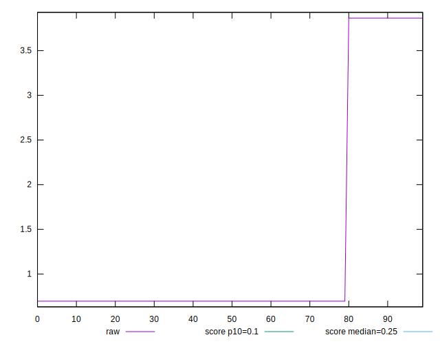
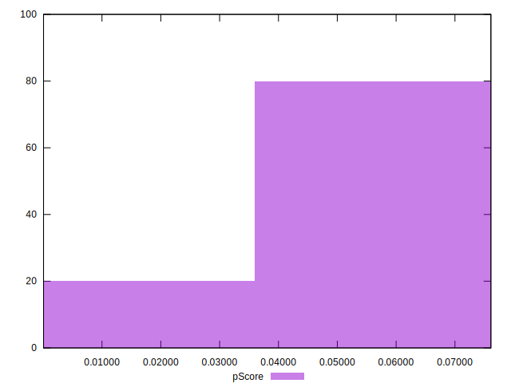

# //cumulative-layout-shift/samples/pages+cached+noadtech+nomedia+nocss

[→ Parent](../..)


## Raw


```yaml
p90min: 0.6958385416666666
p90max: 3.864670138888889
p90range: 3.1688315972222227
p90mean: 1.268925107121747
p90median: 0.6958385416666666
p90stdev: 1.2196665958582795
p90skewness: 1.6583699784683552
p90eccentricity: 1.0000000000000016
p90discretization: 47
outlandishness: 1.0979263483863428
confidence: 0.4968636642902478
p90confidence: 0.493123034387602

```


## Score


```yaml
p90min: 0
p90max: 0.08
p90range: 0.08
p90mean: 0.06553191489361707
p90median: 0.08
p90stdev: 0.030791578749149864
p90skewness: -1.6583699784683477
p90eccentricity: 1.0000000000000002
p90discretization: 47
outlandishness: 0.9537932197672457
confidence: 0.012543769501056332
p90confidence: 0.012449333939231626

```


## Raw Estimate


## Score Estimate


## P Score


```yaml
p90min: 0.00006417586681428666
p90max: 0.07611248195409825
p90range: 0.07604830608728397
p90mean: 0.062359064895759625
p90median: 0.07611248195409825
p90stdev: 0.029270592570325736
p90skewness: -1.6583699784683357
p90eccentricity: 0.999999999999998
p90discretization: 47
outlandishness: 0.9538402109514164
confidence: 0.011924155281308376
p90confidence: 0.01183438447491875

```


## Score Difference


```yaml
p90min: 0
p90max: 0
p90range: 0
p90mean: 0
p90median: 0
p90stdev: 0
p90skewness: .nan
p90eccentricity: .nan
p90discretization: 94
outlandishness: .nan
confidence: 0
p90confidence: 0

```


## P Score Difference


```yaml
p90min: -0.003887518045901747
p90max: 0.00006417586681428666
p90range: 0.003951693912716034
p90mean: -0.0031728499978573646
p90median: -0.003887518045901747
p90stdev: 0.0015209861788241488
p90skewness: 1.6583699784683583
p90eccentricity: 1
p90discretization: 47
outlandishness: 0.9528698918858508
confidence: 0.000619614219747968
p90confidence: 0.0006149494643128843

```

