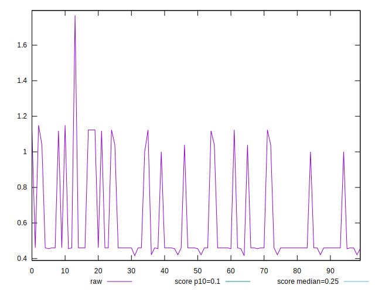
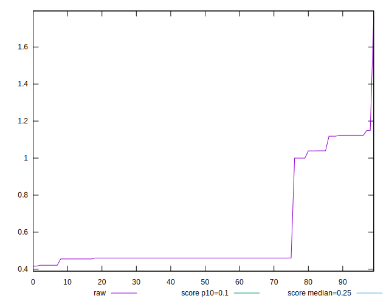
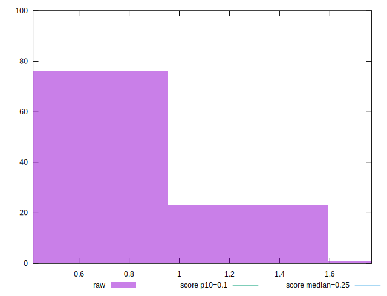
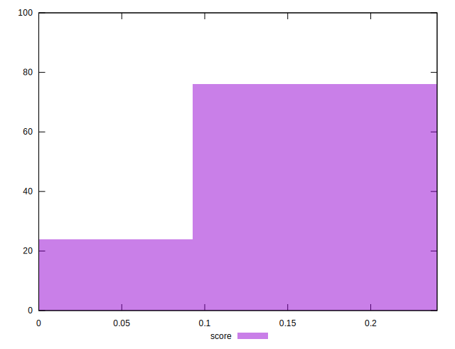
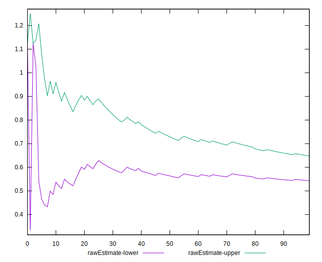
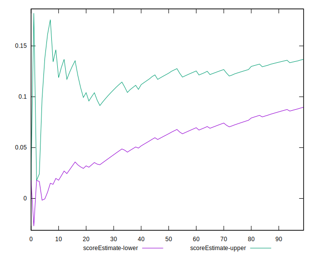
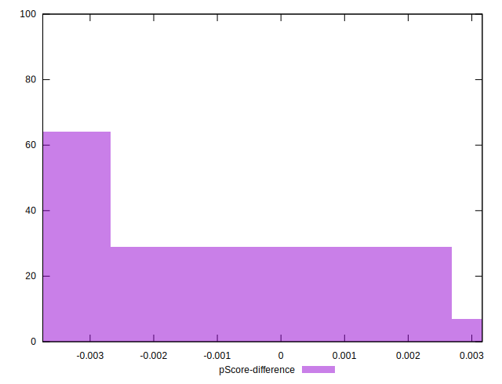

# //cumulative-layout-shift/samples/pages+cached+noadtech+nomedia

[→ Parent](../..)


## Raw


```yaml
p90min: 0.4215234375
p90max: 1.1234112548828126
p90range: 0.7018878173828126
p90mean: 0.5951906915759372
p90median: 0.460498046875
p90stdev: 0.2586791737843603
p90skewness: 1.3544876690838168
p90eccentricity: 0.9999999999999997
p90discretization: 11.75
outlandishness: 1.0596768500911704
confidence: 0.11322417034496032
p90confidence: 0.10458649891912233

```


## Score


```yaml
p90min: 0.02
p90max: 0.23
p90range: 0.21000000000000002
p90mean: 0.16180851063829765
p90median: 0.2
p90stdev: 0.07535677927624151
p90skewness: -1.299336496863328
p90eccentricity: 0.9999999999999983
p90discretization: 23.5
outlandishness: 0.9728884625110387
confidence: 0.03078039665435694
p90confidence: 0.03046747675517617

```


## Raw Estimate


## Score Estimate


## P Score


```yaml
p90min: 0.01779099174547588
p90max: 0.2324919951492026
p90range: 0.21470100340372672
p90mean: 0.1596315521014961
p90median: 0.19645555020220185
p90stdev: 0.07481437490587488
p90skewness: -1.2843872519448423
p90eccentricity: 0.9999999999999971
p90discretization: 11.75
outlandishness: 0.9733829785971857
confidence: 0.03058305315866807
p90confidence: 0.030248177407396562

```


## Score Difference


```yaml
p90min: 0
p90max: 0
p90range: 0
p90mean: 0
p90median: 0
p90stdev: 0
p90skewness: .nan
p90eccentricity: .nan
p90discretization: 94
outlandishness: .nan
confidence: 0
p90confidence: 0

```


## P Score Difference


```yaml
p90min: -0.0037440818712487223
p90max: 0.0031284075684879405
p90range: 0.006872489439736663
p90mean: -0.0022232305400554852
p90median: -0.003544449797798166
p90stdev: 0.002180501060832116
p90skewness: 1.4119207904556692
p90eccentricity: 1.0000000000000007
p90discretization: 9.4
outlandishness: 0.8983727817259577
confidence: 0.0009105686457408993
p90confidence: 0.0008815977278169702

```

