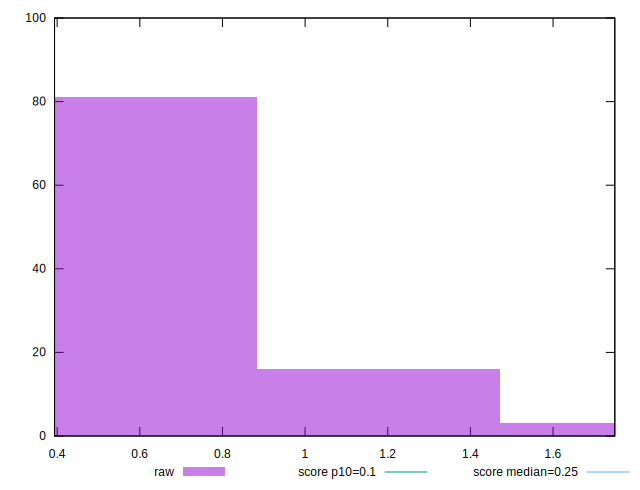
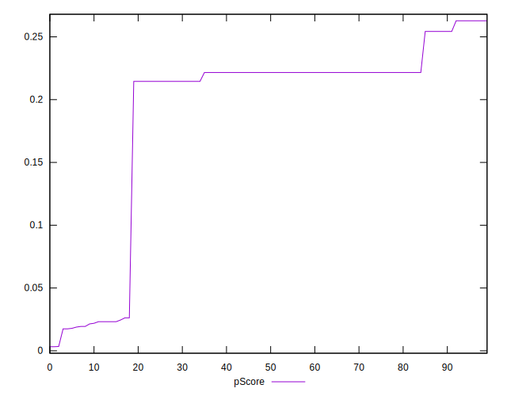

# //cumulative-layout-shift/samples/pages+cached+noadtech

[→ Parent](../..)


## Raw


```yaml
p90min: 0.39359130859374997
p90max: 1.1292220058441163
p90range: 0.7356306972503663
p90mean: 0.5367675823658071
p90median: 0.43256591796875
p90stdev: 0.23940708412700637
p90skewness: 1.7654879075602907
p90eccentricity: 0.9999999999999984
p90discretization: 7.230769230769231
outlandishness: 1.1222875671837749
confidence: 0.12213914677784157
p90confidence: 0.09679460614851099

```


## Score


```yaml
p90min: 0.02
p90max: 0.26
p90range: 0.24000000000000002
p90mean: 0.18882978723404267
p90median: 0.22
p90stdev: 0.07696167024687531
p90skewness: -1.640936966900597
p90eccentricity: 1.0000000000000007
p90discretization: 15.666666666666666
outlandishness: 0.9629635111763536
confidence: 0.0322696270177083
p90confidence: 0.03111634974061961

```


## Raw Estimate


## Score Estimate


## P Score


```yaml
p90min: 0.017477123090291147
p90max: 0.26278877104710546
p90range: 0.24531164795681432
p90mean: 0.19098777120238303
p90median: 0.22159060454387491
p90stdev: 0.07776001250156629
p90skewness: -1.6396513914598276
p90eccentricity: 1.000000000000001
p90discretization: 7.230769230769231
outlandishness: 0.9639278192329382
confidence: 0.03252144409380866
p90confidence: 0.031439127257401576

```


## Score Difference


```yaml
p90min: 0
p90max: 0
p90range: 0
p90mean: 0
p90median: 0
p90stdev: 0
p90skewness: .nan
p90eccentricity: .nan
p90discretization: 94
outlandishness: .nan
confidence: 0
p90confidence: 0

```


## P Score Difference


```yaml
p90min: -0.0025228769097088537
p90max: 0.004542675850018968
p90range: 0.007065552759727822
p90mean: 0.0023141395525779953
p90median: 0.0015906045438749128
p90stdev: 0.00147417349218574
p90skewness: -0.3154843913486744
p90eccentricity: 1.000000000000001
p90discretization: 6.714285714285714
outlandishness: 0.9132285876919665
confidence: 0.000695635679055351
p90confidence: 0.0005960226410635162

```

