# //cumulative-layout-shift/samples/pages+cached

[→ Parent](../..)


## Raw


```yaml
p90min: 0.45085449218749996
p90max: 1.7678036499023437
p90range: 1.3169491577148438
p90mean: 0.8961338009529924
p90median: 1.0986516828536987
p90stdev: 0.3684238835798909
p90skewness: 0.0354752731649892
p90eccentricity: 1.0000000000000002
p90discretization: 3.9166666666666665
outlandishness: 1.0288401393715294
confidence: 0.1549425220071789
p90confidence: 0.14895734951561362

```

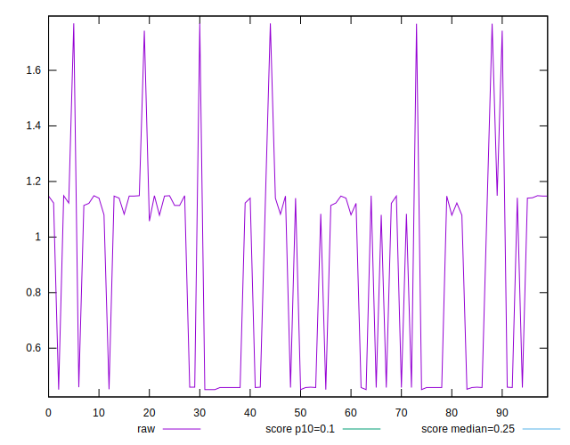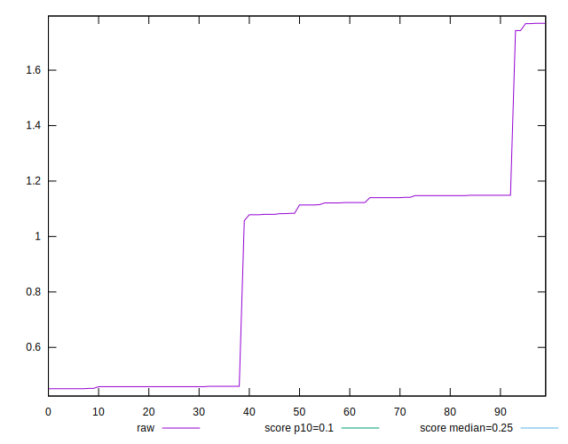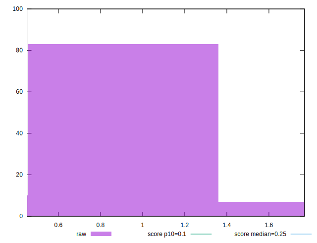
## Score


```yaml
p90min: 0
p90max: 0.2
p90range: 0.2
p90mean: 0.08808510638297866
p90median: 0.02
p90stdev: 0.08826069455715882
p90skewness: 0.47478780052468283
p90eccentricity: 1.0000000000000007
p90discretization: 31.333333333333332
outlandishness: 1.0162977525729886
confidence: 0.03490840567258495
p90confidence: 0.035684654859761945

```

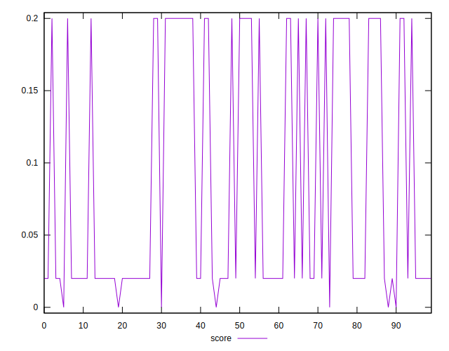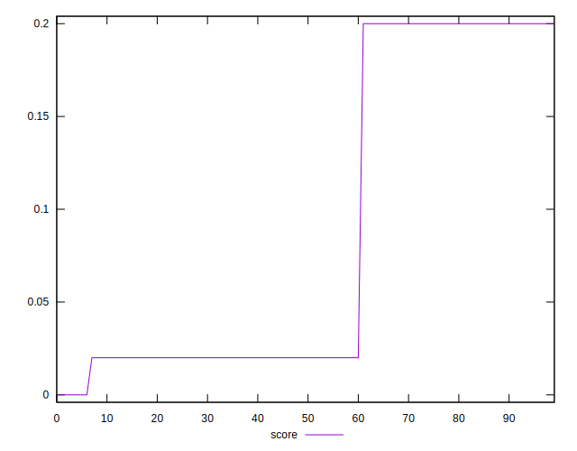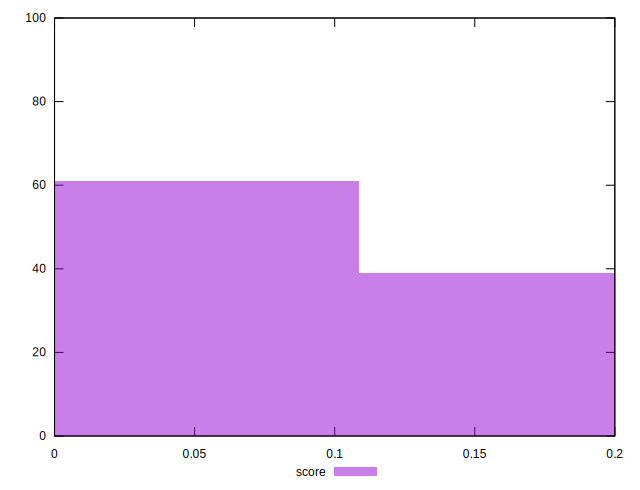
## Raw Estimate

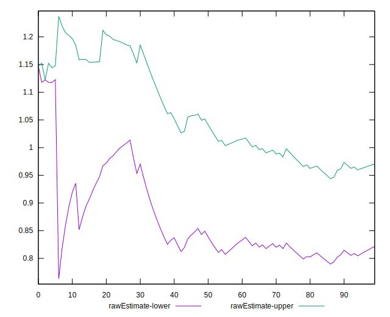
## Score Estimate

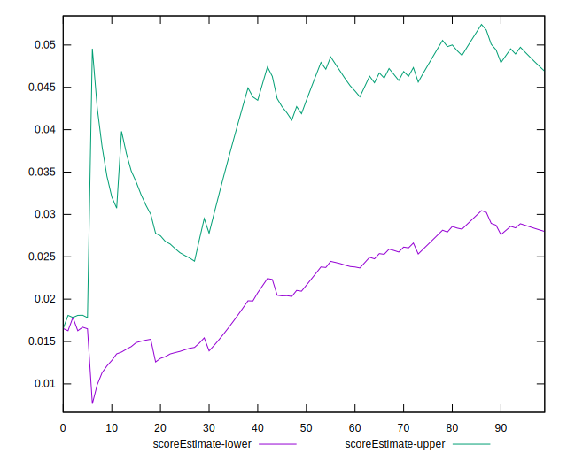
## P Score


```yaml
p90min: 0.0031118255667967887
p90max: 0.2047569218238503
p90range: 0.2016450962570535
p90mean: 0.08666346887910352
p90median: 0.019226796325370138
p90stdev: 0.08879383229973282
p90skewness: 0.47853113929149643
p90eccentricity: 1.0000000000000007
p90discretization: 4.7
outlandishness: 1.0240506609301634
confidence: 0.03514421979797779
p90confidence: 0.03590020762004694

```

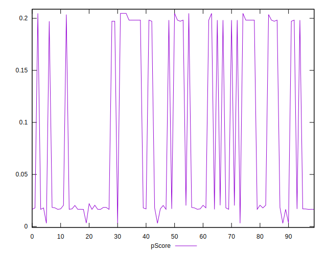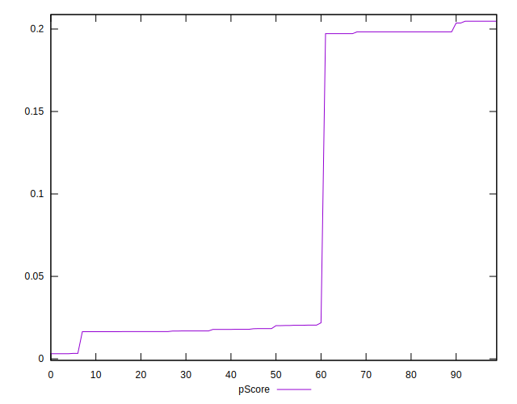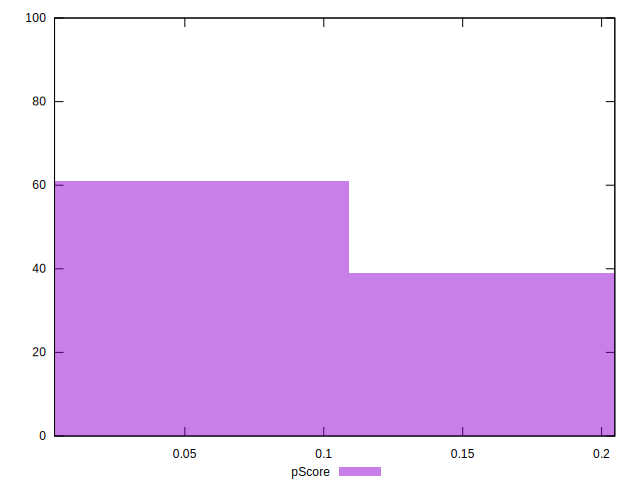
## Score Difference


```yaml
p90min: 0
p90max: 0
p90range: 0
p90mean: 0
p90median: 0
p90stdev: 0
p90skewness: .nan
p90eccentricity: .nan
p90discretization: 94
outlandishness: .nan
confidence: 0
p90confidence: 0

```


## P Score Difference


```yaml
p90min: -0.0035342237039838013
p90max: 0.004756921823850291
p90range: 0.008291145527834092
p90mean: -0.0012098373550828978
p90median: -0.0017008933368568013
p90stdev: 0.002405172394426858
p90skewness: 1.2528652407184748
p90eccentricity: 1
p90discretization: 4.2727272727272725
outlandishness: 0.8275196949586282
confidence: 0.0010113089325315963
p90confidence: 0.0009724345271016018

```

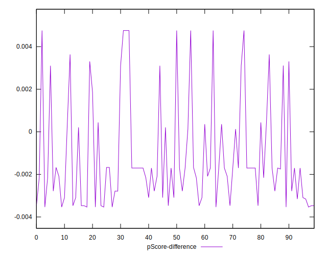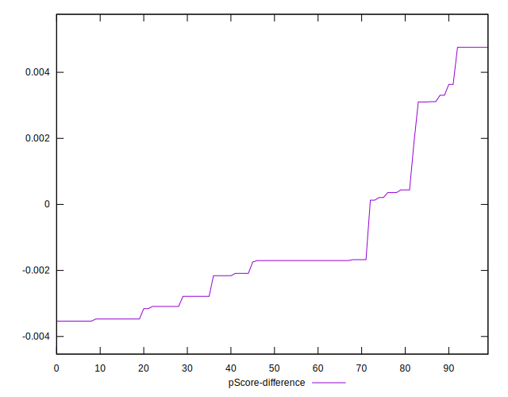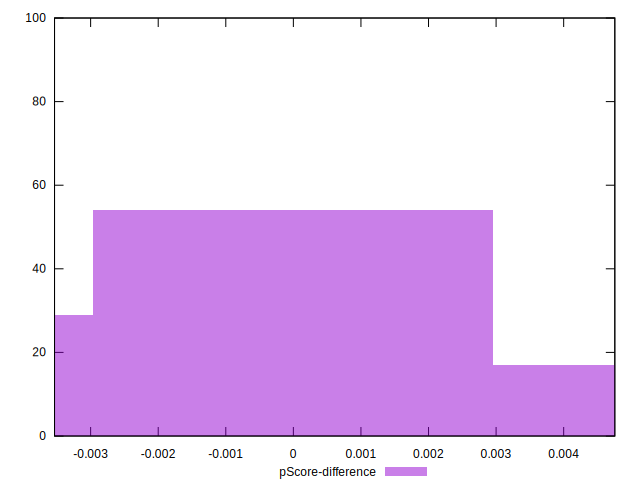