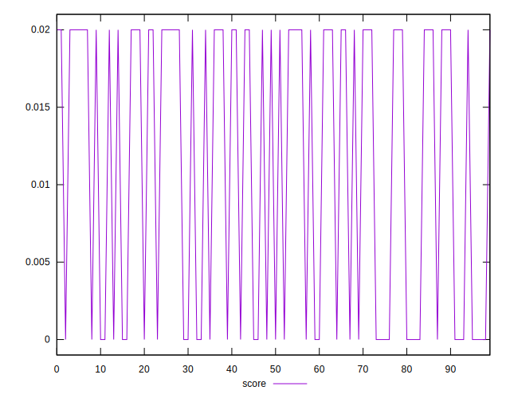

# //cumulative-layout-shift/samples/pages

[→ Parent](../..)


## Raw


```yaml
p90min: 1.121230978012085
p90max: 1.7690829467773437
p90range: 0.6478519687652586
p90mean: 1.399245226799174
p90median: 1.1487898769378664
p90stdev: 0.30523499519327063
p90skewness: 0.302097417801521
p90eccentricity: 1.0000000000000002
p90discretization: 5.529411764705882
outlandishness: 1.0069546120502546
confidence: 0.12143810608975
p90confidence: 0.12340946906483972

```


## Score


```yaml
p90min: 0
p90max: 0.02
p90range: 0.02
p90mean: 0.011489361702127665
p90median: 0.02
p90stdev: 0.009888468117976378
p90skewness: -0.3012320380383567
p90eccentricity: 1.0000000000000027
p90discretization: 47
outlandishness: 0.9845049382716049
confidence: 0.0038813225724273533
p90confidence: 0.003998003569451016

```


## Raw Estimate


## Score Estimate


## P Score


```yaml
p90min: 0.0031022719549900213
p90max: 0.01791041875881938
p90range: 0.014808146803829358
p90mean: 0.011189642038334337
p90median: 0.0164657762960162
p90stdev: 0.00687563391841936
p90skewness: -0.28421473099486505
p90eccentricity: 0.9999999999999994
p90discretization: 7.230769230769231
outlandishness: 0.9905508673921621
confidence: 0.0027146934189528874
p90confidence: 0.0027798854807557912

```


## Score Difference


```yaml
p90min: 0
p90max: 0
p90range: 0
p90mean: 0
p90median: 0
p90stdev: 0
p90skewness: .nan
p90eccentricity: .nan
p90discretization: 94
outlandishness: .nan
confidence: 0
p90confidence: 0

```


## P Score Difference


```yaml
p90min: -0.0035967520083595543
p90max: 0.0033156671300033635
p90range: 0.006912419138362918
p90mean: -0.00027700583398066755
p90median: -0.0020895812411806207
p90stdev: 0.0030120289502623973
p90skewness: 0.21704725728891433
p90eccentricity: 1.0000000000000002
p90discretization: 7.230769230769231
outlandishness: 0.9038318594569043
confidence: 0.0011946404640229107
p90confidence: 0.001217792518595207

```

