# //estimated-input-latency/samples/pages+cached

[→ Parent](../..)


## Raw


```yaml
p90min: 12.8
p90max: 56
p90range: 43.2
p90mean: 18.85049645390068
p90median: 15.300000000000093
p90stdev: 8.519296050196012
p90skewness: 2.02067373206718
p90eccentricity: 0.9999999999999991
p90discretization: 1.7407407407407407
outlandishness: 1.5115112747674178
confidence: 11.987197343960299
p90confidence: 3.4444340226950976

```

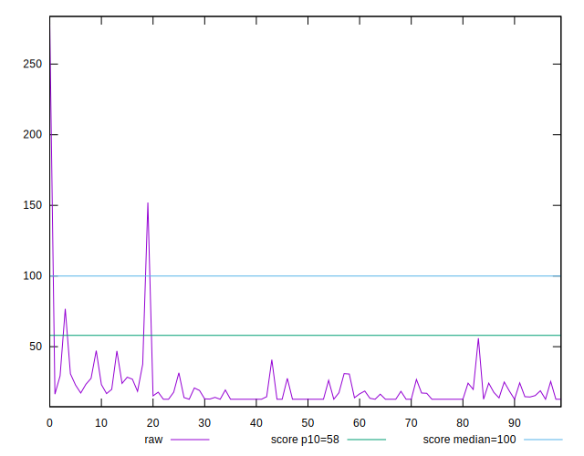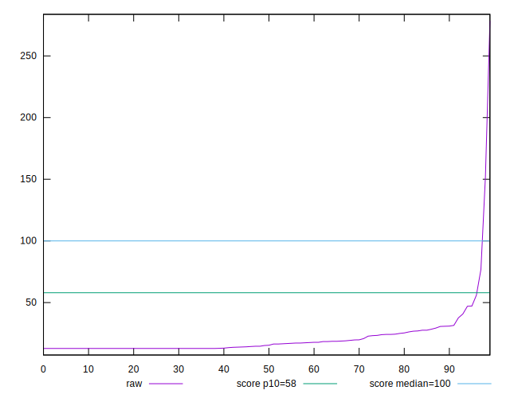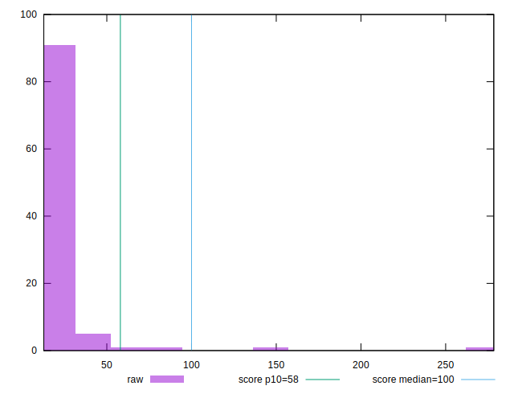
## Score


```yaml
p90min: 0.91
p90max: 1
p90range: 0.08999999999999997
p90mean: 0.9978723404255317
p90median: 1
p90stdev: 0.011000226344434523
p90skewness: -6.3337652575804135
p90eccentricity: 1.000000000000001
p90discretization: 18.8
outlandishness: 0.9586038256781886
confidence: 0.05137199830468799
p90confidence: 0.004447498203474855

```

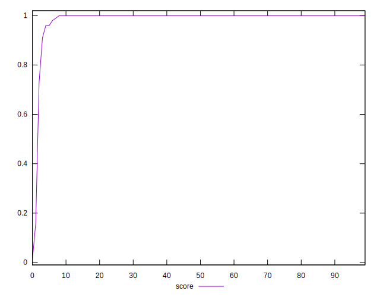
## Raw Estimate

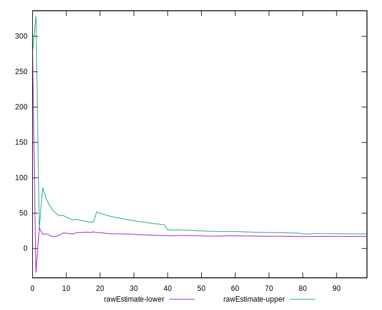
## Score Estimate

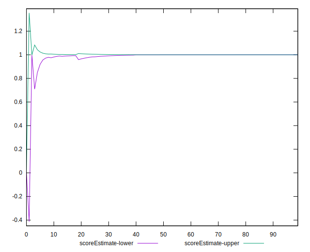
## P Score


```yaml
p90min: 0.9137333244120289
p90max: 0.9999993380488856
p90range: 0.08626601363685671
p90mean: 0.9977031040765422
p90median: 0.9999949731846949
p90stdev: 0.01048849264396145
p90skewness: -6.346048952970954
p90eccentricity: 1.0000000000000009
p90discretization: 1.8431372549019607
outlandishness: 0.9586756590586698
confidence: 0.051328633884997726
p90confidence: 0.004240599305011459

```

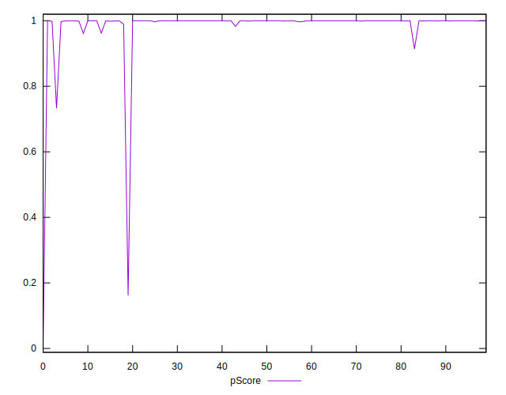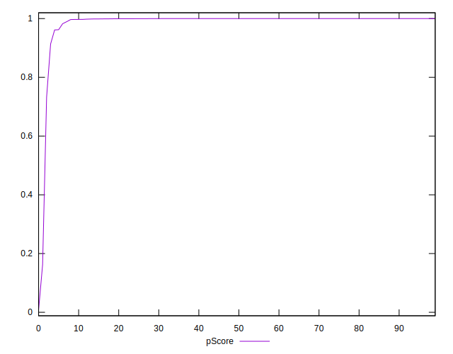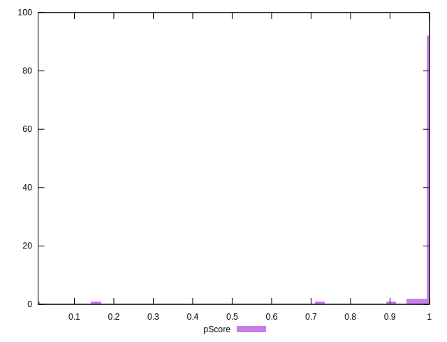
## Score Difference


```yaml
p90min: 0
p90max: 0
p90range: 0
p90mean: 0
p90median: 0
p90stdev: 0
p90skewness: .nan
p90eccentricity: .nan
p90discretization: 94
outlandishness: .nan
confidence: 0
p90confidence: 0

```


## P Score Difference


```yaml
p90min: -0.002711180355898235
p90max: 0.0022928255122822983
p90range: 0.005004005868180533
p90mean: -0.00013720296145632371
p90median: -0.000001773399132931619
p90stdev: 0.0006128033811200656
p90skewness: -0.33013034871190977
p90eccentricity: 0.9999999999999976
p90discretization: 1.9583333333333333
outlandishness: 0.8853357853120036
confidence: 0.0003721577805294169
p90confidence: 0.0002477623506350599

```

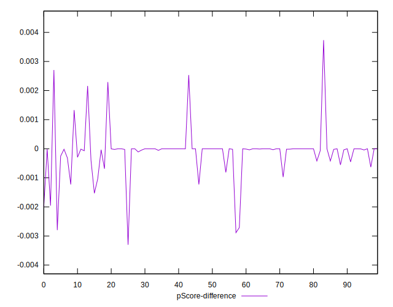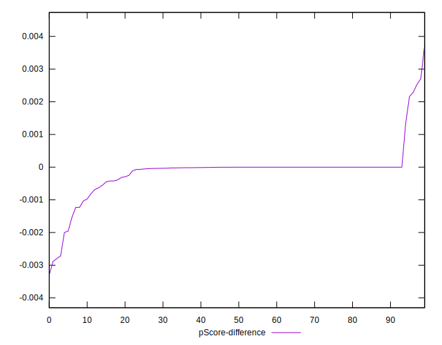