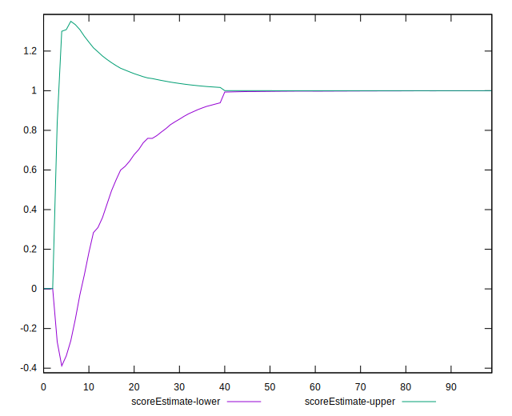
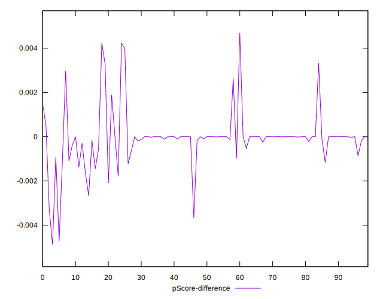

# //estimated-input-latency/samples/pages

[→ Parent](../..)


## Raw


```yaml
p90min: 12.8
p90max: 68.4
p90range: 55.60000000000001
p90mean: 22.090070921985788
p90median: 15.69999999999991
p90stdev: 12.477862259500787
p90skewness: 1.729287205991503
p90eccentricity: 1.0000000000000004
p90discretization: 1.540983606557377
outlandishness: 1.7897778546005396
confidence: 20.341379399622085
p90confidence: 5.0449207356913925

```


## Score


```yaml
p90min: 0.81
p90max: 1
p90range: 0.18999999999999995
p90mean: 0.9919148936170211
p90median: 1
p90stdev: 0.028143877900647502
p90skewness: -4.387760148803052
p90eccentricity: 0.9999999999999954
p90discretization: 10.444444444444445
outlandishness: 0.954724326164738
confidence: 0.056644464711069355
p90confidence: 0.011378842805836823

```


## Raw Estimate


## Score Estimate


## P Score


```yaml
p90min: 0.8142132411253376
p90max: 0.9999993380488856
p90range: 0.18578609692354808
p90mean: 0.9918320445882726
p90median: 0.999993357019193
p90stdev: 0.027720162401189068
p90skewness: -4.370516770367122
p90eccentricity: 0.9999999999999988
p90discretization: 1.6491228070175439
outlandishness: 0.9547637048176525
confidence: 0.056559575477309644
p90confidence: 0.011207530519741975

```


## Score Difference


```yaml
p90min: 0
p90max: 0
p90range: 0
p90mean: 0
p90median: 0
p90stdev: 0
p90skewness: .nan
p90eccentricity: .nan
p90discretization: 94
outlandishness: .nan
confidence: 0
p90confidence: 0

```


## P Score Difference


```yaml
p90min: -0.0032884518987843503
p90max: 0.003982654931979024
p90range: 0.007271106830763374
p90mean: -0.00006337433784586379
p90median: -0.0000017519278445732311
p90stdev: 0.0010350627055873754
p90skewness: 1.159574372837596
p90eccentricity: 1.0000000000000002
p90discretization: 1.7407407407407407
outlandishness: 0.9254344671517449
confidence: 0.0005786032929895395
p90confidence: 0.0004184858910573917

```

