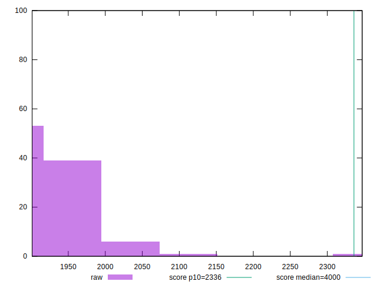
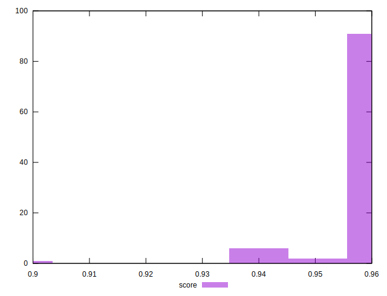
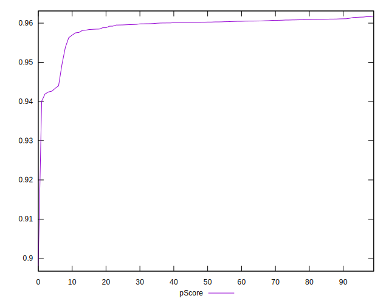
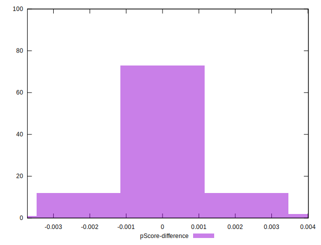

# //first-contentful-paint/samples/pages+cached+noadtech+nomedia

[→ Parent](../..)


## Raw


```yaml
p90min: 1903.8154999999997
p90max: 2064.81205
p90range: 160.9965500000003
p90mean: 1925.0974776595745
p90median: 1916.0898249999998
p90stdev: 31.792728698374358
p90skewness: 3.4460613806712628
p90eccentricity: 1.0000000000000002
p90discretization: 1
outlandishness: 1.0068124824730829
confidence: 22.02620398631666
p90confidence: 12.854108573967906

```


## Score


```yaml
p90min: 0.94
p90max: 0.96
p90range: 0.020000000000000018
p90mean: 0.9589361702127648
p90median: 0.96
p90stdev: 0.00424466751984256
p90skewness: -3.961927280524129
p90eccentricity: 0.9999999999999976
p90discretization: 31.333333333333332
outlandishness: 0.9980484347770731
confidence: 0.002985328200384401
p90confidence: 0.0017161602477751838

```


## Raw Estimate


## Score Estimate


## P Score


```yaml
p90min: 0.9424387019531171
p90max: 0.9615536717924209
p90range: 0.01911496983930383
p90mean: 0.9592013649094656
p90median: 0.9602585804293479
p90stdev: 0.003751226785394296
p90skewness: -3.55504687049463
p90eccentricity: 1.0000000000000002
p90discretization: 1
outlandishness: 0.9981224472312072
confidence: 0.002951735647560046
p90confidence: 0.001516657372901132

```


## Score Difference


```yaml
p90min: 0
p90max: 1.1102230246251565e-16
p90range: 1.1102230246251565e-16
p90mean: 5.9054416203465774e-18
p90median: 0
p90stdev: 2.4915085490873318e-17
p90skewness: 3.981981890375798
p90eccentricity: 0.9999999999999972
p90discretization: 47
outlandishness: 2.262016
confidence: 1.1806664533324081e-17
p90confidence: 1.0073410718148074e-17

```


## P Score Difference


```yaml
p90min: -0.0023703642878334374
p90max: 0.0026370815747356335
p90range: 0.005007445862569071
p90mean: 0.0002988257877365736
p90median: 0.0003708726194238121
p90stdev: 0.0009395326120414958
p90skewness: -0.5140516535011764
p90eccentricity: 0.9999999999999999
p90discretization: 1
outlandishness: 1.011009527885974
confidence: 0.0004859945021533596
p90confidence: 0.00037986214767977977

```

