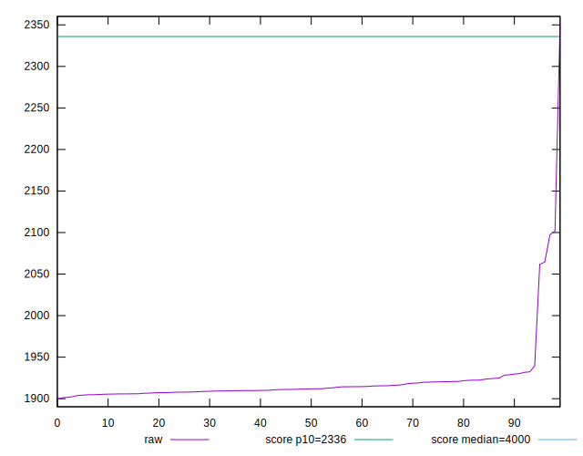

# //first-contentful-paint/samples/pages+cached+noadtech

[→ Parent](../..)


## Raw


```yaml
p90min: 1902.4739999999997
p90max: 2064.5838999999996
p90range: 162.10989999999993
p90mean: 1916.9673249999998
p90median: 1911.696
p90stdev: 22.82048876210398
p90skewness: 5.579135208291796
p90eccentricity: 0.9999999999999997
p90discretization: 1
outlandishness: 1.007845211406352
confidence: 21.446127183298408
p90confidence: 9.226544944979764

```


## Score


```yaml
p90min: 0.94
p90max: 0.96
p90range: 0.020000000000000018
p90mean: 0.959574468085105
p90median: 0.96
p90stdev: 0.002886097865159691
p90skewness: -6.6348880269691755
p90eccentricity: 0.999999999999994
p90discretization: 47
outlandishness: 0.9979699891544285
confidence: 0.0027729161501028774
p90confidence: 0.0011668773594685686

```


## Raw Estimate


## Score Estimate


## P Score


```yaml
p90min: 0.9424690547496314
p90max: 0.961693604420532
p90range: 0.019224549670900593
p90mean: 0.960118701726019
p90median: 0.9607252384259701
p90stdev: 0.002695966104898107
p90skewness: -5.764927611445453
p90eccentricity: 1.0000000000000002
p90discretization: 1
outlandishness: 0.9978684090828959
confidence: 0.0029182433806623108
p90confidence: 0.0010900052446856999

```


## Score Difference


```yaml
p90min: 0
p90max: 1.1102230246251565e-16
p90range: 1.1102230246251565e-16
p90mean: 1.1810883240693154e-18
p90median: 0
p90stdev: 1.139000331521095e-17
p90skewness: 9.539955591519906
p90eccentricity: 0.9999999999999999
p90discretization: 47
outlandishness: 14.137600000000003
confidence: 8.528132291650283e-18
p90confidence: 4.605088813249998e-18

```


## P Score Difference


```yaml
p90min: -0.001974253748550314
p90max: 0.0018339994449412256
p90range: 0.00380825319349154
p90mean: 0.0005292256184180055
p90median: 0.0007601870032336033
p90stdev: 0.000813808398470978
p90skewness: -0.8720452777187585
p90eccentricity: 1.0000000000000004
p90discretization: 1
outlandishness: 0.8743653897119732
confidence: 0.0003955498732736546
p90confidence: 0.00032903062872007504

```

