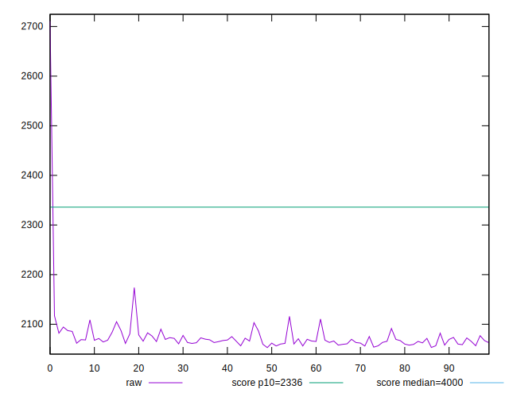
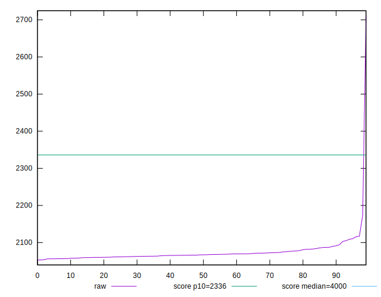
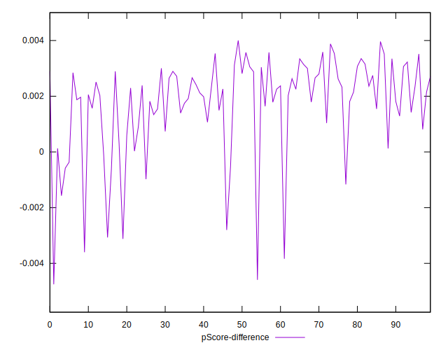

# //first-contentful-paint/samples/pages+cached

[→ Parent](../..)


## Raw


```yaml
p90min: 2056.13
p90max: 2115.9205
p90range: 59.790500000000065
p90mean: 2070.342460106383
p90median: 2067.002
p90stdev: 12.666749792740534
p90skewness: 1.6185553240983899
p90eccentricity: 1
p90discretization: 1
outlandishness: 1.0071657793162165
confidence: 25.83474037895575
p90confidence: 5.121289797421436

```


## Score


```yaml
p90min: 0.94
p90max: 0.94
p90range: 0
p90mean: 0.9399999999999988
p90median: 0.94
p90stdev: 1.1102230246251565e-15
p90skewness: 1
p90eccentricity: 1
p90discretization: 94
outlandishness: 0.9972359551833405
confidence: 0.004692630237270673
p90confidence: 4.488739370326686e-16

```


## Raw Estimate


## Score Estimate


## P Score


```yaml
p90min: 0.9354071650267592
p90max: 0.9435872351870305
p90range: 0.008180070160271224
p90mean: 0.9416859097558744
p90median: 0.9421468838086503
p90stdev: 0.0017209299359131998
p90skewness: -1.6660451183950624
p90eccentricity: 1.0000000000000002
p90discretization: 1
outlandishness: 0.997171848842642
confidence: 0.004718449956776392
p90confidence: 0.0006957886645807474

```


## Score Difference


```yaml
p90min: 1.1102230246251565e-16
p90max: 1.1102230246251565e-16
p90range: 0
p90mean: 1.1102230246251565e-16
p90median: 1.1102230246251565e-16
p90stdev: 0
p90skewness: .nan
p90eccentricity: .nan
p90discretization: 94
outlandishness: 0.9801
confidence: 4.330179641073934e-18
p90confidence: 0

```


## P Score Difference


```yaml
p90min: -0.0035997876994230404
p90max: 0.003587235187030524
p90range: 0.007187022886453565
p90mean: 0.001773116780877683
p90median: 0.002198968156063963
p90stdev: 0.0015721451525510777
p90skewness: -1.5127738482914763
p90eccentricity: 1
p90discretization: 1
outlandishness: 0.8694726050252037
confidence: 0.0007434179221370838
p90confidence: 0.0006356335335872634

```

