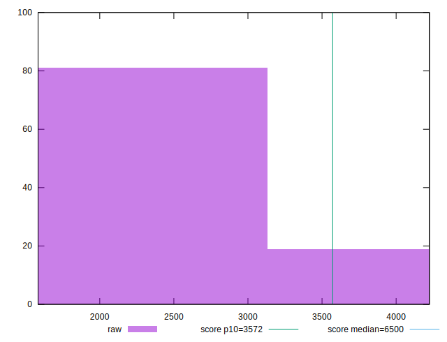
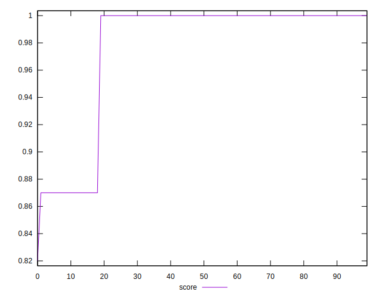

# //first-cpu-idle/samples/pages+cached+noadtech+nomedia+nocss

[→ Parent](../..)


## Raw


```yaml
p90min: 1584.5865
p90max: 3853.8519999999994
p90range: 2269.2654999999995
p90mean: 1971.7866755319142
p90median: 1587.6600000000003
p90stdev: 848.1010150377158
p90skewness: 1.755031017136877
p90eccentricity: 1.0000000000000007
p90discretization: 1
outlandishness: 1.0500917803252021
confidence: 350.77028952766386
p90confidence: 342.895466205913

```


## Score


```yaml
p90min: 0.87
p90max: 1
p90range: 0.13
p90mean: 0.9778723404255317
p90median: 1
p90stdev: 0.04885654947330299
p90skewness: -1.7550294029241607
p90eccentricity: 0.9999999999999968
p90discretization: 47
outlandishness: 0.9937261463216591
confidence: 0.02048498999849678
p90confidence: 0.01975317681716898

```


## Raw Estimate


## Score Estimate


## P Score


```yaml
p90min: 0.8684245939423898
p90max: 0.9987421750916898
p90range: 0.13031758114930003
p90mean: 0.9767375287432418
p90median: 0.9987248339885153
p90stdev: 0.048546975344834375
p90skewness: -1.7551288860630663
p90eccentricity: 1.0000000000000002
p90discretization: 1
outlandishness: 0.9936963593568825
confidence: 0.0203729841150845
p90confidence: 0.019628012994435177

```


## Score Difference


```yaml
p90min: 0
p90max: 0
p90range: 0
p90mean: 0
p90median: 0
p90stdev: 0
p90skewness: .nan
p90eccentricity: .nan
p90discretization: 94
outlandishness: .inf
confidence: 4.330179641073934e-18
p90confidence: 0

```


## P Score Difference


```yaml
p90min: -0.001458718143218296
p90max: 0.00012100138732551446
p90range: 0.0015797195305438105
p90mean: -0.0011644032010415422
p90median: -0.0012707481688228328
p90stdev: 0.0003302103683789622
p90skewness: 2.7020382379840417
p90eccentricity: 0.9999999999999997
p90discretization: 1
outlandishness: 0.968368383027922
confidence: 0.0002166306347745038
p90confidence: 0.0001335072546827399

```

