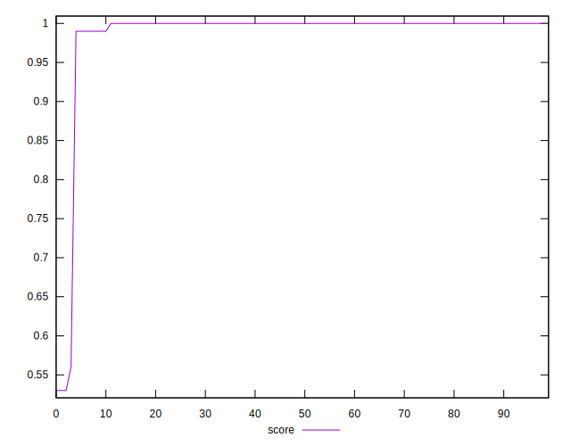
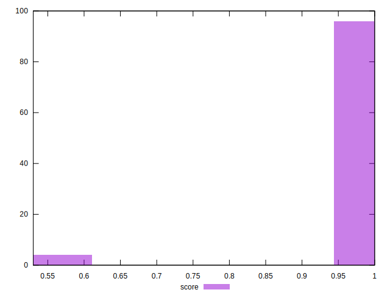
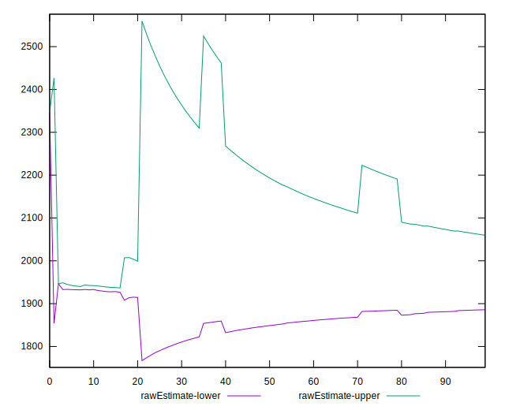
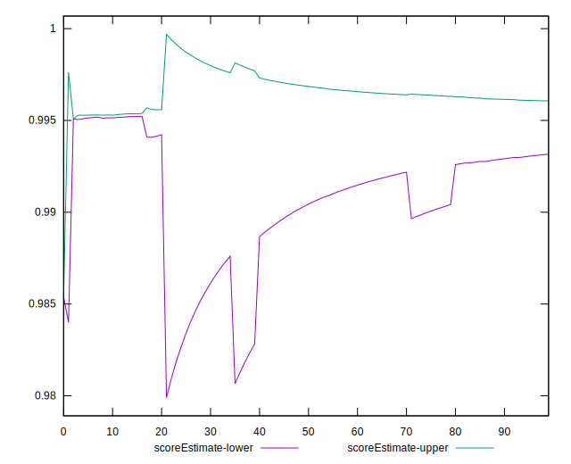
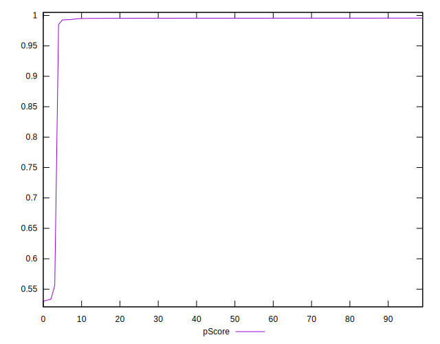
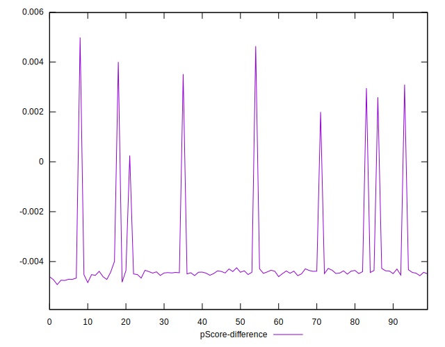
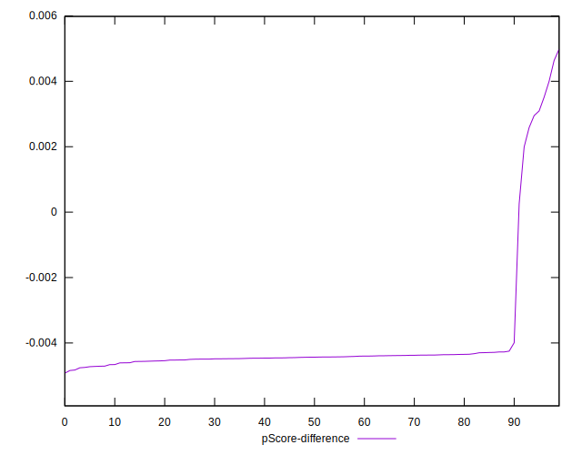
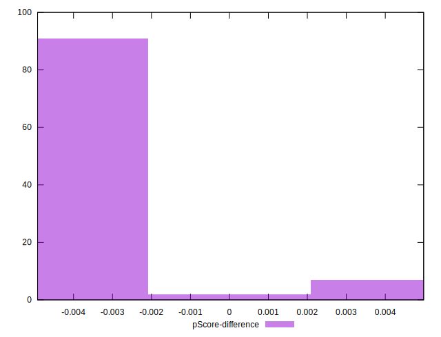

# //first-cpu-idle/samples/pages+cached+noadtech+nomedia

[→ Parent](../..)


## Raw


```yaml
p90min: 1903.8154999999997
p90max: 6086.073
p90range: 4182.257500000001
p90mean: 1972.756905851064
p90median: 1916.0898249999998
p90stdev: 429.77724374785
p90skewness: 9.331757496763359
p90eccentricity: 1.0000000000000007
p90discretization: 1
outlandishness: 1.1324053361305177
confidence: 330.1847347100886
p90confidence: 173.7631081045903

```


## Score


```yaml
p90min: 0.56
p90max: 1
p90range: 0.43999999999999995
p90mean: 0.9945744680851063
p90median: 1
p90stdev: 0.04513961541746025
p90skewness: -9.491220525474708
p90eccentricity: 0.9999999999999958
p90discretization: 31.333333333333332
outlandishness: 0.9724925925178014
confidence: 0.035499400960403826
p90confidence: 0.01825038432743454

```


## Raw Estimate


## Score Estimate


## P Score


```yaml
p90min: 0.5560067225367017
p90max: 0.9957128955211216
p90range: 0.43970617298441994
p90mean: 0.9906220844702527
p90median: 0.995536324630436
p90stdev: 0.04508212387054626
p90skewness: -9.530599872114017
p90eccentricity: 1.0000000000000002
p90discretization: 1
outlandishness: 0.9727156513000652
confidence: 0.03514481805005294
p90confidence: 0.018227139937400296

```


## Score Difference


```yaml
p90min: 0
p90max: 0
p90range: 0
p90mean: 0
p90median: 0
p90stdev: 0
p90skewness: .nan
p90eccentricity: .nan
p90discretization: 94
outlandishness: .nan
confidence: 0
p90confidence: 0

```


## P Score Difference


```yaml
p90min: -0.004758414285025436
p90max: 0.003514881260521463
p90range: 0.0082732955455469
p90mean: -0.004016934832442538
p90median: -0.004434455729369791
p90stdev: 0.0017009316419468424
p90skewness: 3.672883549853559
p90eccentricity: 0.9999999999999997
p90discretization: 1
outlandishness: 0.8881442997341562
confidence: 0.0008667856314298496
p90confidence: 0.0006877031603644695

```

