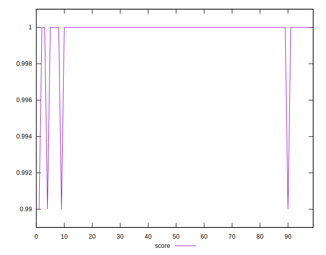

# //first-cpu-idle/samples/pages+cached+noadtech

[→ Parent](../..)


## Raw


```yaml
p90min: 1902.4739999999997
p90max: 2064.5838999999996
p90range: 162.10989999999993
p90mean: 1916.9673249999998
p90median: 1911.696
p90stdev: 22.82048876210398
p90skewness: 5.579135208291796
p90eccentricity: 0.9999999999999997
p90discretization: 1
outlandishness: 1.007845211406352
confidence: 21.446127183298408
p90confidence: 9.226544944979764

```


## Score


```yaml
p90min: 0.99
p90max: 1
p90range: 0.010000000000000009
p90mean: 0.9997872340425532
p90median: 1
p90stdev: 0.0014430489325798455
p90skewness: -6.63488802697019
p90eccentricity: 1.0000000000000022
p90discretization: 47
outlandishness: 0.9994254922001444
confidence: 0.0008543284941589422
p90confidence: 0.0005834386797342843

```


## Raw Estimate


## Score Estimate


## P Score


```yaml
p90min: 0.9929566375940215
p90max: 0.995731877338917
p90range: 0.0027752397448954635
p90mean: 0.9955138503341217
p90median: 0.9956001329562361
p90stdev: 0.0003885968005697211
p90skewness: -5.84519335496158
p90eccentricity: 1.0000000000000002
p90discretization: 1
outlandishness: 0.9996762065214883
confidence: 0.00046175633186245463
p90confidence: 0.00015711345551396974

```


## Score Difference


```yaml
p90min: 0
p90max: 0
p90range: 0
p90mean: 0
p90median: 0
p90stdev: 0
p90skewness: .nan
p90eccentricity: .nan
p90discretization: 94
outlandishness: .nan
confidence: 0
p90confidence: 0

```


## P Score Difference


```yaml
p90min: -0.004696861070724645
p90max: 0.0021695798985899017
p90range: 0.006866440969314547
p90mean: -0.00434799726674306
p90median: -0.004391847372899549
p90stdev: 0.0006837203979981042
p90skewness: 9.204507171706435
p90eccentricity: 1.0000000000000002
p90discretization: 1
outlandishness: 0.9098280533785594
confidence: 0.0005428670868925805
p90confidence: 0.0002764347883908928

```

