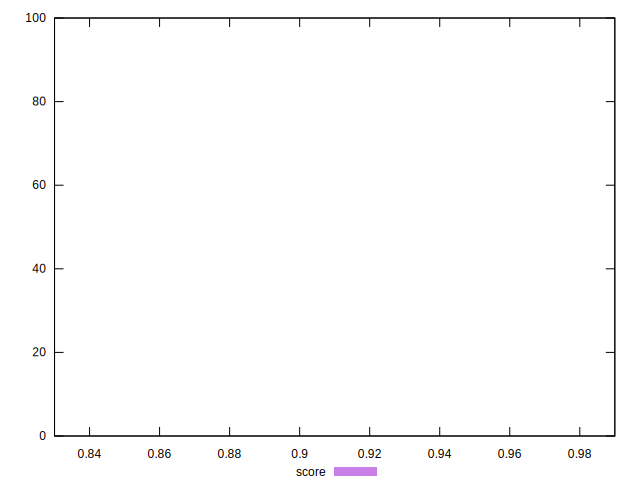
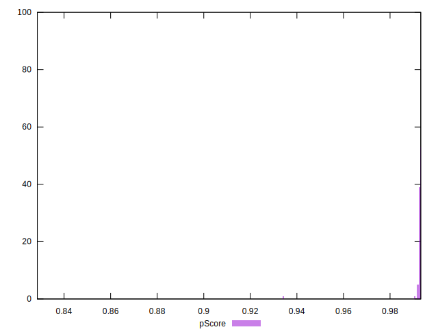
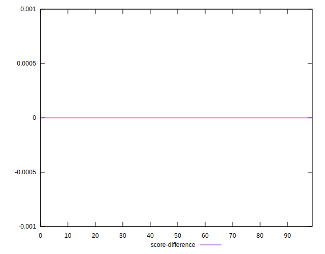

# //first-cpu-idle/samples/pages+cached

[→ Parent](../..)


## Raw


```yaml
p90min: 2056.13
p90max: 2117.048
p90range: 60.917999999999665
p90mean: 2070.429130319149
p90median: 2067.002
p90stdev: 12.954879178231053
p90skewness: 1.7108870783041732
p90eccentricity: 1.0000000000000002
p90discretization: 1
outlandishness: 1.0321200664279362
confidence: 93.16916342913747
p90confidence: 5.237783302574241

```


## Score


```yaml
p90min: 0.99
p90max: 0.99
p90range: 0
p90mean: 0.9899999999999988
p90median: 0.99
p90stdev: 1.2212453270876722e-15
p90skewness: 1
p90eccentricity: 1
p90discretization: 94
outlandishness: 0.99556049382716
confidence: 0.006642629945888981
p90confidence: 4.937613307359355e-16

```


## Raw Estimate


## Score Estimate


## P Score


```yaml
p90min: 0.9918321486742161
p90max: 0.993126886947536
p90range: 0.0012947382733199397
p90mean: 0.9928336124559217
p90median: 0.9929073913160755
p90stdev: 0.00027255042099179187
p90skewness: -1.7920555734524843
p90eccentricity: 1.0000000000000007
p90discretization: 1
outlandishness: 0.9954874413000284
confidence: 0.006783598707103708
p90confidence: 0.00011019477870385787

```


## Score Difference


```yaml
p90min: 0
p90max: 0
p90range: 0
p90mean: 0
p90median: 0
p90stdev: 0
p90skewness: .nan
p90eccentricity: .nan
p90discretization: 94
outlandishness: .inf
confidence: 4.330179641073934e-18
p90confidence: 0

```


## P Score Difference


```yaml
p90min: 0.0018575703725028925
p90max: 0.0031711415297135392
p90range: 0.0013135711572106468
p90mean: 0.0028478570607670625
p90median: 0.0029153575463509718
p90stdev: 0.00025421120285702253
p90skewness: -1.7015121556137682
p90eccentricity: 0.9999999999999999
p90discretization: 1
outlandishness: 0.9604479593931239
confidence: 0.0002258884547274172
p90confidence: 0.00010278005493785223

```

