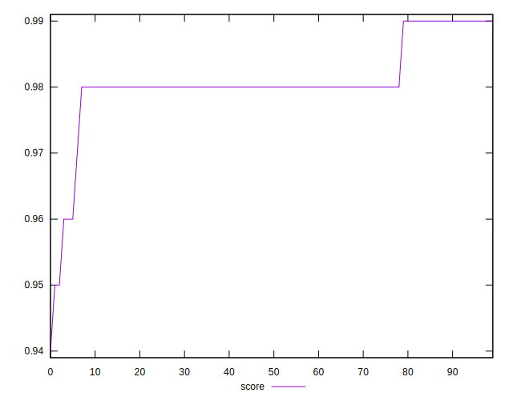
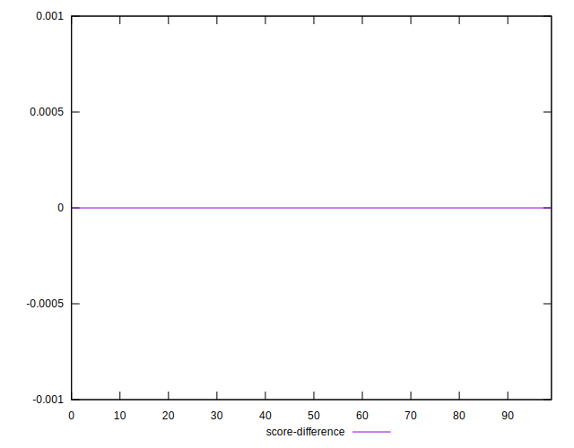

# //first-cpu-idle/samples/pages

[→ Parent](../..)


## Raw


```yaml
p90min: 2327.1110000000003
p90max: 2879.124
p90range: 552.0129999999995
p90mean: 2465.204002659574
p90median: 2475.09475
p90stdev: 100.64563592291094
p90skewness: 1.4784274566842057
p90eccentricity: 1
p90discretization: 1
outlandishness: 1.0099620804073057
confidence: 54.397467721067024
p90confidence: 40.69200677686066

```


## Score


```yaml
p90min: 0.96
p90max: 0.99
p90range: 0.030000000000000027
p90mean: 0.9811702127659573
p90median: 0.98
p90stdev: 0.0056222171326484344
p90skewness: -1.0524717443339486
p90eccentricity: 0.9999999999999984
p90discretization: 23.5
outlandishness: 0.9984306281423431
confidence: 0.0032286502839167334
p90confidence: 0.002273116917239657

```


## Raw Estimate


## Score Estimate


## P Score


```yaml
p90min: 0.9593470760799283
p90max: 0.9860544080479459
p90range: 0.026707331968017556
p90mean: 0.980736982250618
p90median: 0.9806253972217062
p90stdev: 0.004534869152408383
p90skewness: -2.3740531784532455
p90eccentricity: 0.9999999999999994
p90discretization: 1
outlandishness: 0.998436380999085
confidence: 0.0027535942067093383
p90confidence: 0.0018334915825194888

```


## Score Difference


```yaml
p90min: 0
p90max: 0
p90range: 0
p90mean: 0
p90median: 0
p90stdev: 0
p90skewness: .nan
p90eccentricity: .nan
p90discretization: 94
outlandishness: .inf
confidence: 7.423946114831065e-18
p90confidence: 0

```


## P Score Difference


```yaml
p90min: -0.004794974817901476
p90max: 0.004786418454618913
p90range: 0.009581393272520389
p90mean: -0.0004579105928889872
p90median: -0.0005300200791985565
p90stdev: 0.002608694613309381
p90skewness: 0.10130383052673299
p90eccentricity: 0.9999999999999997
p90discretization: 1
outlandishness: 0.8820866771886722
confidence: 0.0010989531206040248
p90confidence: 0.0010547205341804651

```

