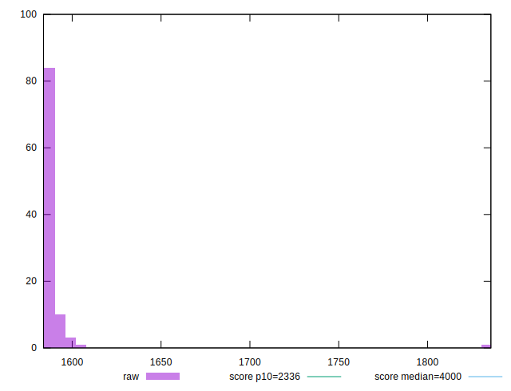
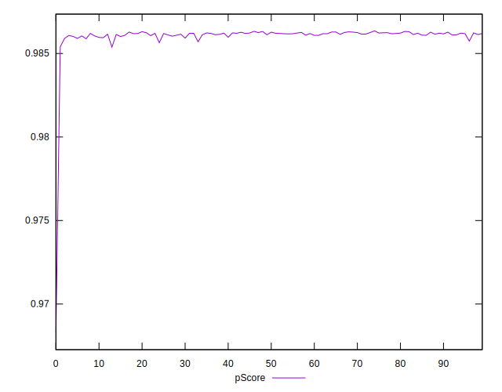
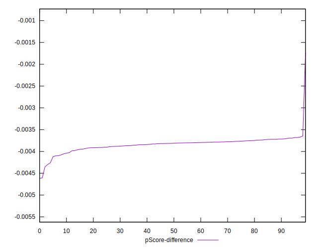

# //first-meaningful-paint/samples/pages+cached+noadtech+nomedia+nocss

[→ Parent](../..)


## Raw


```yaml
p90min: 1584.5865
p90max: 1597.1285
p90range: 12.542000000000144
p90mean: 1587.7772436170208
p90median: 1587.124275
p90stdev: 2.3802522319658768
p90skewness: 1.6965765202132694
p90eccentricity: 1
p90discretization: 1
outlandishness: 1.0033478937066593
confidence: 9.735911044787628
p90confidence: 0.9623590637151971

```


## Score


```yaml
p90min: 0.99
p90max: 0.99
p90range: 0
p90mean: 0.9899999999999988
p90median: 0.99
p90stdev: 1.2212453270876722e-15
p90skewness: 1
p90eccentricity: 1
p90discretization: 94
outlandishness: 0.9995960004081211
confidence: 0.0007800558167195158
p90confidence: 4.937613307359355e-16

```


## Raw Estimate


## Score Estimate


## P Score


```yaml
p90min: 0.9856483572094548
p90max: 0.9863192933584155
p90range: 0.0006709361489607435
p90mean: 0.9861503232445941
p90median: 0.9861853396002168
p90stdev: 0.00012697313355235551
p90skewness: -1.720855576063487
p90eccentricity: 1.0000000000000002
p90discretization: 1
outlandishness: 0.9996177079814572
confidence: 0.0007001289051589995
p90confidence: 0.00005133646942177567

```


## Score Difference


```yaml
p90min: 0
p90max: 0
p90range: 0
p90mean: 0
p90median: 0
p90stdev: 0
p90skewness: .nan
p90eccentricity: .nan
p90discretization: 94
outlandishness: .nan
confidence: 0
p90confidence: 0

```


## P Score Difference


```yaml
p90min: -0.004298897397307488
p90max: -0.0036804041684581623
p90range: 0.0006184932288493261
p90mean: -0.003842535919001169
p90median: -0.0038126717981551983
p90stdev: 0.0001170276702875575
p90skewness: -1.5095039872670668
p90eccentricity: 0.9999999999999996
p90discretization: 1
outlandishness: 0.9977410791580275
confidence: 0.00010556654496071176
p90confidence: 0.00004731542216166239

```

