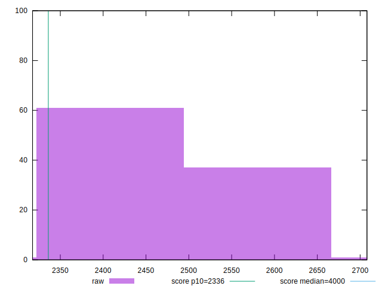
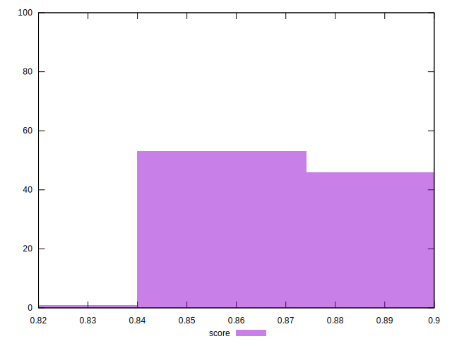
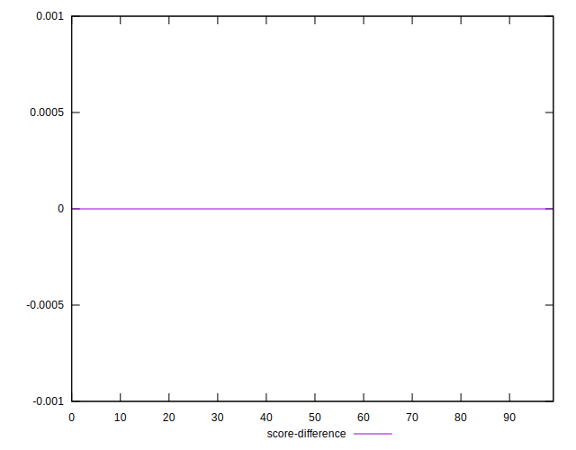

# //first-meaningful-paint/samples/pages

[→ Parent](../..)


## Raw


```yaml
p90min: 2327.1110000000003
p90max: 2563.0814999999993
p90range: 235.970499999999
p90mean: 2450.102731382978
p90median: 2473.6515
p90stdev: 69.90612464795119
p90skewness: -0.4692498673558909
p90eccentricity: 1
p90discretization: 1
outlandishness: 1.0014665910525917
confidence: 30.952565700544593
p90confidence: 28.263724222452325

```


## Score


```yaml
p90min: 0.86
p90max: 0.9
p90range: 0.040000000000000036
p90mean: 0.8787234042553196
p90median: 0.87
p90stdev: 0.013932515356378655
p90skewness: 0.417257941921453
p90eccentricity: 0.9999999999999988
p90discretization: 18.8
outlandishness: 0.9985816171109639
confidence: 0.006239830929041866
p90confidence: 0.005633051091601449

```


## Raw Estimate


## Score Estimate


## P Score


```yaml
p90min: 0.8555429640950813
p90max: 0.9015849002670775
p90range: 0.046041936171996145
p90mean: 0.8782283195323518
p90median: 0.8739219961649748
p90stdev: 0.01353760177214197
p90skewness: 0.42939246329565023
p90eccentricity: 1.0000000000000002
p90discretization: 1
outlandishness: 0.9989897211786174
confidence: 0.0060717117749328284
p90confidence: 0.005473383699183737

```


## Score Difference


```yaml
p90min: 0
p90max: 0
p90range: 0
p90mean: 0
p90median: 0
p90stdev: 0
p90skewness: .nan
p90eccentricity: .nan
p90discretization: 94
outlandishness: .inf
confidence: 4.330179641073934e-18
p90confidence: 0

```


## P Score Difference


```yaml
p90min: -0.004635656299952662
p90max: 0.00469562229953846
p90range: 0.009331278599491122
p90mean: -0.0003376087423459482
p90median: -0.0005177081106439996
p90stdev: 0.0029018901970239543
p90skewness: 0.11625922592043068
p90eccentricity: 0.9999999999999994
p90discretization: 1
outlandishness: 0.8728747525952157
confidence: 0.00119548658831091
p90confidence: 0.0011732623524128751

```

