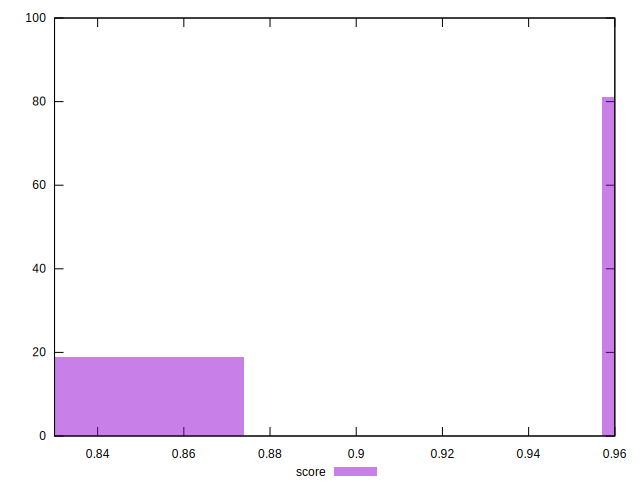

# //interactive/samples/pages+cached+noadtech+nomedia+nocss

[→ Parent](../..)


## Raw


```yaml
p90min: 2890.5406000000003
p90max: 4087.5065000000004
p90range: 1196.9659000000001
p90mean: 3096.203595744681
p90median: 2894.9312250000003
p90stdev: 441.57782498949757
p90skewness: 1.7535636873080163
p90eccentricity: 1
p90discretization: 1
outlandishness: 1.0180078095621945
confidence: 185.08123942863787
p90confidence: 178.53419755573964

```


## Score


```yaml
p90min: 0.87
p90max: 0.96
p90range: 0.08999999999999997
p90mean: 0.9446808510638284
p90median: 0.96
p90stdev: 0.03382376501997898
p90skewness: -1.755029402924127
p90eccentricity: 1.000000000000003
p90discretization: 47
outlandishness: 0.9953882123255009
confidence: 0.014245850957288255
p90confidence: 0.013675276258040055

```


## Raw Estimate


## Score Estimate


## P Score


```yaml
p90min: 0.8710841964983169
p90max: 0.9646639716538379
p90range: 0.09357977515552096
p90mean: 0.9487657581631845
p90median: 0.9644327218098405
p90stdev: 0.034437070614620494
p90skewness: -1.7544741072425374
p90eccentricity: 0.9999999999999996
p90discretization: 1
outlandishness: 0.9951738065420835
confidence: 0.01456815082508898
p90confidence: 0.01392324165847286

```


## Score Difference


```yaml
p90min: 0
p90max: 0
p90range: 0
p90mean: 0
p90median: 0
p90stdev: 0
p90skewness: .nan
p90eccentricity: .nan
p90discretization: 94
outlandishness: .inf
confidence: 4.330179641073934e-18
p90confidence: 0

```


## P Score Difference


```yaml
p90min: 0.001084196498316925
p90max: 0.004663971653837917
p90range: 0.0035797751555209922
p90mean: 0.004115249782691997
p90median: 0.004432721809840501
p90stdev: 0.0007239371964835414
p90skewness: -2.0222652575814744
p90eccentricity: 0.9999999999999997
p90discretization: 1
outlandishness: 0.9323084603446973
confidence: 0.00047021743187441675
p90confidence: 0.00029269483008576095

```

