# //interactive/samples/pages+cached+noadtech+nomedia

[→ Parent](../..)


## Raw


```yaml
p90min: 3726.938
p90max: 5973.337300000001
p90range: 2246.399300000001
p90mean: 3960.416613420371
p90median: 3737.9820249999993
p90stdev: 646.5773053536312
p90skewness: 2.7403438257320825
p90eccentricity: 1
p90discretization: 1.010752688172043
outlandishness: 1.028810437188361
confidence: 285.97241915734116
p90confidence: 261.41747577974166

```

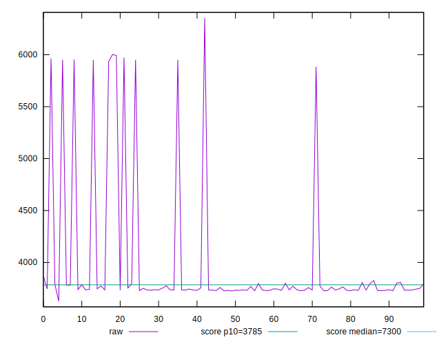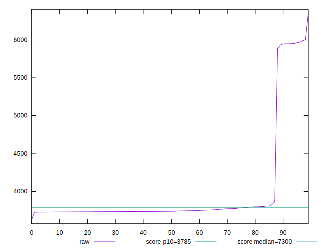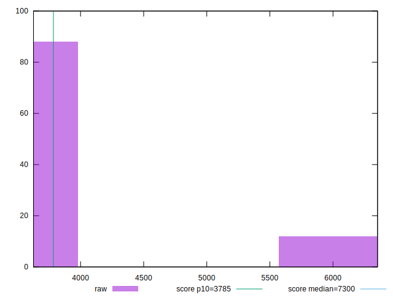
## Score


```yaml
p90min: 0.65
p90max: 0.91
p90range: 0.26
p90mean: 0.8772340425531916
p90median: 0.9
p90stdev: 0.07220544352849806
p90skewness: -2.7421013161385734
p90eccentricity: 1.0000000000000016
p90discretization: 18.8
outlandishness: 0.9858375502650759
confidence: 0.031944406726830736
p90confidence: 0.02919336114720723

```

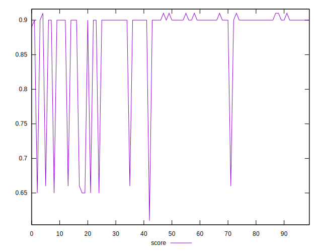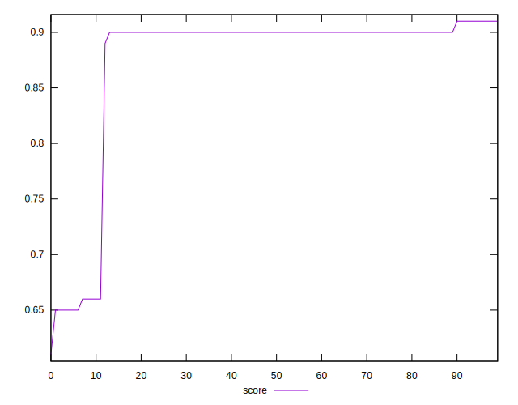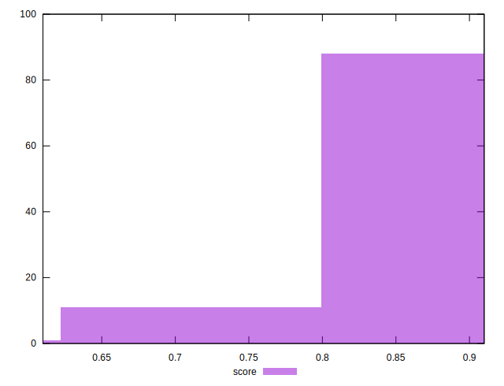
## Raw Estimate

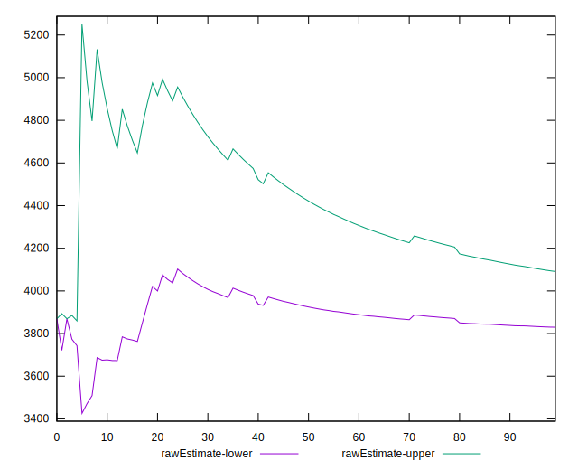
## Score Estimate

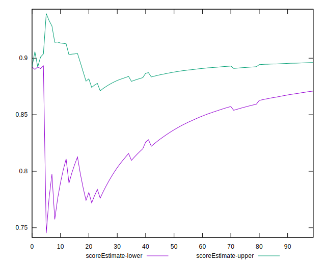
## P Score


```yaml
p90min: 0.6522245650235025
p90max: 0.9051915647956665
p90range: 0.2529669997721641
p90mean: 0.8794103882755487
p90median: 0.9042135430592584
p90stdev: 0.07288317292476258
p90skewness: -2.7433458983547565
p90eccentricity: 1.0000000000000002
p90discretization: 1.010752688172043
outlandishness: 0.9853482338885313
confidence: 0.03227350059489999
p90confidence: 0.029467373715489846

```

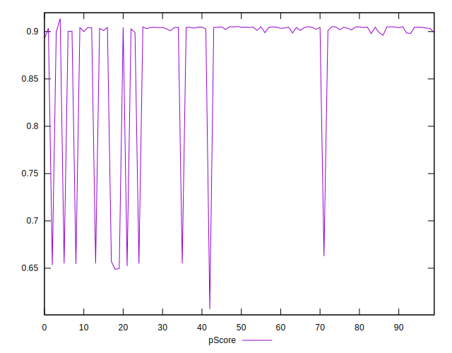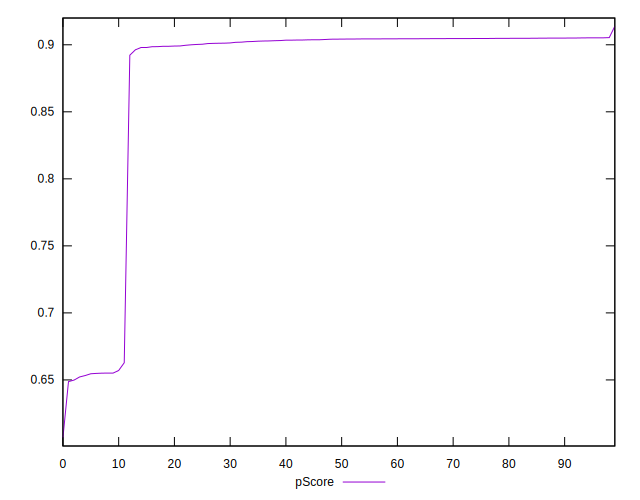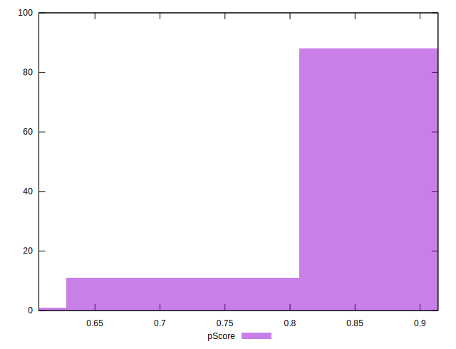
## Score Difference


```yaml
p90min: 0
p90max: 0
p90range: 0
p90mean: 0
p90median: 0
p90stdev: 0
p90skewness: .nan
p90eccentricity: .nan
p90discretization: 94
outlandishness: .nan
confidence: 0
p90confidence: 0

```


## P Score Difference


```yaml
p90min: -0.004959276288747261
p90max: 0.004936146167668909
p90range: 0.00989542245641617
p90mean: 0.0020685455337178826
p90median: 0.0035470640939283538
p90stdev: 0.003158324761111615
p90skewness: -1.0677405306583767
p90eccentricity: 1.0000000000000002
p90discretization: 1.010752688172043
outlandishness: 0.8833500721432019
confidence: 0.0013062706229962364
p90confidence: 0.0012769413338609027

```

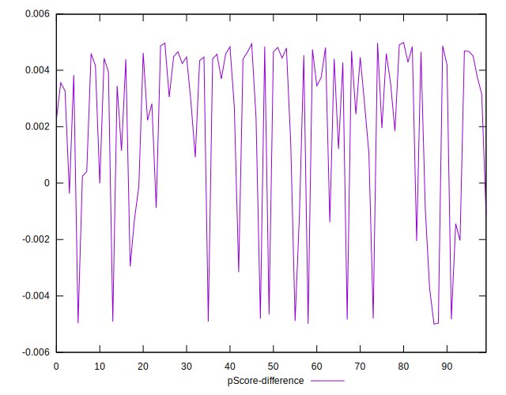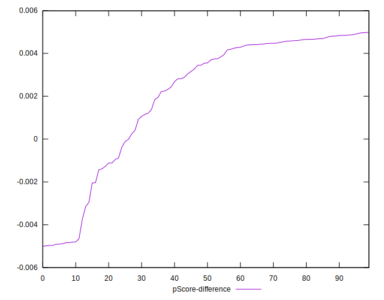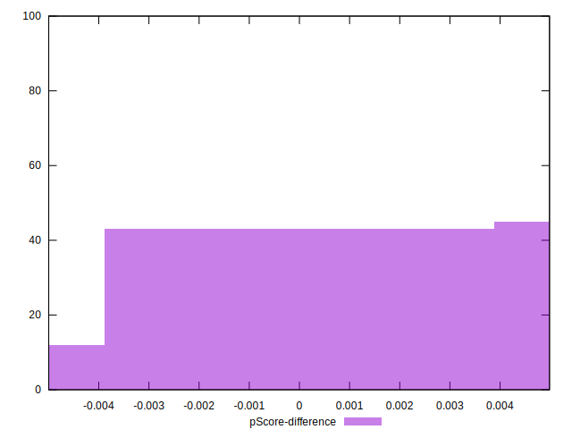