# //interactive/samples/pages+cached+noadtech

[→ Parent](../..)


## Raw


```yaml
p90min: 4207.0560000000005
p90max: 4612.605999999999
p90range: 405.54999999999836
p90mean: 4334.758062183216
p90median: 4331.449543628192
p90stdev: 40.36130651811298
p90skewness: 3.5099100719138505
p90eccentricity: 1.0000000000000002
p90discretization: 1
outlandishness: 1.0285585146095941
confidence: 148.2687872130566
p90confidence: 16.31846769407845

```

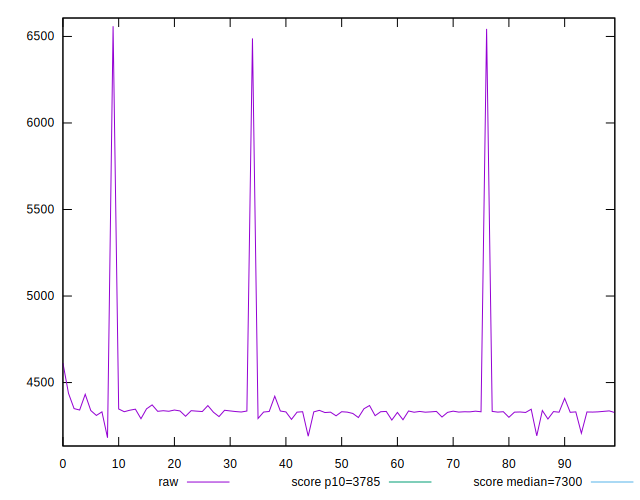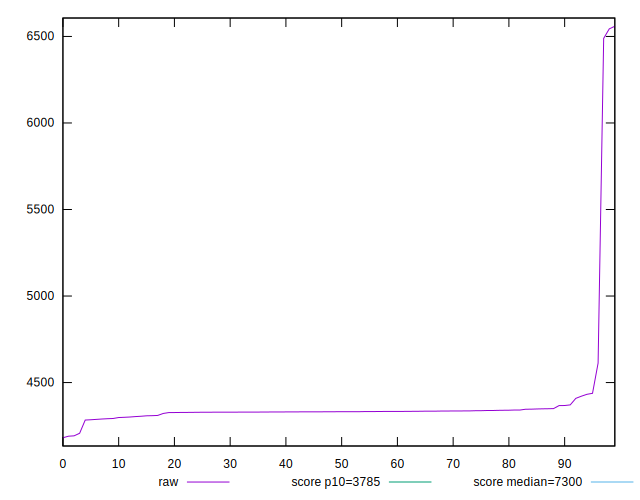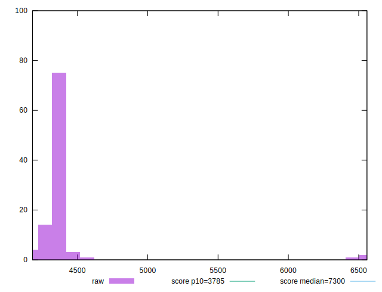
## Score


```yaml
p90min: 0.81
p90max: 0.86
p90range: 0.04999999999999993
p90mean: 0.8475531914893616
p90median: 0.85
p90stdev: 0.006134341805675952
p90skewness: -3.1180909405156267
p90eccentricity: 1.0000000000000058
p90discretization: 18.8
outlandishness: 0.9822558974560066
confidence: 0.017869025076262438
p90confidence: 0.0024801738896989014

```

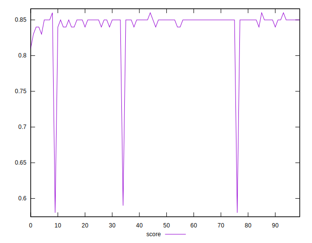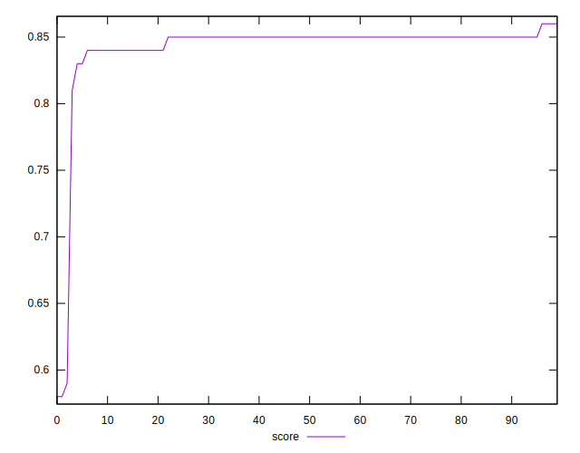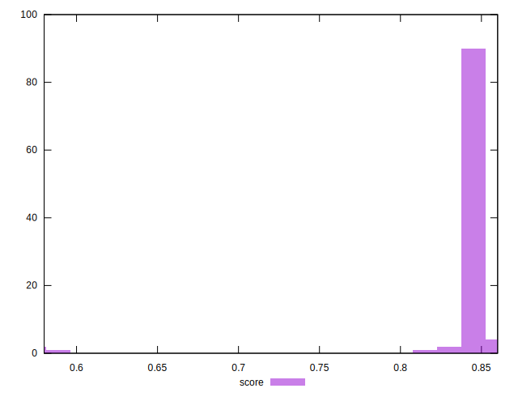
## Raw Estimate

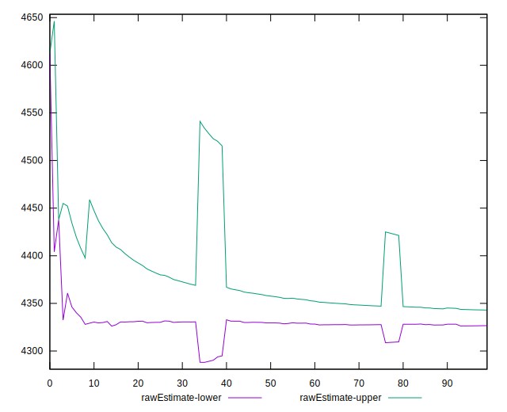
## Score Estimate

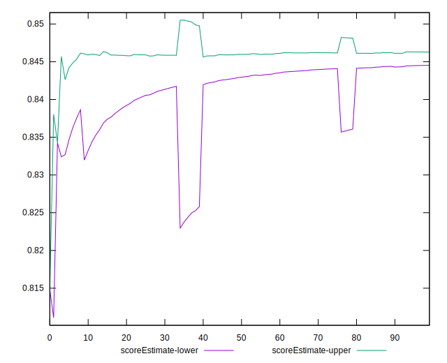
## P Score


```yaml
p90min: 0.8147996989686468
p90max: 0.858876276148266
p90range: 0.044076577179619214
p90mean: 0.8453902120973332
p90median: 0.845763282244443
p90stdev: 0.004385177988631293
p90skewness: -3.6742314141356887
p90eccentricity: 0.9999999999999996
p90discretization: 1
outlandishness: 0.9827665355785122
confidence: 0.01748709791173643
p90confidence: 0.0017729699931331485

```

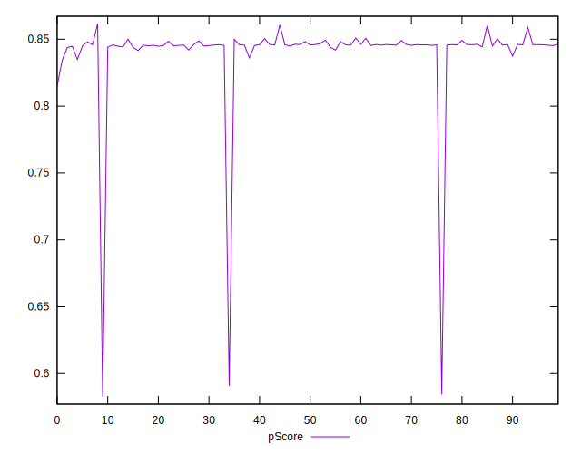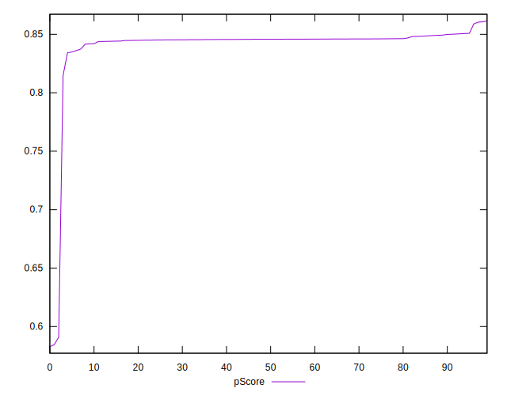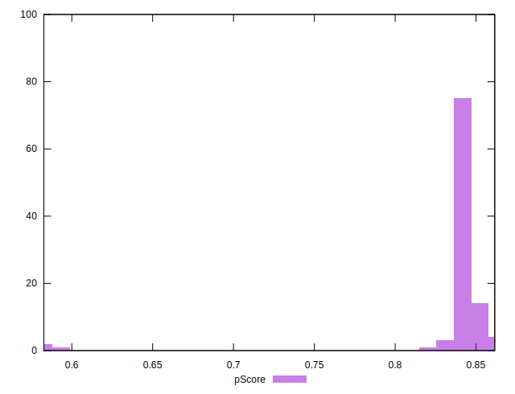
## Score Difference


```yaml
p90min: 0
p90max: 0
p90range: 0
p90mean: 0
p90median: 0
p90stdev: 0
p90skewness: .nan
p90eccentricity: .nan
p90discretization: 94
outlandishness: .inf
confidence: 6.092792000602812e-18
p90confidence: 0

```

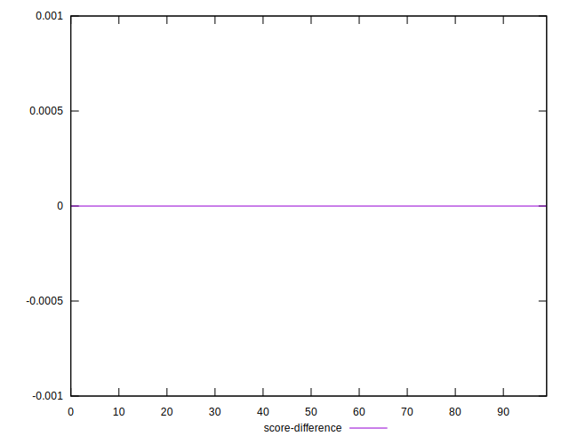
## P Score Difference


```yaml
p90min: -0.004860802316176138
p90max: 0.004822410969485658
p90range: 0.009683213285661796
p90mean: -0.0020468820848875643
p90median: -0.003953125595023532
p90stdev: 0.0031123561957090546
p90skewness: 1.059023584426592
p90eccentricity: 0.9999999999999991
p90discretization: 1
outlandishness: 0.8853252598386309
confidence: 0.0012872967798736462
p90confidence: 0.0012583557970144137

```

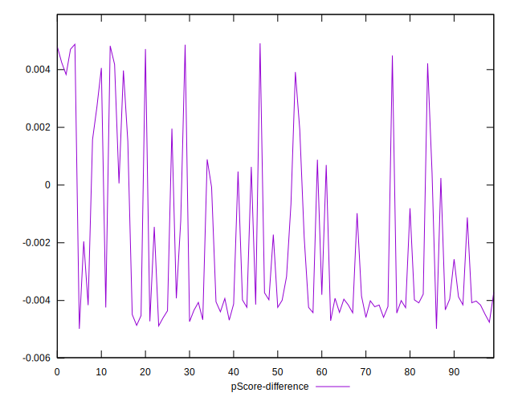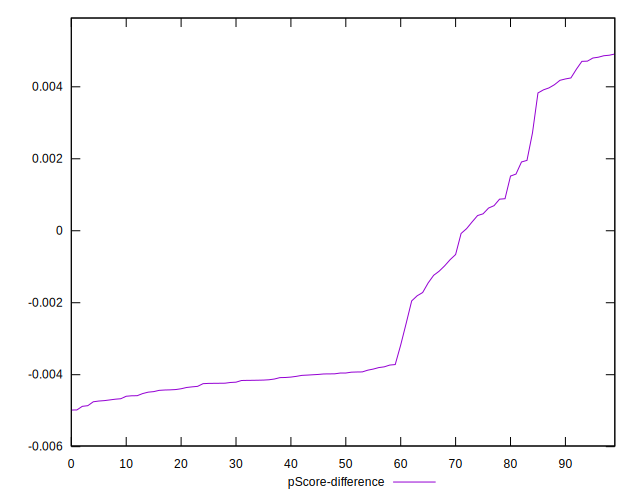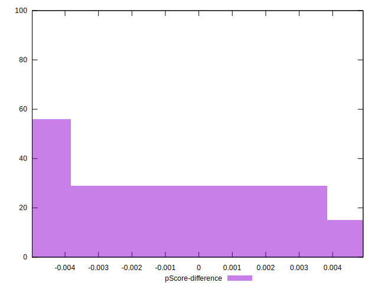