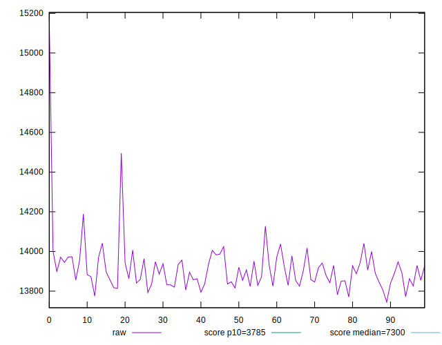
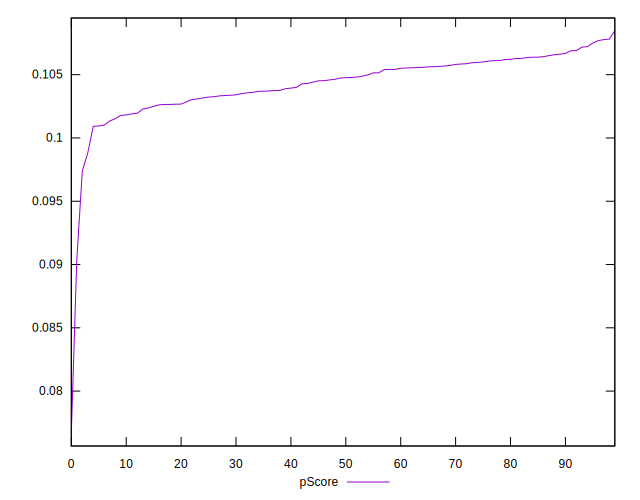

# //interactive/samples/pages+cached

[→ Parent](../..)


## Raw


```yaml
p90min: 13774.792849999998
p90max: 14127.585
p90range: 352.79215000000113
p90mean: 13899.215582978726
p90median: 13888.5534
p90stdev: 70.04546479728901
p90skewness: 0.5589626371221756
p90eccentricity: 0.9999999999999999
p90discretization: 1
outlandishness: 1.0025226182195754
confidence: 62.6782510713067
p90confidence: 28.320060796305228

```


## Score


```yaml
p90min: 0.1
p90max: 0.11
p90range: 0.009999999999999995
p90mean: 0.10446808510638289
p90median: 0.1
p90stdev: 0.0049716261470416695
p90skewness: 0.21398024625550288
p90eccentricity: 0.9999999999999999
p90discretization: 47
outlandishness: 0.99487420244648
confidence: 0.002229884368640328
p90confidence: 0.0020100766716044417

```


## Raw Estimate


## Score Estimate


## P Score


```yaml
p90min: 0.09883180602001423
p90max: 0.10769222292213498
p90range: 0.008860416902120749
p90mean: 0.10449378394731222
p90median: 0.104749875929144
p90stdev: 0.0017731975408020381
p90skewness: -0.5182026373946373
p90eccentricity: 1
p90discretization: 1
outlandishness: 0.9926468711483885
confidence: 0.0014365114506862053
p90confidence: 0.0007169209641866236

```


## Score Difference


```yaml
p90min: 0
p90max: 0
p90range: 0
p90mean: 0
p90median: 0
p90stdev: 0
p90skewness: .nan
p90eccentricity: .nan
p90discretization: 94
outlandishness: .nan
confidence: 0
p90confidence: 0

```


## P Score Difference


```yaml
p90min: -0.004586563371507715
p90max: 0.004778704668545991
p90range: 0.009365268040053706
p90mean: -0.00010085193582678403
p90median: 0.0009341676840750879
p90stdev: 0.003500060039310622
p90skewness: -0.00791487477305888
p90eccentricity: 1.0000000000000004
p90discretization: 1
outlandishness: 0.8160129456911849
confidence: 0.0014088223543031206
p90confidence: 0.00141510822136527

```

