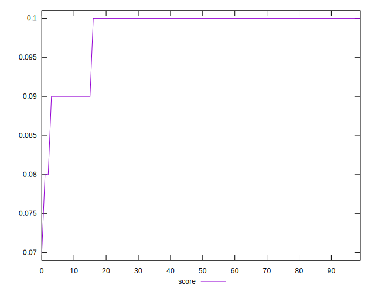
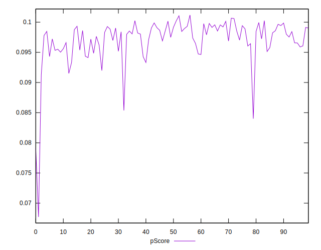
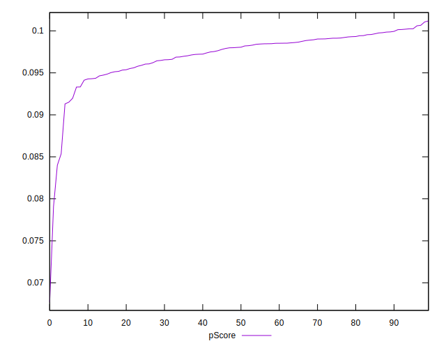

# //interactive/samples/pages

[→ Parent](../..)


## Raw


```yaml
p90min: 14054.572
p90max: 14731.076499999996
p90range: 676.5044999999955
p90mean: 14189.799540425534
p90median: 14160.649249999997
p90stdev: 104.64228024418964
p90skewness: 1.93590378767983
p90eccentricity: 1.0000000000000004
p90discretization: 1
outlandishness: 1.003549713677889
confidence: 82.15866261906476
p90confidence: 42.30788883985186

```


## Score


```yaml
p90min: 0.09
p90max: 0.1
p90range: 0.010000000000000009
p90mean: 0.09861702127659557
p90median: 0.1
p90stdev: 0.0034521235616144616
p90skewness: -2.0955340746285094
p90eccentricity: 0.9999999999999992
p90discretization: 47
outlandishness: 0.9875256624645509
confidence: 0.0019987789206217616
p90confidence: 0.0013957270384914783

```


## Raw Estimate


## Score Estimate


## P Score


```yaml
p90min: 0.08536654156010642
p90max: 0.1006023520276027
p90range: 0.01523581046749628
p90mean: 0.09737999530659333
p90median: 0.09804052205563712
p90stdev: 0.0024169510281768607
p90skewness: -1.766024525315521
p90eccentricity: 0.9999999999999994
p90discretization: 1
outlandishness: 0.9896386962079871
confidence: 0.0017338234584882543
p90confidence: 0.000977196742969008

```


## Score Difference


```yaml
p90min: 0
p90max: 0
p90range: 0
p90mean: 0
p90median: 0
p90stdev: 0
p90skewness: .nan
p90eccentricity: .nan
p90discretization: 94
outlandishness: .nan
confidence: 0
p90confidence: 0

```


## P Score Difference


```yaml
p90min: -0.004668036603112963
p90max: 0.004352184709662893
p90range: 0.009020221312775856
p90mean: -0.001192965362241254
p90median: -0.00140911570954258
p90stdev: 0.0020833016054997177
p90skewness: 0.8004356539937435
p90eccentricity: 1.0000000000000009
p90discretization: 1
outlandishness: 0.8905835350108048
confidence: 0.000922760836282932
p90confidence: 0.0008422990452777431

```

