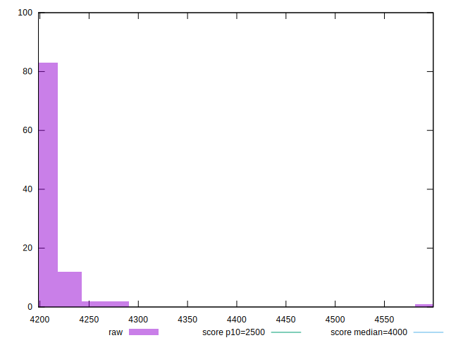

# //largest-contentful-paint/samples/pages+cached+noadtech+nomedia+nocss

[→ Parent](../..)


## Raw


```yaml
p90min: 4199.799299999999
p90max: 4257.521999999999
p90range: 57.72270000000026
p90mean: 4210.145563297873
p90median: 4207.5892
p90stdev: 9.824046912670333
p90skewness: 2.118052839218875
p90eccentricity: 0.9999999999999994
p90discretization: 1
outlandishness: 1.002429663087061
confidence: 16.184049414992867
p90confidence: 3.97195745131734

```


## Score


```yaml
p90min: 0.43
p90max: 0.45
p90range: 0.020000000000000018
p90mean: 0.44542553191489376
p90median: 0.45
p90stdev: 0.005191009744151429
p90skewness: -0.39858131119935397
p90eccentricity: 0.9999999999999999
p90discretization: 31.333333333333332
outlandishness: 0.9940571004147012
confidence: 0.0044381825389444305
p90confidence: 0.00209877558774185

```


## Raw Estimate


## Score Estimate


## P Score


```yaml
p90min: 0.43245558043414856
p90max: 0.44713419246288194
p90range: 0.014678612028733384
p90mean: 0.44448651418072166
p90median: 0.445136808427253
p90stdev: 0.0025050010769744405
p90skewness: -2.1006187885290073
p90eccentricity: 1.0000000000000002
p90discretization: 1
outlandishness: 0.9944524600196568
confidence: 0.003888789646493219
p90confidence: 0.0010127962317050955

```


## Score Difference


```yaml
p90min: 0
p90max: 0
p90range: 0
p90mean: 0
p90median: 0
p90stdev: 0
p90skewness: .nan
p90eccentricity: .nan
p90discretization: 94
outlandishness: .inf
confidence: 2.165089820536967e-18
p90confidence: 0

```


## P Score Difference


```yaml
p90min: -0.004874151794136972
p90max: 0.004794477030949318
p90range: 0.00966862882508629
p90mean: -0.0009020923747004472
p90median: -0.003046218109422155
p90stdev: 0.003537622372214962
p90skewness: 0.4283942841475432
p90eccentricity: 0.9999999999999994
p90discretization: 1
outlandishness: 0.8838855280094482
confidence: 0.0014282564508055736
p90confidence: 0.0014302950368797432

```

