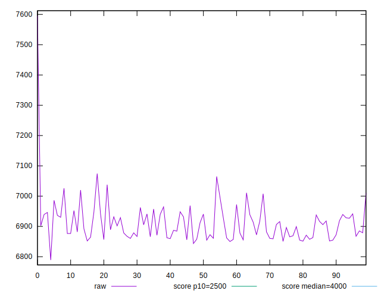
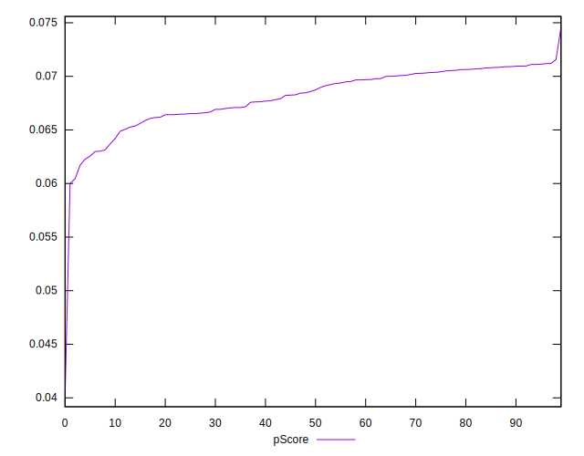

# //largest-contentful-paint/samples/pages+cached+noadtech+nomedia

[→ Parent](../..)


## Raw


```yaml
p90min: 6850.533800000001
p90max: 7037.7485000000015
p90range: 187.21470000000045
p90mean: 6906.811612257183
p90median: 6897.916499999999
p90stdev: 46.966482935004414
p90skewness: 0.8319759016573886
p90eccentricity: 1.0000000000000002
p90discretization: 1
outlandishness: 1.0022513301848381
confidence: 33.96204219665348
p90confidence: 18.989004583769084

```


## Score


```yaml
p90min: 0.06
p90max: 0.07
p90range: 0.010000000000000009
p90mean: 0.06904255319148943
p90median: 0.07
p90stdev: 0.0029424078055190106
p90skewness: -2.7477857990363463
p90eccentricity: 1.0000000000000009
p90discretization: 47
outlandishness: 0.9872213636719761
confidence: 0.0016649314355290682
p90confidence: 0.001189644014512222

```


## Raw Estimate


## Score Estimate


## P Score


```yaml
p90min: 0.061711951607113236
p90max: 0.07118207521308717
p90range: 0.009470123605973935
p90mean: 0.06823894426826678
p90median: 0.0686609773551933
p90stdev: 0.002406770243911172
p90skewness: -0.7679781622289013
p90eccentricity: 1
p90discretization: 1
outlandishness: 0.9908030916576408
confidence: 0.0015239027201822684
p90confidence: 0.00097308055314583

```


## Score Difference


```yaml
p90min: 0
p90max: 0
p90range: 0
p90mean: 0
p90median: 0
p90stdev: 0
p90skewness: .nan
p90eccentricity: .nan
p90discretization: 94
outlandishness: .nan
confidence: 0
p90confidence: 0

```


## P Score Difference


```yaml
p90min: -0.004383828902942699
p90max: 0.0036936971420980513
p90range: 0.00807752604504075
p90mean: -0.0007117838331267111
p90median: -0.0002582714253296925
p90stdev: 0.0019347234608016969
p90skewness: -0.11478043437000704
p90eccentricity: 1.0000000000000007
p90discretization: 1
outlandishness: 0.9008446096412895
confidence: 0.0008629485585906203
p90confidence: 0.0007822274603003665

```

