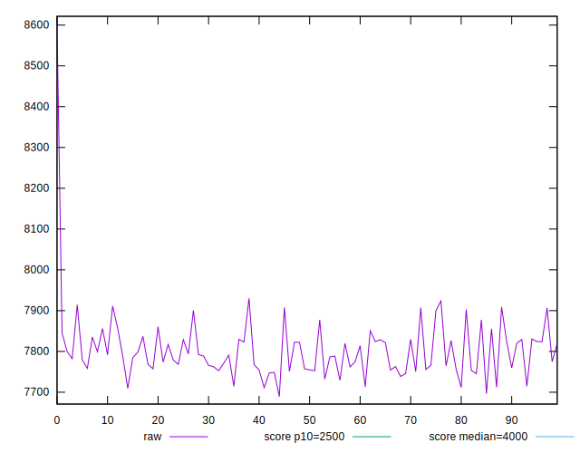
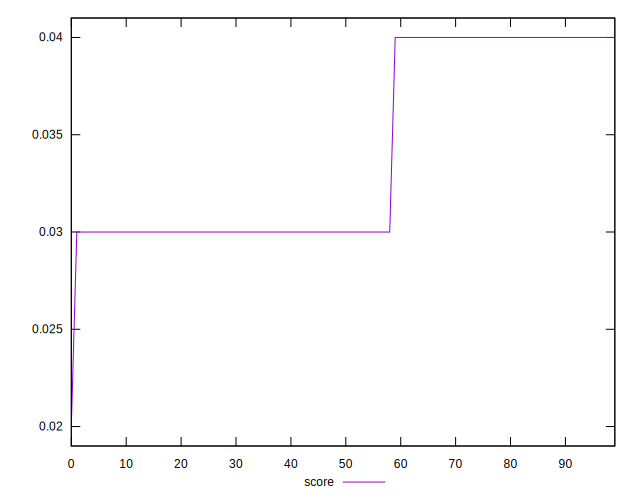

# //largest-contentful-paint/samples/pages+cached+noadtech

[→ Parent](../..)


## Raw


```yaml
p90min: 7711.224500000002
p90max: 7914.270050000003
p90range: 203.04555000000073
p90mean: 7798.445462079129
p90median: 7788.94155
p90stdev: 52.720257946813184
p90skewness: 0.5261914415875043
p90eccentricity: 0.9999999999999999
p90discretization: 1
outlandishness: 1.0019539683854515
confidence: 38.53480485115557
p90confidence: 21.315311627547782

```


## Score


```yaml
p90min: 0.03
p90max: 0.04
p90range: 0.010000000000000002
p90mean: 0.03404255319148934
p90median: 0.03
p90stdev: 0.004907473444540768
p90skewness: 0.390199486285878
p90eccentricity: 0.9999999999999988
p90discretization: 47
outlandishness: 0.9975015624999997
confidence: 0.0019987789206217603
p90confidence: 0.001984139111759124

```


## Raw Estimate


## Score Estimate


## P Score


```yaml
p90min: 0.03139914293625279
p90max: 0.03674714239178373
p90range: 0.0053479994555309385
p90mean: 0.034375837443369764
p90median: 0.03460150191186462
p90stdev: 0.001388932192321367
p90skewness: -0.4478165274373999
p90eccentricity: 1.0000000000000002
p90discretization: 1
outlandishness: 0.9916770506976621
confidence: 0.0008580115050647921
p90confidence: 0.0005615587567634928

```


## Score Difference


```yaml
p90min: 0
p90max: 0
p90range: 0
p90mean: 0
p90median: 0
p90stdev: 0
p90skewness: .nan
p90eccentricity: .nan
p90discretization: 94
outlandishness: .nan
confidence: 0
p90confidence: 0

```


## P Score Difference


```yaml
p90min: -0.004837220718138656
p90max: 0.004860768031610424
p90range: 0.00969798874974908
p90mean: 0.0002466316544412729
p90median: 0.001628656535444778
p90stdev: 0.0037709909897276567
p90skewness: -0.2506467131797523
p90eccentricity: 0.9999999999999999
p90discretization: 1
outlandishness: 0.8885663563533588
confidence: 0.0015095498740119086
p90confidence: 0.001524648232408328

```

