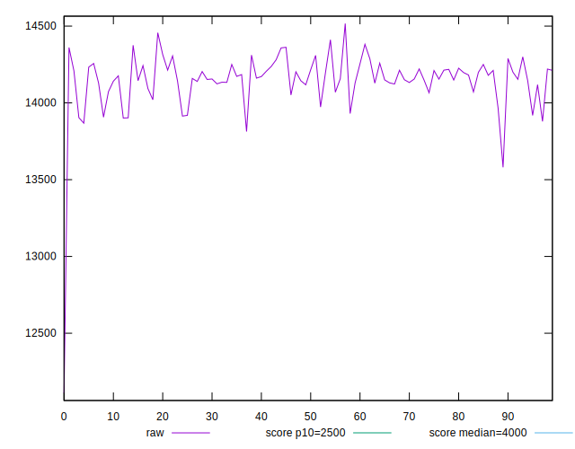
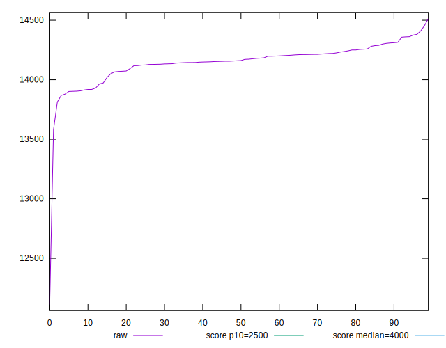
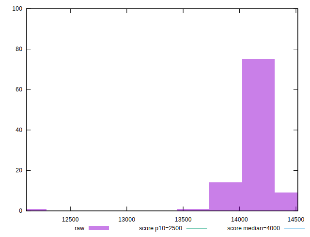
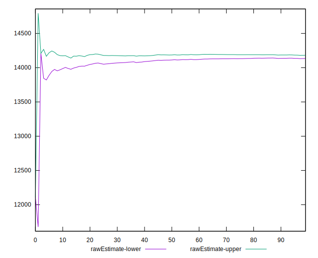
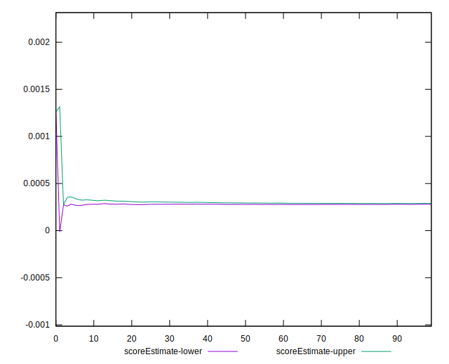
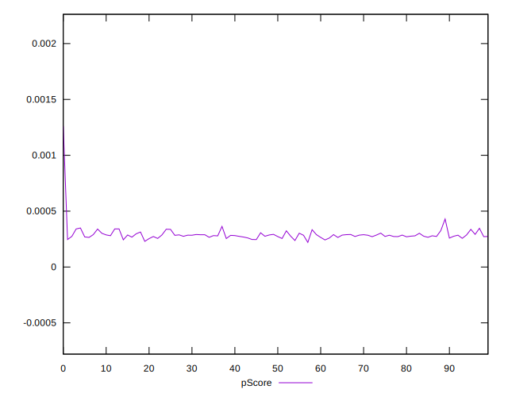
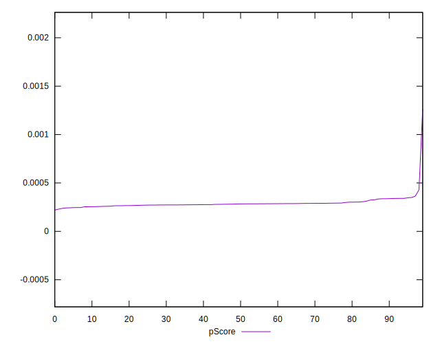
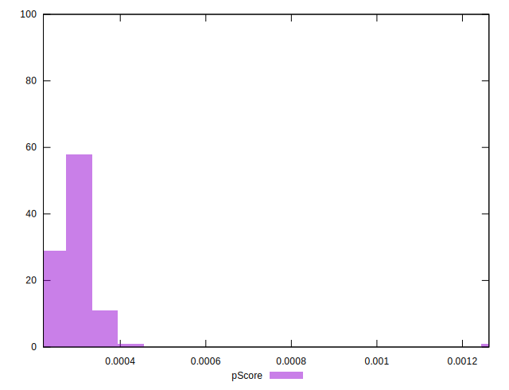
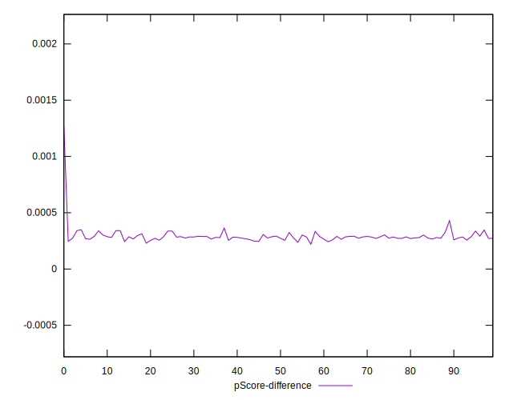
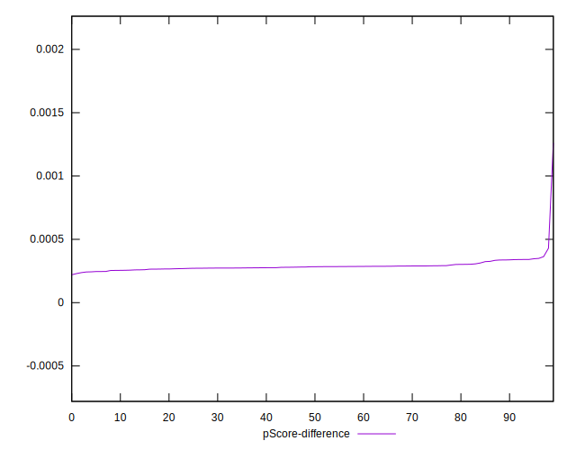

# //largest-contentful-paint/samples/pages+cached

[→ Parent](../..)


## Raw


```yaml
p90min: 13867.941499999999
p90max: 14381.4365
p90range: 513.4950000000008
p90mean: 14157.505231914896
p90median: 14160.2565
p90stdev: 117.49827953012077
p90skewness: -0.6955102491917486
p90eccentricity: 0.9999999999999996
p90discretization: 1
outlandishness: 0.9970963575306427
confidence: 97.46325655863254
p90confidence: 47.50569404292216

```


## Score


```yaml
p90min: 0
p90max: 0
p90range: 0
p90mean: 0
p90median: 0
p90stdev: 0
p90skewness: .nan
p90eccentricity: .nan
p90discretization: 94
outlandishness: .nan
confidence: 0
p90confidence: 0

```


## Raw Estimate


## Score Estimate


## P Score


```yaml
p90min: 0.0002422929364059856
p90max: 0.0003494554382691417
p90range: 0.00010716250186315612
p90mean: 0.0002851585836611719
p90median: 0.0002835522415132463
p90stdev: 0.000024650620296389804
p90skewness: 0.9266245490202558
p90eccentricity: 0.9999999999999997
p90discretization: 1
outlandishness: 1.0736476412394913
confidence: 0.00003992521316869012
p90confidence: 0.000009966484874941024

```


## Score Difference


```yaml
p90min: 0
p90max: 0
p90range: 0
p90mean: 0
p90median: 0
p90stdev: 0
p90skewness: .nan
p90eccentricity: .nan
p90discretization: 94
outlandishness: .nan
confidence: 0
p90confidence: 0

```


## P Score Difference


```yaml
p90min: 0.0002422929364059856
p90max: 0.0003494554382691417
p90range: 0.00010716250186315612
p90mean: 0.0002851585836611719
p90median: 0.0002835522415132463
p90stdev: 0.000024650620296389804
p90skewness: 0.9266245490202558
p90eccentricity: 0.9999999999999997
p90discretization: 1
outlandishness: 1.0736476412394913
confidence: 0.00003992521316869012
p90confidence: 0.000009966484874941024

```

