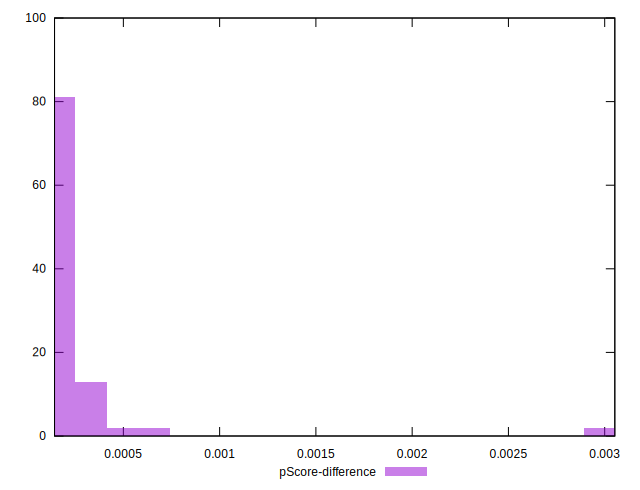

# //largest-contentful-paint/samples/pages

[→ Parent](../..)


## Raw


```yaml
p90min: 12856.6865
p90max: 14672.182
p90range: 1815.495500000001
p90mean: 14394.94053191489
p90median: 14461.669750000001
p90stdev: 260.7179405022681
p90skewness: -3.532001177288944
p90eccentricity: 1.0000000000000002
p90discretization: 1
outlandishness: 0.9908261151799928
confidence: 225.67099179108925
p90confidence: 105.41079207739784

```


## Score


```yaml
p90min: 0
p90max: 0
p90range: 0
p90mean: 0
p90median: 0
p90stdev: 0
p90skewness: .nan
p90eccentricity: .nan
p90discretization: 94
outlandishness: .nan
confidence: 0
p90confidence: 0

```


## Raw Estimate


## Score Estimate


## P Score


```yaml
p90min: 0.00019727334441843603
p90max: 0.000727359350522816
p90range: 0.00053008600610438
p90mean: 0.0002454928749625205
p90median: 0.0002289016155019863
p90stdev: 0.0000672097977979423
p90skewness: 4.937556938676529
p90eccentricity: 1.0000000000000007
p90discretization: 1
outlandishness: 1.521477295044631
confidence: 0.00015444519245846343
p90confidence: 0.000027173573125019433

```


## Score Difference


```yaml
p90min: 0
p90max: 0
p90range: 0
p90mean: 0
p90median: 0
p90stdev: 0
p90skewness: .nan
p90eccentricity: .nan
p90discretization: 94
outlandishness: .nan
confidence: 0
p90confidence: 0

```


## P Score Difference


```yaml
p90min: 0.00019727334441843603
p90max: 0.000727359350522816
p90range: 0.00053008600610438
p90mean: 0.0002454928749625205
p90median: 0.0002289016155019863
p90stdev: 0.0000672097977979423
p90skewness: 4.937556938676529
p90eccentricity: 1.0000000000000007
p90discretization: 1
outlandishness: 1.521477295044631
confidence: 0.00015444519245846343
p90confidence: 0.000027173573125019433

```

