# //mainthread-work-breakdown/samples/pages+cached+noadtech+nomedia+nocss

[→ Parent](../..)


## Raw


```yaml
p90min: 348.584
p90max: 436.9920000000001
p90range: 88.40800000000007
p90mean: 382.0932340425533
p90median: 379.3740000000001
p90stdev: 20.69168795209629
p90skewness: 0.8320035583376537
p90eccentricity: 1.0000000000000007
p90discretization: 1
outlandishness: 1.013647567840362
confidence: 12.976781089177297
p90confidence: 8.365850130017598

```

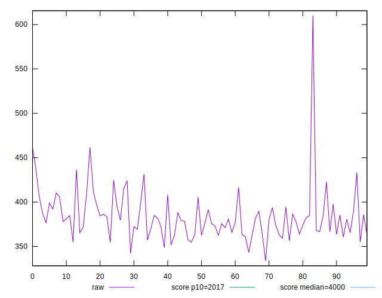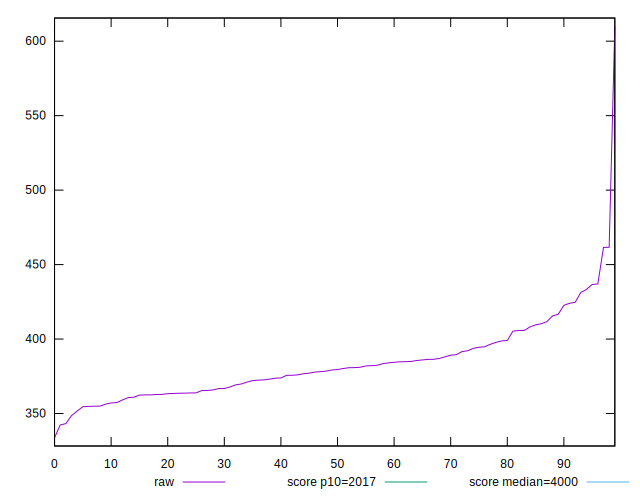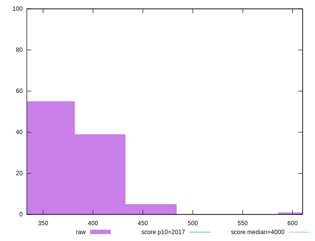
## Score


```yaml
p90min: 1
p90max: 1
p90range: 0
p90mean: 1
p90median: 1
p90stdev: 0
p90skewness: .nan
p90eccentricity: .nan
p90discretization: 94
outlandishness: 1
confidence: 0
p90confidence: 0

```


## Raw Estimate

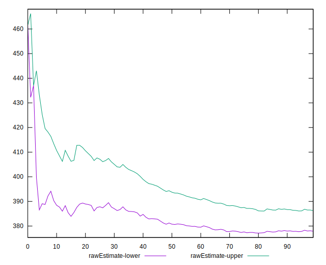
## Score Estimate

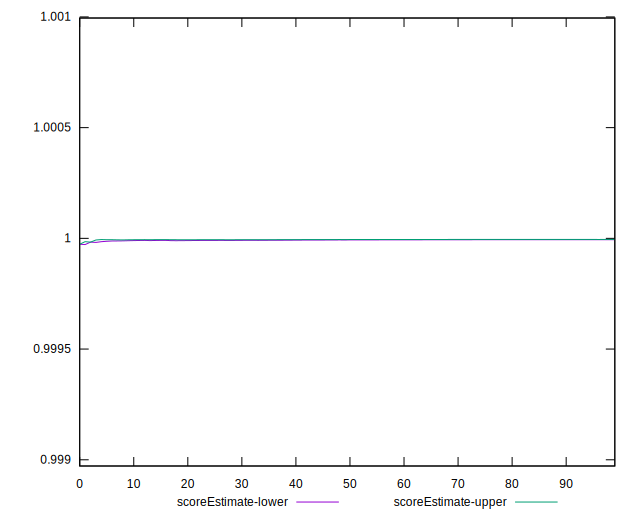
## P Score


```yaml
p90min: 0.9999829470074815
p90max: 0.9999975281814077
p90range: 0.000014581173926275781
p90mean: 0.999993913900873
p90median: 0.9999948018930589
p90stdev: 0.0000032625789656378964
p90skewness: -1.666600891353664
p90eccentricity: 0.9999999999999996
p90discretization: 1
outlandishness: 0.9999952327577699
confidence: 0.00000834716230168725
p90confidence: 0.0000013190923199240145

```

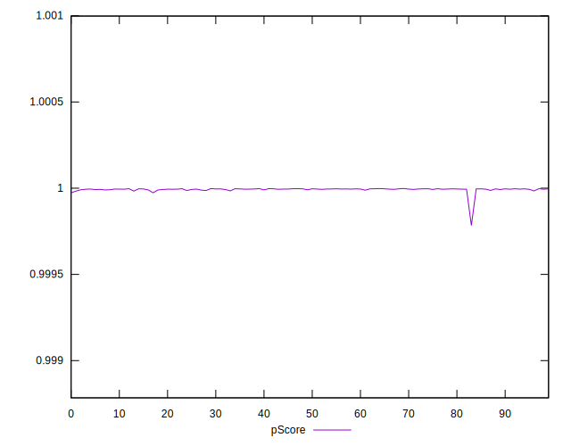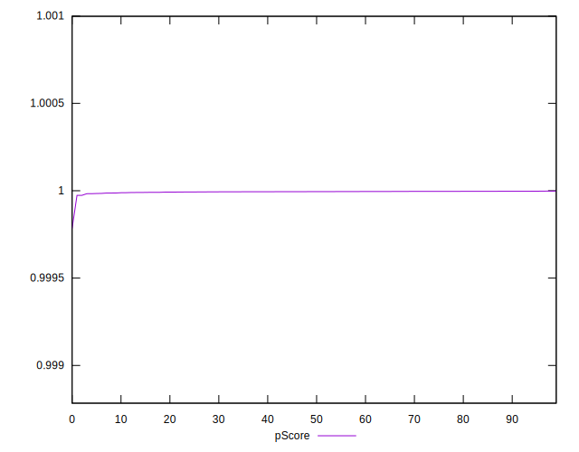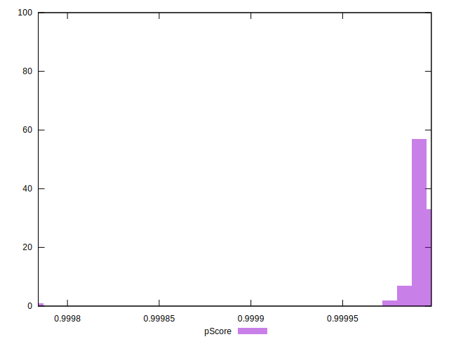
## Score Difference


```yaml
p90min: 0
p90max: 0
p90range: 0
p90mean: 0
p90median: 0
p90stdev: 0
p90skewness: .nan
p90eccentricity: .nan
p90discretization: 94
outlandishness: .nan
confidence: 0
p90confidence: 0

```


## P Score Difference


```yaml
p90min: -0.00001705299251852921
p90max: -0.0000024718185922534275
p90range: 0.000014581173926275781
p90mean: -0.000006086099127693943
p90median: -0.000005198106941106673
p90stdev: 0.000003262578965637896
p90skewness: -1.6666008914307728
p90eccentricity: 1.0000000000000002
p90discretization: 1
outlandishness: 1.9366845664790548
confidence: 0.00000834716230168725
p90confidence: 0.0000013190923199240142

```

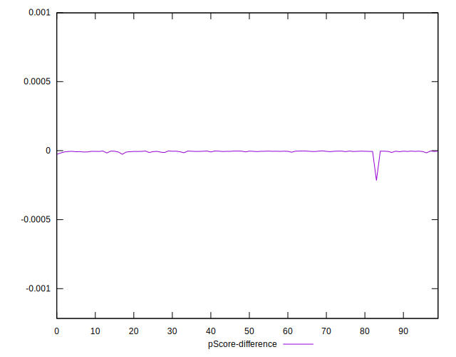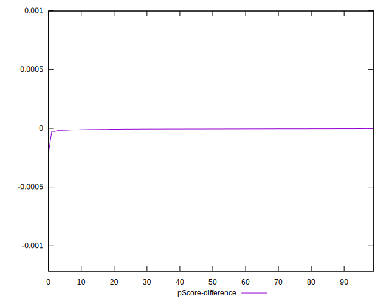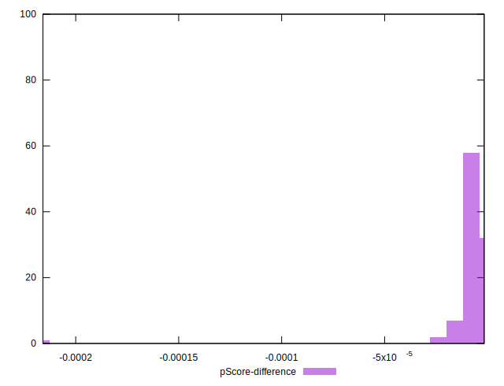