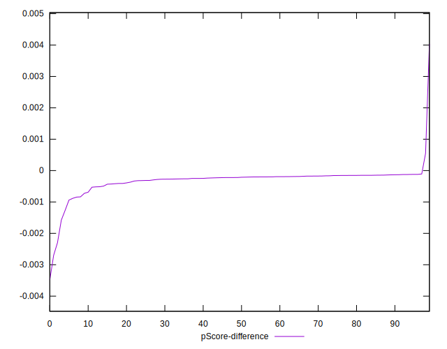

# //mainthread-work-breakdown/samples/pages+cached+noadtech+nomedia

[→ Parent](../..)


## Raw


```yaml
p90min: 563.6520000000002
p90max: 904.6960000000009
p90range: 341.0440000000008
p90mean: 631.5545957446813
p90median: 612.2100000000006
p90stdev: 64.9528771163192
p90skewness: 2.0604754842200697
p90eccentricity: 0.9999999999999999
p90discretization: 1
outlandishness: 1.0326085692335774
confidence: 37.812923252300266
p90confidence: 26.261078203314256

```


## Score


```yaml
p90min: 1
p90max: 1
p90range: 0
p90mean: 1
p90median: 1
p90stdev: 0
p90skewness: .nan
p90eccentricity: .nan
p90discretization: 94
outlandishness: 0.9996000399999998
confidence: 0.0005487899156712154
p90confidence: 0

```


## Raw Estimate


## Score Estimate


## P Score


```yaml
p90min: 0.9973008132079676
p90max: 0.9998776889202873
p90range: 0.0025768757123196817
p90mean: 0.9996525193886282
p90median: 0.9997785975611684
p90stdev: 0.00039836239126762304
p90skewness: -3.9559705633555744
p90eccentricity: 1.0000000000000002
p90discretization: 1
outlandishness: 0.9996566362506486
confidence: 0.0004577818370591197
p90confidence: 0.00016106177855068288

```


## Score Difference


```yaml
p90min: 0
p90max: 0
p90range: 0
p90mean: 0
p90median: 0
p90stdev: 0
p90skewness: .nan
p90eccentricity: .nan
p90discretization: 94
outlandishness: .nan
confidence: 0
p90confidence: 0

```


## P Score Difference


```yaml
p90min: -0.0015793640157452105
p90max: -0.00012056178092356706
p90range: 0.0014588022348216434
p90mean: -0.00029687519910345854
p90median: -0.0002163506079781441
p90stdev: 0.00024051944376084938
p90skewness: -2.9647274766618836
p90eccentricity: 0.9999999999999999
p90discretization: 1
outlandishness: 1.1554564508274987
confidence: 0.00026251446688413074
p90confidence: 0.00009724434393737364

```

