# //mainthread-work-breakdown/samples/pages+cached+noadtech

[→ Parent](../..)


## Raw


```yaml
p90min: 582.5080000000007
p90max: 748.0560000000008
p90range: 165.54800000000012
p90mean: 631.3080000000006
p90median: 622.5120000000006
p90stdev: 36.864064037510964
p90skewness: 1.2981869866176006
p90eccentricity: 1
p90discretization: 1
outlandishness: 1.0088202662238535
confidence: 17.748564668712984
p90confidence: 14.904498639026885

```

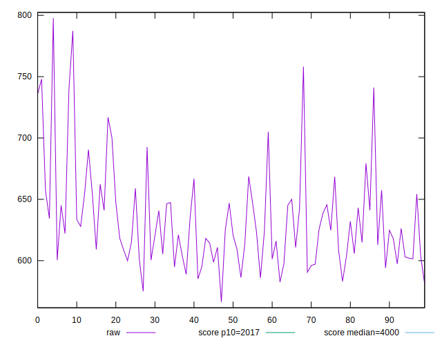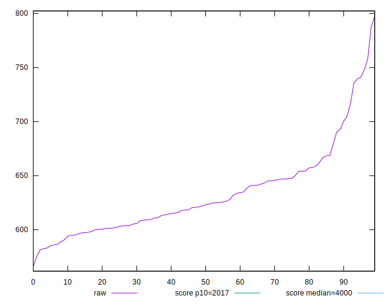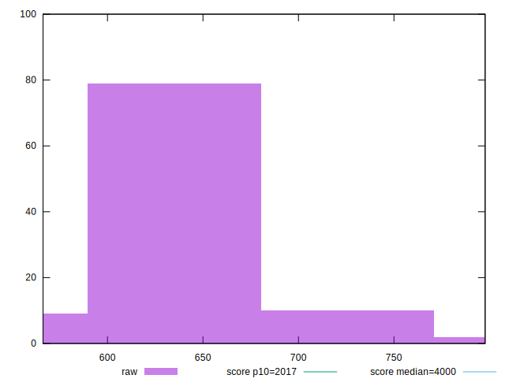
## Score


```yaml
p90min: 1
p90max: 1
p90range: 0
p90mean: 1
p90median: 1
p90stdev: 0
p90skewness: .nan
p90eccentricity: .nan
p90discretization: 94
outlandishness: 1
confidence: 0
p90confidence: 0

```


## Raw Estimate

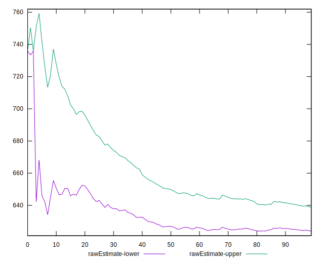
## Score Estimate

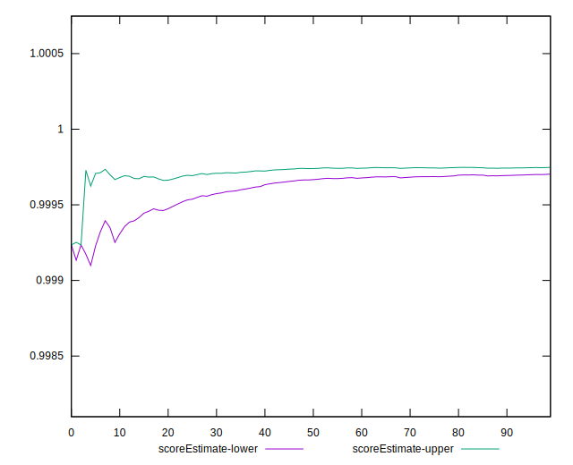
## P Score


```yaml
p90min: 0.9991497377360355
p90max: 0.9998446674625059
p90range: 0.0006949297264703391
p90mean: 0.9997059096699258
p90median: 0.9997510918327044
p90stdev: 0.00014359696058505354
p90skewness: -2.1482239388742372
p90eccentricity: 0.9999999999999999
p90discretization: 1
outlandishness: 0.9999594058185746
confidence: 0.00007937377185346511
p90confidence: 0.00005805764392744461

```

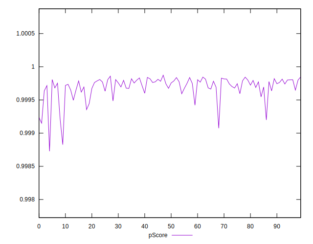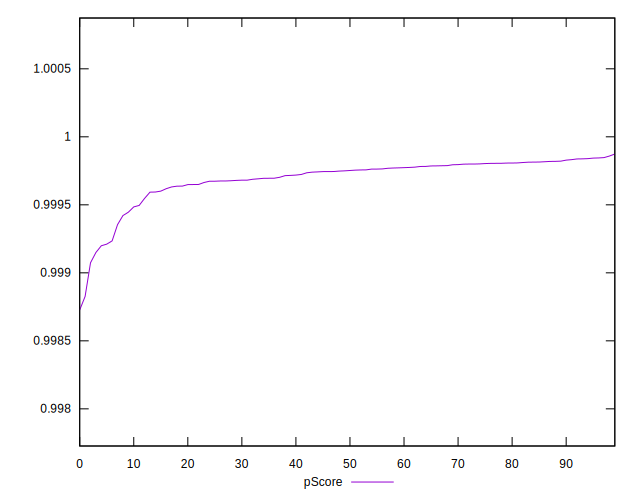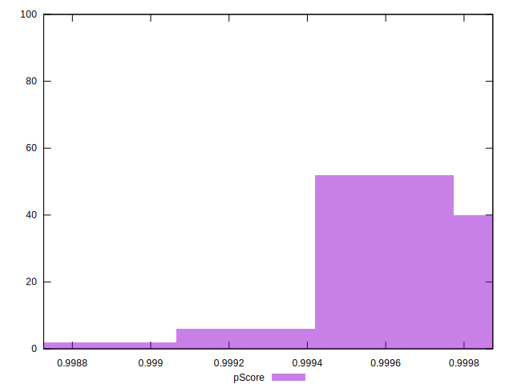
## Score Difference


```yaml
p90min: 0
p90max: 0
p90range: 0
p90mean: 0
p90median: 0
p90stdev: 0
p90skewness: .nan
p90eccentricity: .nan
p90discretization: 94
outlandishness: .nan
confidence: 0
p90confidence: 0

```


## P Score Difference


```yaml
p90min: -0.0008502622639644519
p90max: -0.0001553325374941128
p90range: 0.0006949297264703391
p90mean: -0.0002940903300741569
p90median: -0.00024890816729561394
p90stdev: 0.00014359696058505354
p90skewness: -2.1482239388661672
p90eccentricity: 0.9999999999999996
p90discretization: 1
outlandishness: 1.1427544185141543
confidence: 0.00007937377185346511
p90confidence: 0.00005805764392744461

```

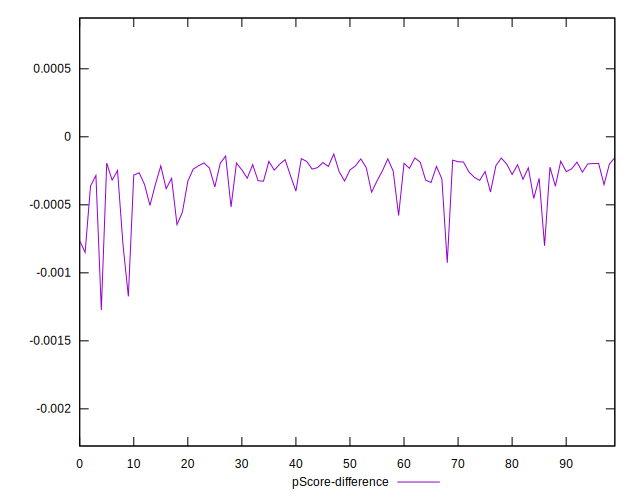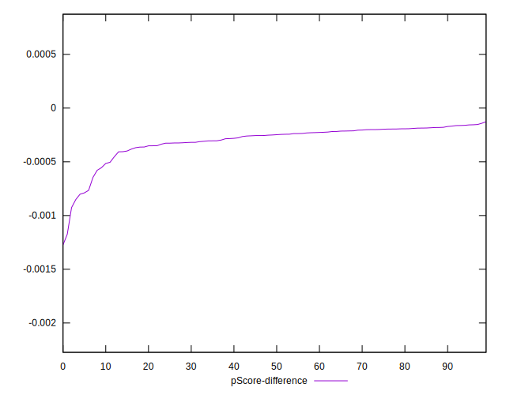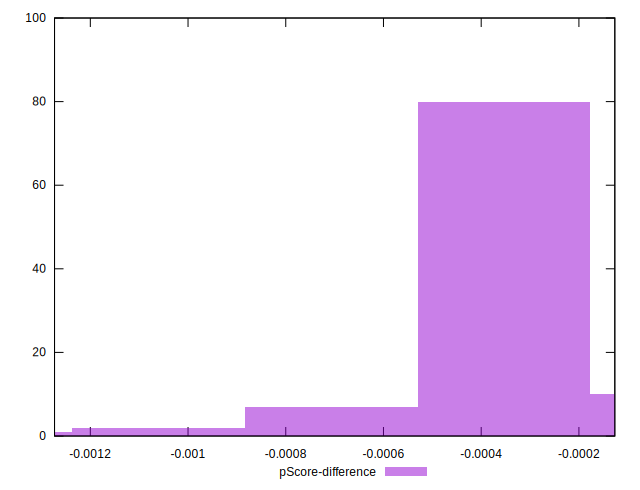