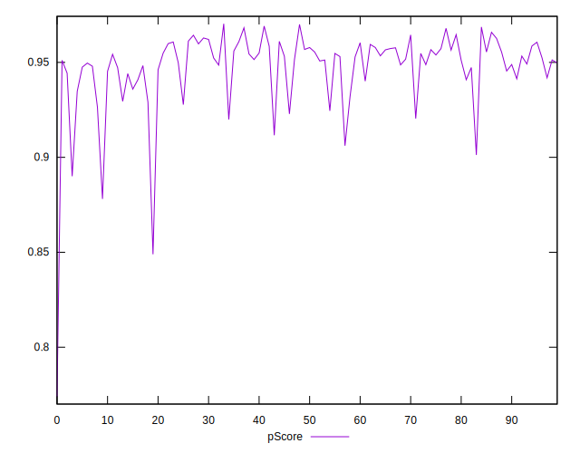

# //mainthread-work-breakdown/samples/pages+cached

[→ Parent](../..)


## Raw


```yaml
p90min: 1479.799999999999
p90max: 2076.8120000000035
p90range: 597.0120000000045
p90mean: 1663.5983829787247
p90median: 1640.6280000000008
p90stdev: 114.53542113204952
p90skewness: 1.2941050278731923
p90eccentricity: 1.0000000000000004
p90discretization: 1
outlandishness: 1.018663474548273
confidence: 67.84619309119789
p90confidence: 46.30778165548849

```


## Score


```yaml
p90min: 0.89
p90max: 0.97
p90range: 0.07999999999999996
p90mean: 0.9486170212765959
p90median: 0.95
p90stdev: 0.014774983445271854
p90skewness: -1.601705287160723
p90eccentricity: 0.9999999999999997
p90discretization: 10.444444444444445
outlandishness: 0.9940696013497884
confidence: 0.010179442362572302
p90confidence: 0.005973669111132756

```


## Raw Estimate


## Score Estimate


## P Score


```yaml
p90min: 0.890061201933351
p90max: 0.9686448307934484
p90range: 0.0785836288600974
p90mean: 0.9487886240884661
p90median: 0.9523547514904054
p90stdev: 0.014558858199279458
p90skewness: -1.703217609884115
p90eccentricity: 1.0000000000000007
p90discretization: 1
outlandishness: 0.9940588376897845
confidence: 0.010068799237956722
p90confidence: 0.0058862875779552085

```


## Score Difference


```yaml
p90min: 0
p90max: 1.1102230246251565e-16
p90range: 1.1102230246251565e-16
p90mean: 5.0786797934980564e-17
p90median: 0
p90stdev: 5.530974956507697e-17
p90skewness: 0.17083256870359323
p90eccentricity: 1.0000000000000002
p90discretization: 47
outlandishness: 1.0111939426717147
confidence: 2.169022775314444e-17
p90confidence: 2.2362268204579326e-17

```


## P Score Difference


```yaml
p90min: -0.0045415430560799
p90max: 0.004724127704060832
p90range: 0.009265670760140732
p90mean: 0.0001695461997472061
p90median: 0.0000908816181999228
p90stdev: 0.0025682878859312665
p90skewness: 0.05991929498642507
p90eccentricity: 0.9999999999999999
p90discretization: 1
outlandishness: 0.9582798772248584
confidence: 0.0010763243448023707
p90confidence: 0.0010383837023921461

```

