# //mainthread-work-breakdown/samples/pages

[→ Parent](../..)


## Raw


```yaml
p90min: 1646.952000000002
p90max: 2300.5519999999965
p90range: 653.5999999999945
p90mean: 1814.2171063829794
p90median: 1821.9140000000011
p90stdev: 112.1657329557436
p90skewness: 1.1935846434105597
p90eccentricity: 0.9999999999999997
p90discretization: 1
outlandishness: 1.0228892623962467
confidence: 76.37015693404673
p90confidence: 45.34969374193856

```

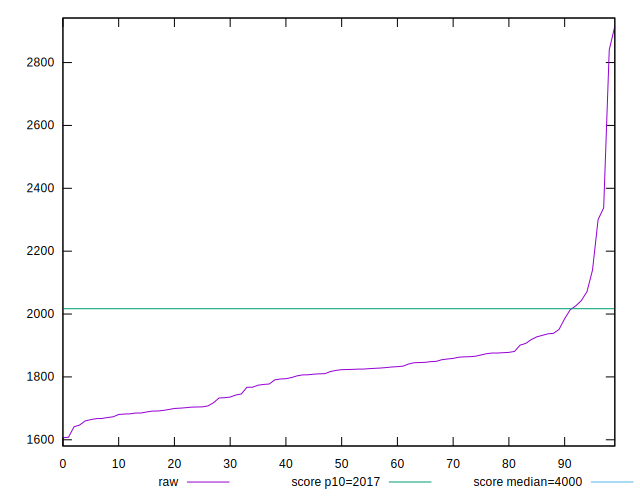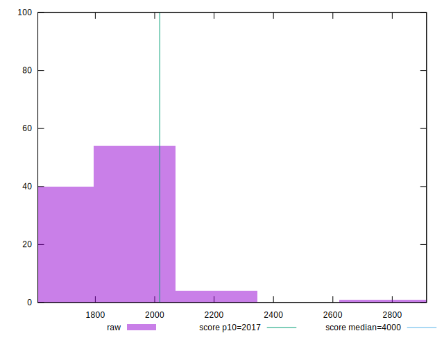
## Score


```yaml
p90min: 0.85
p90max: 0.95
p90range: 0.09999999999999998
p90mean: 0.9300000000000009
p90median: 0.93
p90stdev: 0.016885093514065082
p90skewness: -1.4850155757080297
p90eccentricity: 0.9999999999999991
p90discretization: 10.444444444444445
outlandishness: 0.9912022314718467
confidence: 0.013328850323862655
p90confidence: 0.006826807078138335

```

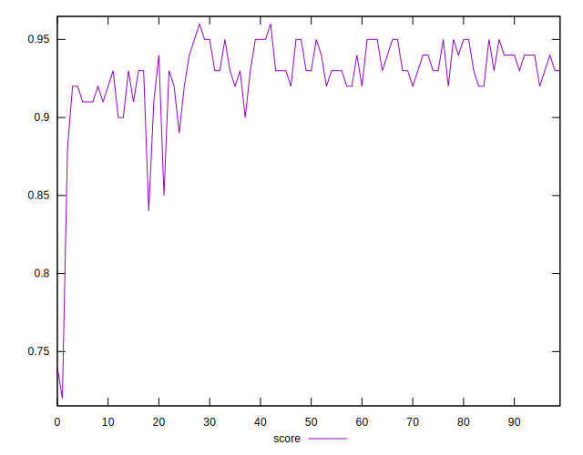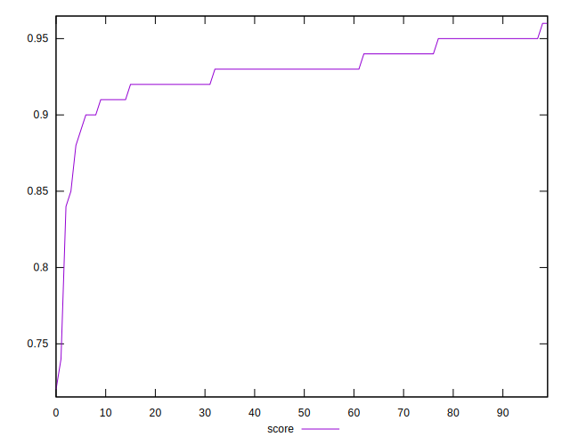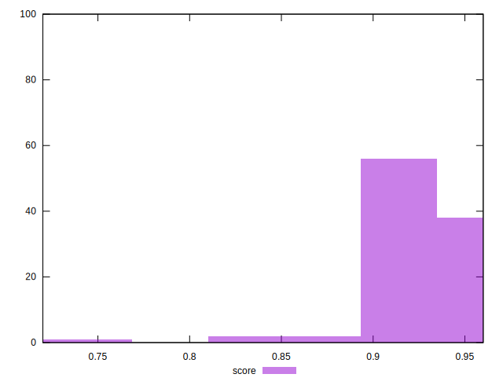
## Raw Estimate

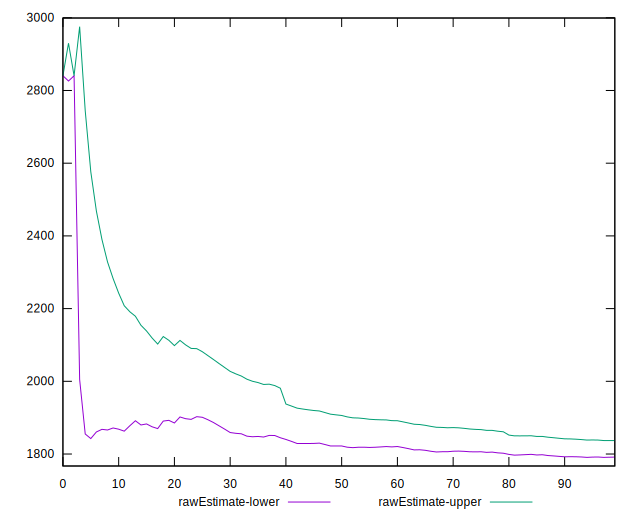
## Score Estimate

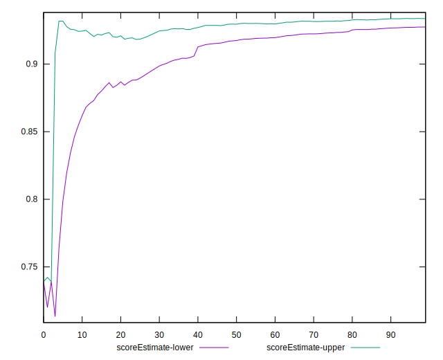
## P Score


```yaml
p90min: 0.849746392220077
p90max: 0.9516358568257279
p90range: 0.10188946460565096
p90mean: 0.9297329933062147
p90median: 0.9294829960952673
p90stdev: 0.016371836703000034
p90skewness: -1.7078916970195184
p90eccentricity: 1.0000000000000002
p90discretization: 1
outlandishness: 0.9912164736466568
confidence: 0.013120935228278476
p90confidence: 0.006619292371289784

```

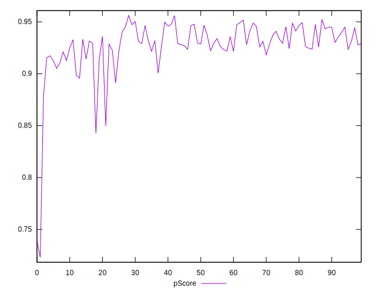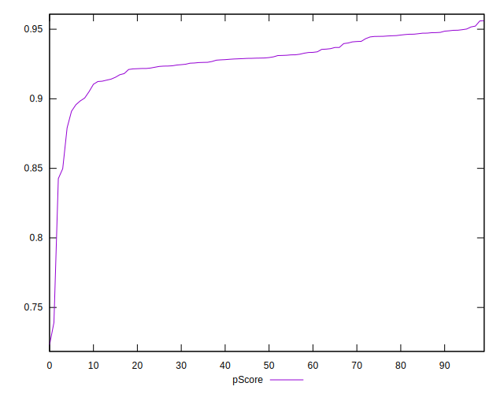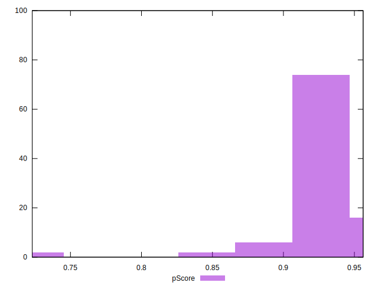
## Score Difference


```yaml
p90min: 0
p90max: 1.1102230246251565e-16
p90range: 1.1102230246251565e-16
p90mean: 3.897591469428741e-17
p90median: 0
p90stdev: 5.29912621446783e-17
p90skewness: 0.6240740781687906
p90eccentricity: 0.9999999999999992
p90discretization: 47
outlandishness: 1.0515570247933883
confidence: 2.088957257349536e-17
p90confidence: 2.1424881253244533e-17

```

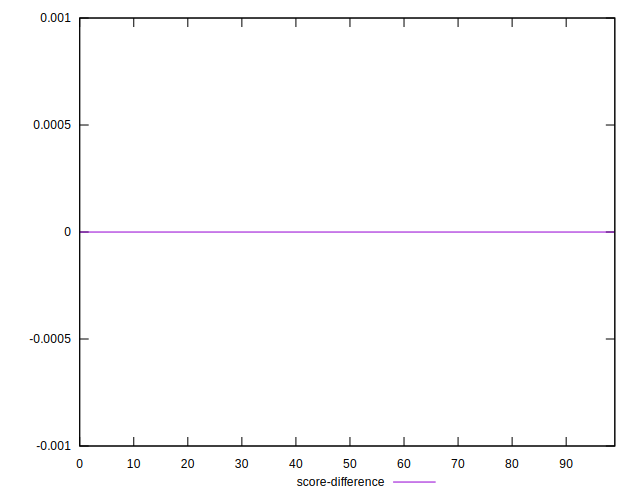
## P Score Difference


```yaml
p90min: -0.004578552789664125
p90max: 0.00480201840245198
p90range: 0.009380571192116105
p90mean: -0.00027772831877706457
p90median: -0.0005170039047328046
p90stdev: 0.0027040710765914053
p90skewness: 0.05901506234159792
p90eccentricity: 0.9999999999999994
p90discretization: 1
outlandishness: 0.8708857413114147
confidence: 0.0011282305151392418
p90confidence: 0.0010932821633523233

```

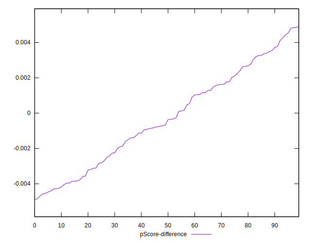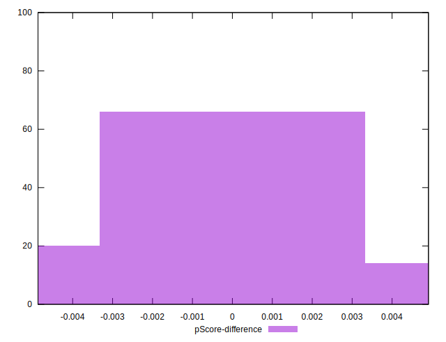