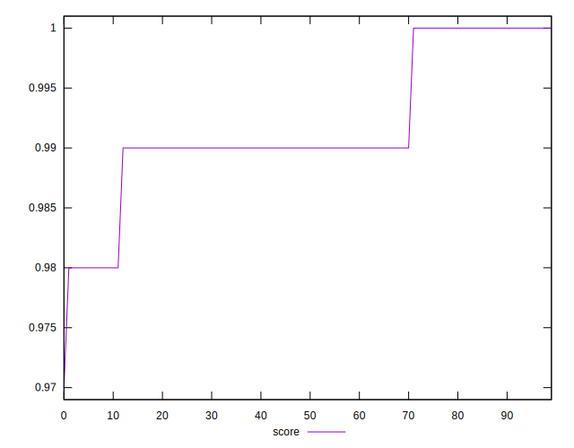

# //max-potential-fid/samples/pages+cached+noadtech+nomedia+nocss

[→ Parent](../..)


## Raw


```yaml
p90min: 66
p90max: 88
p90range: 22
p90mean: 73.08510638297872
p90median: 72
p90stdev: 5.960257695535763
p90skewness: 0.6075077534759545
p90eccentricity: 1.0000000000000007
p90discretization: 4.2727272727272725
outlandishness: 1.0083609261540483
confidence: 2.638257133138622
p90confidence: 2.4097899955080577

```


## Score


```yaml
p90min: 0.98
p90max: 1
p90range: 0.020000000000000018
p90mean: 0.991808510638297
p90median: 0.99
p90stdev: 0.005827806776511639
p90skewness: -0.04715359085933739
p90eccentricity: 1.0000000000000007
p90discretization: 31.333333333333332
outlandishness: 0.9995795786824199
confidence: 0.0025234108149848693
p90confidence: 0.002356238804290395

```


## Raw Estimate


## Score Estimate


## P Score


```yaml
p90min: 0.979634315738652
p90max: 0.9954734645055221
p90range: 0.015839148766870093
p90mean: 0.9914859568931236
p90median: 0.9926466668793034
p90stdev: 0.003906723826342088
p90skewness: -1.0423725206644512
p90eccentricity: 1.0000000000000009
p90discretization: 4.2727272727272725
outlandishness: 0.9993118786999028
confidence: 0.001851398556319375
p90confidence: 0.0015795263347394362

```


## Score Difference


```yaml
p90min: 0
p90max: 0
p90range: 0
p90mean: 0
p90median: 0
p90stdev: 0
p90skewness: .nan
p90eccentricity: .nan
p90discretization: 94
outlandishness: .nan
confidence: 0
p90confidence: 0

```


## P Score Difference


```yaml
p90min: -0.004931822957321863
p90max: 0.0046375893622611075
p90range: 0.00956941231958297
p90mean: -0.0004752397538123857
p90median: 0.00019072068583270152
p90stdev: 0.0033935181947433355
p90skewness: -0.09196598319661173
p90eccentricity: 1.0000000000000007
p90discretization: 3.76
outlandishness: 0.9175762585010895
confidence: 0.0013696174611786249
p90confidence: 0.0013720323202455042

```

