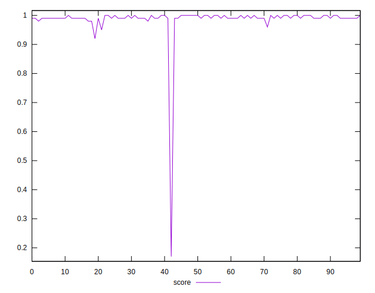
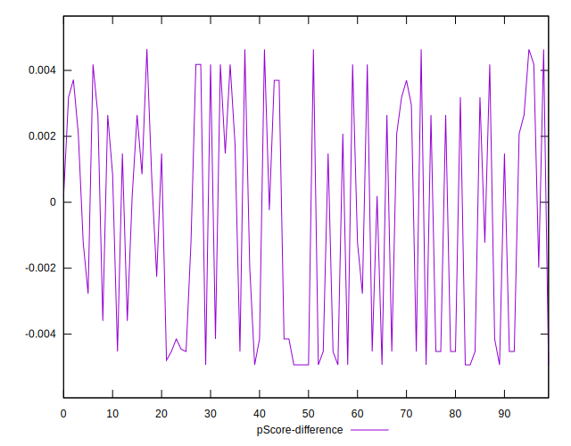

# //max-potential-fid/samples/pages+cached+noadtech+nomedia

[→ Parent](../..)


## Raw


```yaml
p90min: 65
p90max: 100.5
p90range: 35.5
p90mean: 71.34574468085107
p90median: 69
p90stdev: 6.084522829480693
p90skewness: 1.7693167009625534
p90eccentricity: 0.9999999999999988
p90discretization: 4.2727272727272725
outlandishness: 1.117472657356304
confidence: 13.511296293800262
p90confidence: 2.4600315944233615

```


## Score


```yaml
p90min: 0.96
p90max: 1
p90range: 0.040000000000000036
p90mean: 0.9928723404255313
p90median: 0.99
p90stdev: 0.006461397718749034
p90skewness: -1.3031549889368332
p90eccentricity: 0.9999999999999999
p90discretization: 23.5
outlandishness: 0.9816089699442702
confidence: 0.032322914085294835
p90confidence: 0.002612405767506061

```


## Raw Estimate


## Score Estimate


## P Score


```yaml
p90min: 0.9629466270469359
p90max: 0.9958542552567312
p90range: 0.032907628209795314
p90mean: 0.9924345886601972
p90median: 0.994180911427837
p90stdev: 0.0045004925421595
p90skewness: -3.5130817523993736
p90eccentricity: 1.0000000000000009
p90discretization: 4.2727272727272725
outlandishness: 0.9812594641191874
confidence: 0.032272408978458754
p90confidence: 0.001819592785573295

```


## Score Difference


```yaml
p90min: 0
p90max: 0
p90range: 0
p90mean: 0
p90median: 0
p90stdev: 0
p90skewness: .nan
p90eccentricity: .nan
p90discretization: 94
outlandishness: .inf
confidence: 4.330179641073934e-18
p90confidence: 0

```


## P Score Difference


```yaml
p90min: -0.004931822957321863
p90max: 0.0046375893622611075
p90range: 0.00956941231958297
p90mean: -0.0006383517982992601
p90median: -0.0007312157017196758
p90stdev: 0.003624686314429517
p90skewness: 0.07734783066104582
p90eccentricity: 0.9999999999999988
p90discretization: 3.9166666666666665
outlandishness: 0.9094694923711045
confidence: 0.0014529339995040993
p90confidence: 0.0014654958331599562

```

