# //max-potential-fid/samples/pages+cached+noadtech

[→ Parent](../..)


## Raw


```yaml
p90min: 65
p90max: 79
p90range: 14
p90mean: 69.38297872340425
p90median: 68
p90stdev: 3.6352481930508156
p90skewness: 0.9848851060967454
p90eccentricity: 0.9999999999999996
p90discretization: 6.266666666666667
outlandishness: 1.009738405797715
confidence: 1.809190086363487
p90confidence: 1.469766103127384

```

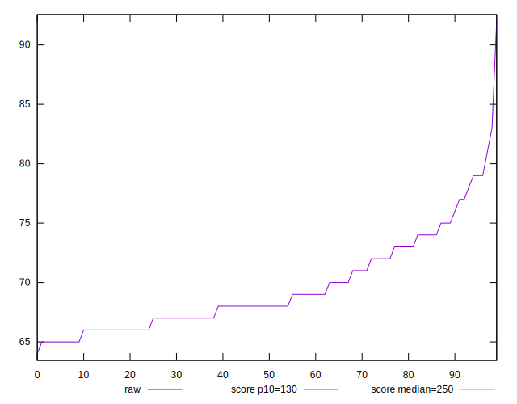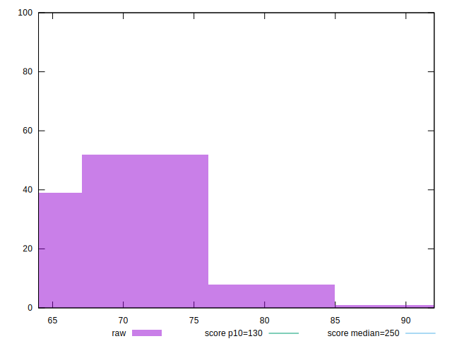
## Score


```yaml
p90min: 0.99
p90max: 1
p90range: 0.010000000000000009
p90mean: 0.9938297872340419
p90median: 0.99
p90stdev: 0.004861131769700375
p90skewness: 0.4814569204863807
p90eccentricity: 0.9999999999999997
p90discretization: 47
outlandishness: 0.9995376257141899
confidence: 0.0021839311508776646
p90confidence: 0.001965402723148089

```

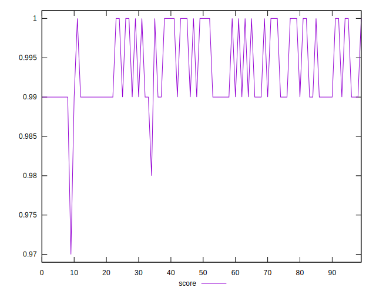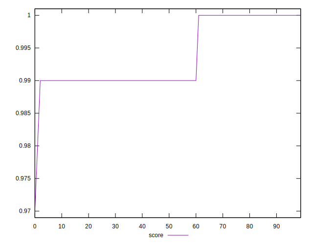
## Raw Estimate

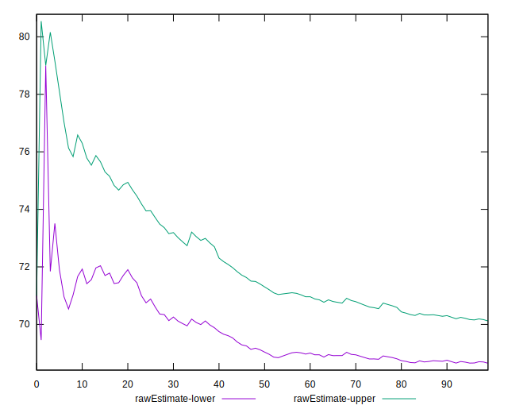
## Score Estimate

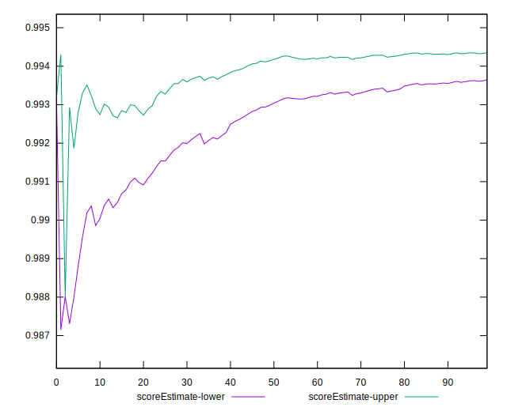
## P Score


```yaml
p90min: 0.9880175836752019
p90max: 0.9958542552567312
p90range: 0.007836671581529342
p90mean: 0.9938139000503927
p90median: 0.9946375893622611
p90stdev: 0.0019517286880229808
p90skewness: -1.3338872998009137
p90eccentricity: 1.0000000000000002
p90discretization: 6.266666666666667
outlandishness: 0.9994172495644719
confidence: 0.0011485335242112137
p90confidence: 0.0007891028386015237

```

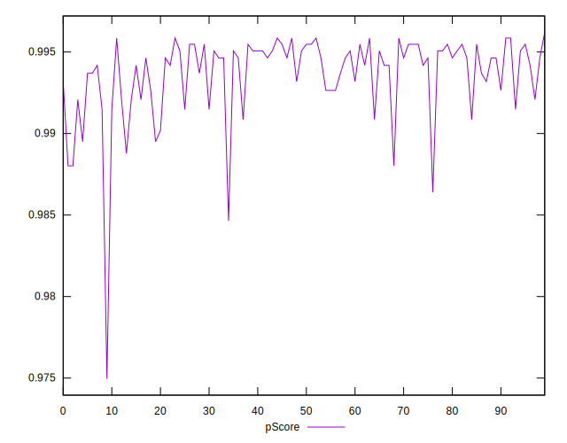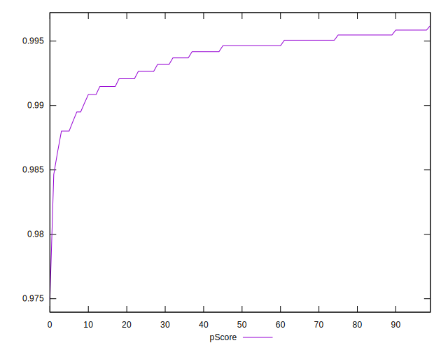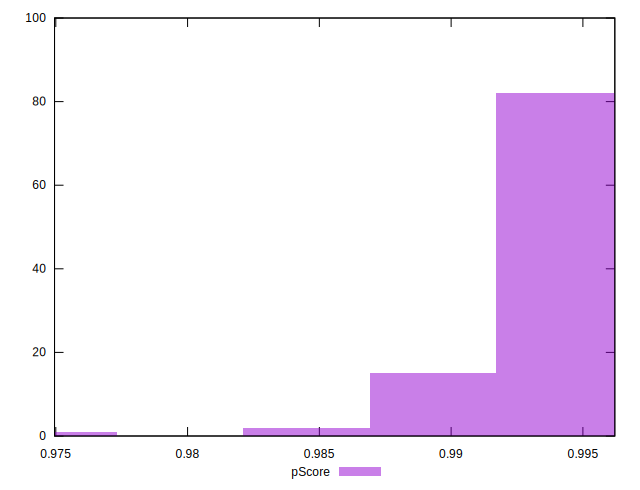
## Score Difference


```yaml
p90min: 0
p90max: 0
p90range: 0
p90mean: 0
p90median: 0
p90stdev: 0
p90skewness: .nan
p90eccentricity: .nan
p90discretization: 94
outlandishness: .nan
confidence: 0
p90confidence: 0

```


## P Score Difference


```yaml
p90min: -0.004931822957321863
p90max: 0.0046375893622611075
p90range: 0.00956941231958297
p90mean: -0.00007461221277767717
p90median: 0.0011651869866929898
p90stdev: 0.003874804931588209
p90skewness: -0.09947000235739316
p90eccentricity: 1.0000000000000004
p90discretization: 5.529411764705882
outlandishness: 1.029775981928148
confidence: 0.0015442118260216228
p90confidence: 0.001566621216005529

```

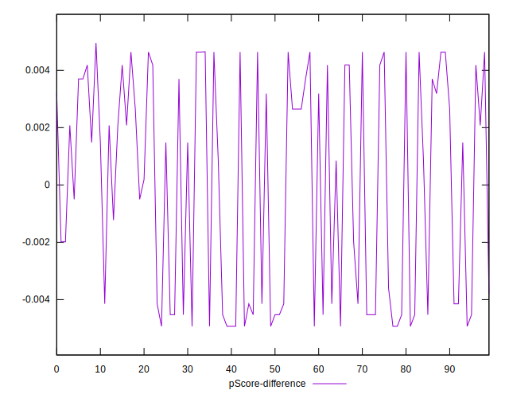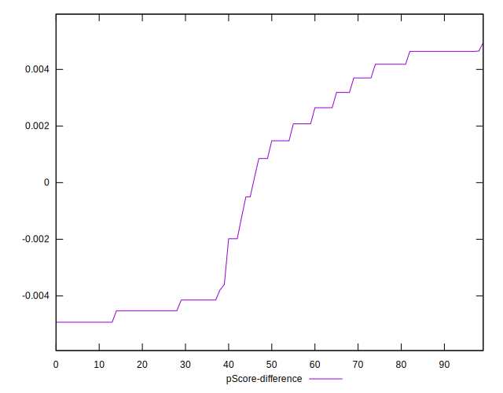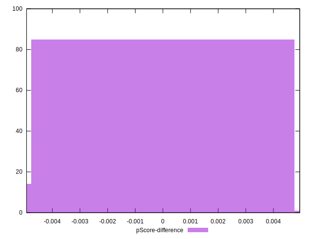