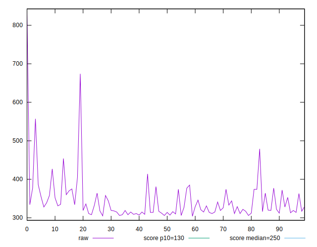
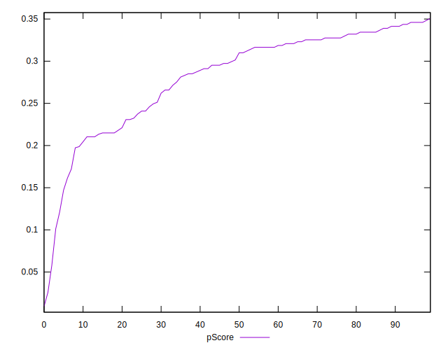
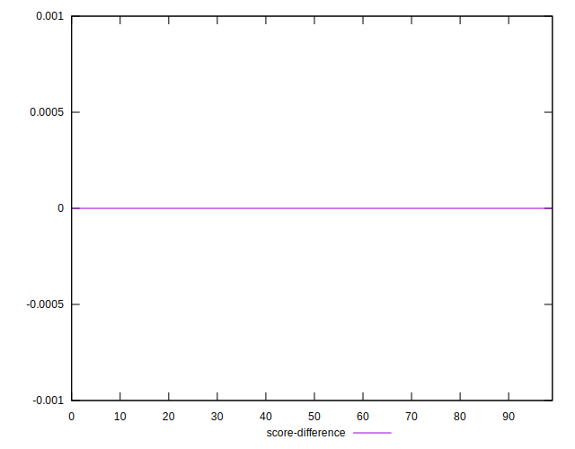

# //max-potential-fid/samples/pages+cached

[→ Parent](../..)


## Raw


```yaml
p90min: 305.9999999999991
p90max: 479
p90range: 173.0000000000009
p90mean: 337.5425531914894
p90median: 324
p90stdev: 33.3510231090049
p90skewness: 1.7444749123627201
p90eccentricity: 0.9999999999999994
p90discretization: 1.2876712328767124
outlandishness: 1.0572485285809772
confidence: 27.842818454836003
p90confidence: 13.484142118256807

```


## Score


```yaml
p90min: 0.1
p90max: 0.35
p90range: 0.24999999999999997
p90mean: 0.2847872340425531
p90median: 0.305
p90stdev: 0.056431632961774725
p90skewness: -1.108796840151826
p90eccentricity: 0.9999999999999994
p90discretization: 4.476190476190476
outlandishness: 0.9611469513051946
confidence: 0.02771630247332815
p90confidence: 0.022815856543136195

```


## Raw Estimate


## Score Estimate


## P Score


```yaml
p90min: 0.10127397293277118
p90max: 0.3460087474833111
p90range: 0.24473477455053994
p90mean: 0.2844529808820792
p90median: 0.3057048715016456
p90stdev: 0.055788849321126065
p90skewness: -1.1014458791767134
p90eccentricity: 1.0000000000000002
p90discretization: 1.2876712328767124
outlandishness: 0.9604509982359944
confidence: 0.0275891385235177
p90confidence: 0.022555972882791847

```


## Score Difference


```yaml
p90min: 0
p90max: 5.551115123125783e-17
p90range: 5.551115123125783e-17
p90mean: 1.771632486103973e-18
p90median: 0
p90stdev: 9.757390901081482e-18
p90skewness: 5.326002287485497
p90eccentricity: 1.0000000000000044
p90discretization: 47
outlandishness: 3.5344000000000007
confidence: 5.167706891451846e-18
p90confidence: 3.94500777932789e-18

```


## P Score Difference


```yaml
p90min: -0.004762995021792837
p90max: 0.004942257760970431
p90range: 0.009705252782763268
p90mean: -0.0004591917525901601
p90median: -0.00012303217303225034
p90stdev: 0.0028350887338224108
p90skewness: 0.08398189217194706
p90eccentricity: 0.9999999999999992
p90discretization: 1.2876712328767124
outlandishness: 0.8715117256259366
confidence: 0.001176407214154486
p90confidence: 0.0011462538729256626

```

